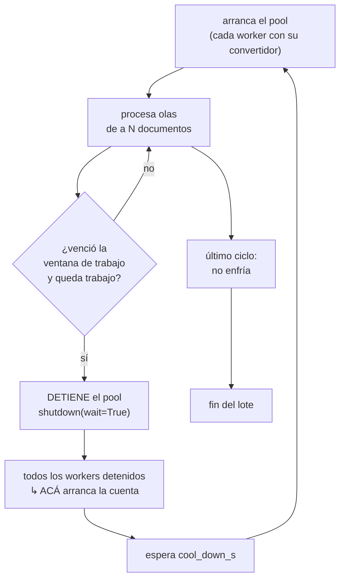

# Lotes largos: workers, checkpoints y enfriamiento

> **Fase**: F6 (cliente) · **Tareas**: T-601 / T-602 · **Épica**: E-CLI-1/E-CLI-3
> **Decisión**: [ADR-010](v2/docs/plan/04-decisiones-abiertas-adr.md) · **Código**: [`v2/src/voucherflow/batch.py`](v2/src/voucherflow/batch.py)
> **Última actualización**: 2026-09-12

Guía del **modo batch**: cómo procesar una carpeta entera sin degradar la máquina,
cómo reanudar un lote interrumpido y qué significan exactamente `--workers`,
`--force`, `--work-window` y `--cool-down`.

Está escrita para el **operador que va a correr el lote**, y para quien tenga que
auditar después qué pasó. La verificación ejecutable de todo esto es
`python scripts/F6/t602.py` (12 escenarios + 6 fronteras) y la suite
`tests/test_batch_t602.py`.

---

## 1. En una pantalla

```bash
# Lote típico en una máquina que se calienta: 4 workers y enfriamiento activo.
voucherflow batch files/2025-08 --workers 4 --cooling on \
  --work-window 600 --cool-down 120 --cases salida/cases -o lote.json
```

Qué hace, en orden:

1. **Descubre** los documentos de la carpeta (y sus subcarpetas), en orden
   determinista, salteando los artefactos que ya generaron corridas anteriores.
2. **Reanuda**: si un documento ya tiene un checkpoint válido, lo saltea.
3. **Procesa** los pendientes en el pool de workers (cada uno con su convertidor).
4. Cada `--work-window` segundos de trabajo continuo: **detiene los workers** y
   **espera `--cool-down`** antes de seguir.
5. Al terminar deja un **checkpoint** por documento, el **agregado** del lote en
   `-o` (un único JSON con una entrada por documento) y, si se pidió, el
   `CaseRecord` de cada caso (sidecar + índice).

---

## 2. El problema y el requisito

En una máquina local, un lote largo calienta el equipo y lo degrada. El pedido
operativo original (`my_prompt.md`) es:

> tras ~10 min de procesamiento hay que parar ~2 min para que la máquina se
> enfríe, **y los 2 minutos empiezan a contar cuando todos los workers están
> detenidos**.

La segunda mitad es la parte difícil y la que el diseño resuelve de forma
explícita: **la cuenta no arranca cuando termina el último documento, sino cuando
el último worker dejó de existir.**

---

## 3. Workers: uno por proceso, con su propio convertidor

### Cómo se elige

| `--workers` | Qué corre | Cuándo |
|---|---|---|
| `1` (default) | El lote en el **proceso actual**, secuencial y determinista | Lotes chicos, o cuando querés reproducibilidad exacta |
| `>1` | Un **pool de procesos**; cada worker con su convertidor de Docling y su cliente de modelos | Lotes largos, máquinas con varios núcleos |

Con `1` worker **no** se levanta un proceso aparte: el costo de serializar y
recargar el convertidor sería mayor que el beneficio. Ese camino es el que usa la
suite de tests y es el que garantiza el mismo resultado siempre.

### Cada worker tiene lo suyo

Un worker es un **proceso**, no un hilo: la librería de conversión y los modelos
son pesados y no se comparten entre procesos. Cada uno construye su convertidor y
su cliente de modelos **de forma perezosa** (la primera vez que le toca un
documento), así que un lote de un solo documento no paga la carga de modelos de
más.

El trabajo cruza la frontera del proceso como **datos simples** (una ruta y un
id), no como objetos vivos: así el lote no depende de que las sesiones HTTP ni los
convertidores se puedan empaquetar y enviar a otro proceso. El worker devuelve su
resultado también como datos, y el proceso principal los **revalida contra los
contratos** antes de aceptarlos — si algo no cierra, falla en la frontera y no
más adelante con un resultado a medias.

### Cuánto paralelismo conviene

Más workers no es siempre mejor: cada uno carga su propio convertidor y compite
por el mismo disco y la misma CPU. Para una máquina de desarrollo, empezar por
`--workers 2` o `4` y medir es más útil que subir el número; el lote reporta
cuántos worker aplicó y cuánto tardó cada ciclo de trabajo.

### Un detalle honesto

Si corrés el lote con un orquestador **inyectado** (como hacen los tests, con
dobles), el paralelismo real no es posible —un doble no se puede enviar a otro
proceso— y el lote **lo declara** en su traza en vez de reportar un paralelismo
que no existió. Ese aviso es esperable en tests, no en producción.

---

## 4. Checkpoints y reanudación

### Qué es un checkpoint

Cada documento que termina deja un archivo **junto a él**:

```
files/2025-08/2D2C9347/factura.jpg
files/2025-08/2D2C9347/factura.batch.json   ← checkpoint
```

Contiene el **hash del contenido** del documento, cuándo se procesó, si salió bien
y un resumen del veredicto (estado, certeza, letra). La escritura es **atómica**:
si la máquina se apaga a mitad de la escritura, el checkpoint anterior queda
intacto y nunca se lee uno truncado — que en un mecanismo de reanudación sería
peor que no tener checkpoint, porque haría saltear un documento con la marca de
"hecho".

### Cómo se reanuda

```bash
voucherflow batch files/2025-08 --workers 4        # corre todo lo pendiente
```

Al volver a correr sobre la misma carpeta, **lo ya completado se saltea**. Eso es
el Gherkin de E-CLI-1: *"interrupción + reanudación no repite pasos completados"*.

Para **rehacer** todo desde cero, se pide explícitamente:

```bash
voucherflow batch files/2025-08 --workers 4 --force
```

### Tres reglas que evitan saltear trabajo por error

| Regla | Por qué |
|---|---|
| La reanudación se decide por el **hash del contenido**, no por el nombre del archivo | Si el documento **cambió**, no es el mismo documento: se reprocesa aunque no uses `--force`. Reanudar por nombre es la trampa silenciosa — no falla, simplemente saltea trabajo que había que rehacer |
| Un checkpoint de una corrida que **falló** no se reutiliza | Un error no es un paso completado. Si se reutilizara, un documento fallido quedaría salteado para siempre y el lote nunca lo reintentaría |
| Un checkpoint **ilegible** se trata como ausente | Un archivo derivado corrupto no puede hacer saltear trabajo: se reprocesa y se reescribe |

El reintento de un documento que falló es **entre corridas** (volvés a correr el
lote y se reprocesa), no un bucle interno: un lote no se queda reintentando lo
mismo indefinidamente.

### Apagar los checkpoints

```bash
voucherflow batch files/2025-08 --no-checkpoints
```

Ignora y **no escribe** checkpoints: reprocesa todo. Notá que **no borra** los
checkpoints existentes: apagar el mecanismo no puede destruir el estado del lote.

### De qué se puede prescindir

Los checkpoints son un **derivado**: si los borrás a mano, el lote simplemente
vuelve a procesar esos documentos. Ningún resultado se pierde por borrarlos,
porque el resultado real vive en el `CaseRecord` (si usás `--cases`) y en el JSON
de salida.

---

## 5. Enfriamiento

### La configuración

| Parámetro | Default | Qué es |
|---|---|---|
| `--cooling auto\|on\|off` | `auto` | `auto` respeta la configuración (`CoolingConfig.enabled`); `on`/`off` la fuerzan para esa corrida |
| `--work-window S` | `600` (10 min) | Segundos de trabajo continuo antes de detener los workers |
| `--cool-down S` | `120` (2 min) | Segundos de enfriamiento, contados **desde que todos los workers están detenidos** |

El default del ADR-010 es `enabled: false`; en una máquina que se calienta se
activa con `--cooling on` o poniendo `enabled: true` en la configuración.

### Cómo funciona el ciclo



Tres cosas que conviene mirar de cerca:

**Se detiene el pool, no se lo pausa.** Un proceso detenido es lo que hace real la
pausa: no consume CPU ni retiene los modelos cargados. Un pool "pausado" pero vivo
no enfría nada.

**La cuenta arranca cuando el pool está detenido.** El instante que registra la
traza es el de *todos los workers detenidos*, no el del último documento
terminado. Con workers en paralelo la diferencia es real: si un worker sigue
trabajando, la máquina sigue caliente.

**El último ciclo no enfría.** Si no queda trabajo para reanudar, dormir dos
minutos para terminar sería tiempo perdido.

El trabajo avanza en **olas** del tamaño del pool: la ventana se evalúa entre
olas, así que nunca se interrumpe un documento a la mitad para pausar.

### Ver el ciclo sin esperar

```bash
python scripts/F6/t602.py --manual
```

```
ciclo 1: 2 documento(s) | ventana 120s | todos detenidos en t=120s | enfriado 120s
ciclo 2: 2 documento(s) | ventana 120s | todos detenidos en t=360s | enfriado 120s
ciclo 3: 1 documento(s) | ventana  60s | todos detenidos en t=540s | enfriado   0s
total: 2 pausas, 240s enfriados
```

El script usa un **reloj simulado**: el tiempo avanza solo cuando el lote duerme,
así que el enfriamiento se verifica **sin esperar** los minutos reales. Es la
misma técnica de la suite de tests.

---

## 6. Configuración

### Archivo YAML

`voucherflow.yaml` (o el que pases por parámetro):

```yaml
workers: 4
cooling:
  enabled: true
  work_window_s: 600     # 10 min de trabajo continuo
  cool_down_s: 120       # 2 min desde que todos los workers están detenidos
ollama:
  url: http://localhost:11434
  max_reintentos: 3
modelos:
  vlm:  { rol: vlm,    modelo: qwen2.5vl:3b, num_ctx: 4096 }
  llm:  { rol: llm,    modelo: qwen2.5:7b,   num_ctx: 8192 }
```

### Variables de entorno

Máxima prioridad, con **doble guion bajo** para separar los niveles:

```bash
VOUCHERFLOW__WORKERS=4 \
VOUCHERFLOW__COOLING__ENABLED=1 \
VOUCHERFLOW__COOLING__WORK_WINDOW_S=600 \
VOUCHERFLOW__COOLING__COOL_DOWN_S=120 \
  voucherflow batch files/2025-08
```

### Prioridad

Los flags del CLI pisan todo lo demás para esa corrida; después viene la variable
de entorno, después el YAML, y al final los defaults. Es decir:

```
--work-window 300  >  VOUCHERFLOW__COOLING__WORK_WINDOW_S  >  voucherflow.yaml  >  default
```

Acortar la ventana con `--work-window` es justamente lo que permite **probar** el
enfriamiento en una máquina distinta de la de referencia, sin tocar el archivo de
configuración.

### Un default que conviene entender

**No pidas una máquina libre y después te quejes de que se calienta**: el
enfriamiento viene **apagado** por default (`enabled: false`), porque es una
política operativa, no una decisión de la librería. En una máquina que se calienta
se activa explícitamente.

---

## 7. Qué reporta el lote

`-o lote.json` escribe el **agregado** del lote (o `lote.agregado.json` si no se
pasa `-o`). Es un **único JSON** que consolida la corrida: una entrada por
documento, la síntesis y las métricas.

```json
{
  "version": "agregado-lote@1",
  "raiz": "files/2025-08",
  "resumen": {
    "documentos": 12,
    "ok": 9,
    "errores": 0,
    "por_estado": { "aprobado": 8, "rechazado": 1 },
    "requieren_revision": 2,
    "revision_obligatoria": 1,
    "con_sidecar": 9
  },
  "documentos": [
    {
      "documento_id": "sha256:9f2c…",
      "archivo": "files/2025-08/2D2C9347/factura.jpg",
      "ok": true,
      "estado": "aprobado",
      "tipo_comprobante": "A",
      "certeza": "alta",
      "origen": "programa",
      "hitl_requerido": false,
      "campos_extraidos": 15,
      "sidecar": "sha256_9f2c….case.json"
    }
  ],
  "metricas": { "…": "se calculan sobre el histórico persistido (--cases)" },
  "lote": { "…": "la traza del runner: workers, ciclos, enfriamiento" }
}
```

### El agregado es un índice, no una copia

Por cada documento guarda el **veredicto** y un **puntero al sidecar** — no la
evidencia completa. La evidencia vive en el `CaseRecord` (el sidecar), y se lee
desde ahí:

```bash
voucherflow case show sha256:9f2c… --dir salida/cases
```

La razón es doble, y las dos importan:

- **Tamaño**: cada `CaseRecord` puede pesar cientos de KB (todas las lecturas, por
  fuente, con su sostén). Un lote de mil documentos daría un agregado de cientos
  de MB: un archivo que nadie puede abrir.
- **Una sola verdad**: si el agregado copiara el contenido, tendríamos dos lugares
  que dicen lo mismo y que pueden **divergir**. Corregir un caso dejaría el
  agregado viejo mintiendo sin que nadie lo note. Con punteros, el agregado no
  puede contradecir al sidecar.

Así, cada pregunta vive donde corresponde: *"¿qué pasó en el lote?"* se responde
con el agregado; *"¿por qué se decidió así?"*, con el sidecar.

### Se acumula entre corridas

El agregado **suma** lo que procesó cada corrida, con **una entrada por
documento**: reprocesar un documento actualiza su entrada, no agrega otra. Después
de interrumpir y reanudar un lote, el archivo describe la carpeta completa —no la
última corrida—, que es lo que hace que sirva como estado.

### Se puede reconstruir del histórico

Si perdiste el agregado (o procesaste la carpeta en varias sesiones), se
reconstruye leyendo los sidecars, sin volver a correr el pipeline:

```bash
voucherflow case aggregate --dir salida/cases -o lote.json
```

### Métricas: se derivan o se declaran

El bloque `metricas` sale del **histórico persistido** (F5/T-507), así que aparece
cuando el lote corrió con `--cases`. Si no hay histórico del cual derivarlas, el
agregado las deja en `null` y dice por qué en `metricas_no_disponibles` — no las
inventa.

### La traza del runner

El bloque `lote` es de T-602 y tiene lo de la corrida:

- **`max_workers_solicitado` vs. `max_workers_aplicado`**: lo que pediste y lo que
  realmente corrió. Si no coinciden, `lote.notas` dice por qué.
- **`reanudados`**: qué documentos se saltearon y por qué no se reprocesaron.
- **`ciclos[].todos_detenidos_s`**: el instante exacto en que arrancó cada
  enfriamiento. Es la prueba de que la cuenta empezó con el pool detenido y no
  antes. El **último** ciclo siempre tiene `hubo_enfriamiento: false`.
- **`checkpoints`**: si se escribieron. Si el directorio no era escribible, el
  motivo aparece en `no_escribibles` en vez de dar el trabajo por perdido.

### Estado de salida y contadores

Los contadores de `resumen` son **de la carpeta**, no de la corrida: `documentos`
incluye los reanudados, y `por_estado` acumula lo que se sabe de todos. El estado
de salida, en cambio, es de la corrida: `0` si no dejó errores, `≠ 0` si alguno
falló.

Un **rechazo** (el documento no es un comprobante) **no** es un error: es una
conclusión del sistema, con certeza alta, y se cuenta en `por_estado.rechazado`.

---

## 8. Problemas frecuentes

| Síntoma | Causa | Qué hacer |
|---|---|---|
| La corrida termina enseguida y no procesa nada | Los documentos ya tienen checkpoint válido | Es lo esperado: el lote reanudó. Verificá `lote.reanudados` en el agregado, o usá `--force` para rehacer |
| El agregado tiene más documentos de los que procesó esta corrida | Se **acumula** entre corridas | Es lo esperado: el agregado es el estado de la carpeta. Mirá `lote.procesados` para lo de esta corrida. Si querés empezar de cero, borrá el archivo |
| Un documento sigue apareciendo como pendiente | Su contenido **cambió** (el hash es otro) | Es correcto: se reprocesa solo. Si querés forzarlo, `--force` |
| El lote no enfría | `enabled` está en `false` (el default) | `--cooling on`, o `enabled: true` en el YAML |
| El lote tarda más de lo esperado | Está enfriando entre ciclos | Mirá `lote.enfriamientos` y `lote.segundos_enfriados` |
| `metricas` viene en `null` | El lote no corrió con `--cases`: no hay histórico del cual derivarlas | Agregá `--cases DIR` (y mirá `metricas_no_disponibles`) |
| `max_workers_aplicado` es menor al pedido | Había un orquestador inyectado (tests) | Solo pasa en tests; `lote.notas` lo explica |
| Un documento falló y no querés esperar al lote entero | — | Volvé a correr: solo se reprocesa lo que falta (no reutiliza el checkpoint del fallo) |
| La máquina se apagó a mitad del lote | — | Volvé a correr sobre la misma carpeta: reanuda desde los checkpoints, sin repetir lo completado |

---

## 9. Para quien vaya a tocar el código

- **Runner**: `v2/src/voucherflow/batch.py` — `ejecutar_lote()`, `EjecutorProcesos`,
  `EjecutorSerial`, `CheckpointsLote`, `Reloj` y la traza (`TrazaLote`).
- **Punto de entrada CLI**: `v2/src/voucherflow/cli/main.py::_cmd_batch`.
- **Orquestador**: `PipelineOrchestrator.ejecutar_lote` (delega en el runner y
  conserva el contrato de retorno: la lista de `PipelineResult`).
- **Configuración**: `v2/src/voucherflow/settings/config.py::CoolingSettings`.
- **Pruebas**: `tests/test_batch_t602.py` (46) y `scripts/F6/t602.py` (12 + 6).

Tres piezas se **inyectan** (`ejecutor`, `reloj`, `checkpoints`): es lo que permite
verificar el enfriamiento **sin dormir** y el lote **sin procesos reales**. Si
agregás algo a la política, mantené ese contrato: cualquier comportamiento que no
se pueda verificar con un reloj simulado tampoco se va a poder testear.

Y un detalle que ya mordió una vez: el contrato del runner es `resultado()`, no
`result()`. El `Future` de la biblioteca estándar expone lo segundo, así que el
ejecutor lo **adapta** en su frontera — un detalle de la stdlib no debe condicionar
el contrato del lote.

---

## Enlaces

- Arquitectura del módulo: [`v2/docs/plan/03-arquitectura/ORCH-CLI.md`](v2/docs/plan/03-arquitectura/ORCH-CLI.md)
- Decisión de enfriamiento: [`ADR-010`](v2/docs/plan/04-decisiones-abiertas-adr.md)
- Plan de la fase: [`v2/docs/plan/05-plan/F6.md`](v2/docs/plan/05-plan/F6.md) y [`F6-subplan.md`](v2/docs/plan/05-plan/F6-subplan.md) §3.2
- Cliente CLI (subcomandos y códigos de salida): [`v2/README.md`](v2/README.md)
