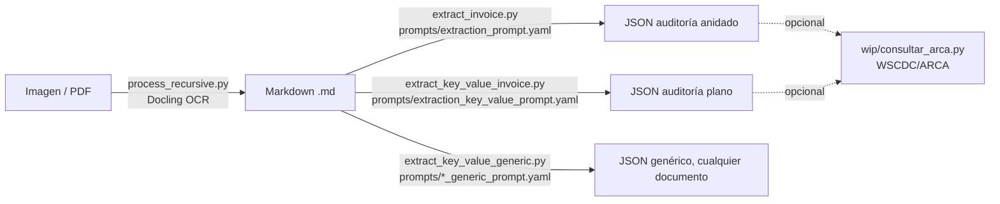

# ibm-docling

Pipeline local para digitalizar comprobantes de gastos (facturas, tickets, boletos)
con [Docling](https://github.com/DS4SD/docling) (OCR → Markdown) y extraer/auditar
sus datos con modelos LLM locales corriendo en [Ollama](https://ollama.com/), sin
enviar información a servicios externos.

## Flujo general



## Requisitos

- Python 3.13 (entorno conda `py313_env` en este proyecto — usar el comando
  `python`, no `python3`, para tener acceso a las dependencias instaladas)
- [Ollama](https://ollama.com/) corriendo localmente (`http://localhost:11434`)
  con al menos un modelo descargado, por ejemplo:
  ```bash
  ollama pull qwen2.5vl:3b   # modelo multimodal, mejor para documentos/facturas
  ollama pull smollm2        # modelo chico, más rápido
  ```
- Dependencias Python: `docling`, `pyyaml`, `python-dotenv`, `afip.py` (esta
  última solo si vas a usar `consultar_arca.py`)

## Estructura del proyecto

| Archivo | Qué hace |
|---|---|
| [process_recursive.py](process_recursive.py) | Convierte recursivamente imágenes/PDFs de `files/` a Markdown usando Docling (OCR), en paralelo con múltiples workers |
| [run.py](run.py) | Ejemplo mínimo de conversión de un solo archivo con Docling |
| [ask.py](ask.py) | Hace preguntas sobre un archivo vía Ollama: pregunta puntual, modo interactivo, o extracción progresiva de campos (`--fields`) |
| [extract_common.py](extract_common.py) | Lógica compartida por los scripts `extract_*.py` "single-shot" (carga el prompt system/user, llama a Ollama, parsea el JSON de respuesta) |
| [extract_invoice.py](extract_invoice.py) | Extrae y audita un comprobante en una sola llamada, usando `prompts/extraction_prompt.yaml` → JSON anidado (`emisor`, `comprobante`, `financiero`, etc.) |
| [extract_key_value_invoice.py](extract_key_value_invoice.py) | Igual que `extract_invoice.py` pero con `prompts/extraction_key_value_prompt.yaml` → JSON plano (todas las claves al mismo nivel) |
| [extract_key_value_generic.py](extract_key_value_generic.py) | Igual mecanismo, pero con `prompts/extraction_key_value_generic_prompt.yaml`: no asume tipo de documento, el modelo decide qué claves extraer |
| [questions.yaml](questions.yaml) | Template de campos de control de gastos, preguntados uno por uno en orden (usado por `ask.py --fields` / `wip/extract_template.py`) |
| `prompts/` | Prompts system/user (YAML) usados por los scripts `extract_*.py` |
| `wip/` | Scripts/config en desarrollo o de uso opcional: `extract_template.py` (extracción progresiva campo a campo), `consultar_arca.py` (WSCDC/ARCA), `.env`/`.env.example` |
| [kill_workers.py](kill_workers.py) / [kill_workers.sh](kill_workers.sh) | Mata procesos/workers huérfanos de `process_recursive.py` |
| `files/` | Comprobantes originales organizados por mes (`AAAA-MM/`) y carpeta hash, junto a su `.md` generado |

## Uso

### 1. Convertir archivos a Markdown (OCR)

```bash
python process_recursive.py                  # procesa todo 'files/'
python process_recursive.py files/2026-06    # procesa solo un mes
python process_recursive.py -w 4 files        # 4 workers en paralelo
python process_recursive.py --force files     # reprocesa aunque ya exista el .md
```

Si un proceso queda colgado, limpiá los workers huérfanos con:

```bash
python kill_workers.py   # o ./kill_workers.sh
```

### 2. Extraer campos de control (uno por uno, con contexto progresivo)

```bash
python ask.py archivo.md --fields questions.yaml --output resultado.json
# o el atajo pensado para pipelines:
python wip/extract_template.py archivo.md -o resultado.json
```

### 3. Auditoría completa en una sola llamada (JSON estructurado)

```bash
python extract_invoice.py archivo.md -m qwen2.5vl:3b -o auditoria.json             # JSON anidado
python extract_key_value_invoice.py archivo.md -o auditoria.json                  # JSON plano
python extract_key_value_generic.py archivo.md -o resultado.json                  # cualquier tipo de documento
```

Devuelve un JSON con validación de calidad/legibilidad, datos del emisor, del
comprobante, desglose financiero (subtotal, impuestos, monto no gravado) y
datos específicos del rubro (comensales, litros de combustible).

### 4. Preguntas libres sobre un archivo

```bash
python ask.py archivo.md                                   # modo interactivo
python ask.py archivo.md -q "¿Cuál es el importe total?"    # pregunta puntual
```

### 5. Constatar un comprobante contra ARCA/AFIP (opcional)

```bash
cp wip/.env.example wip/.env   # completar AFIP_ACCESS_TOKEN (gratis en https://app.afipsdk.com)
python wip/consultar_arca.py --json resultado.json --cae 75082223003046
```

Sin certificado propio, se puede probar en modo desarrollo con el CUIT público
`20409378472`. Ver [wip/.env.example](wip/.env.example) para más detalle.

## Notas

- Los archivos `.env`, certificados (`certs/`) y los comprobantes (`files/`) no
  se versionan (ver [.gitignore](.gitignore)).
- Todo el procesamiento de OCR y de LLM corre localmente (Docling + Ollama):
  ningún comprobante se envía a servicios externos, salvo que uses
  `consultar_arca.py` (que sí se conecta a los web services de ARCA/AFIP) o
  Afip SDK (que usa un `access_token` de terceros para simplificar la firma).
