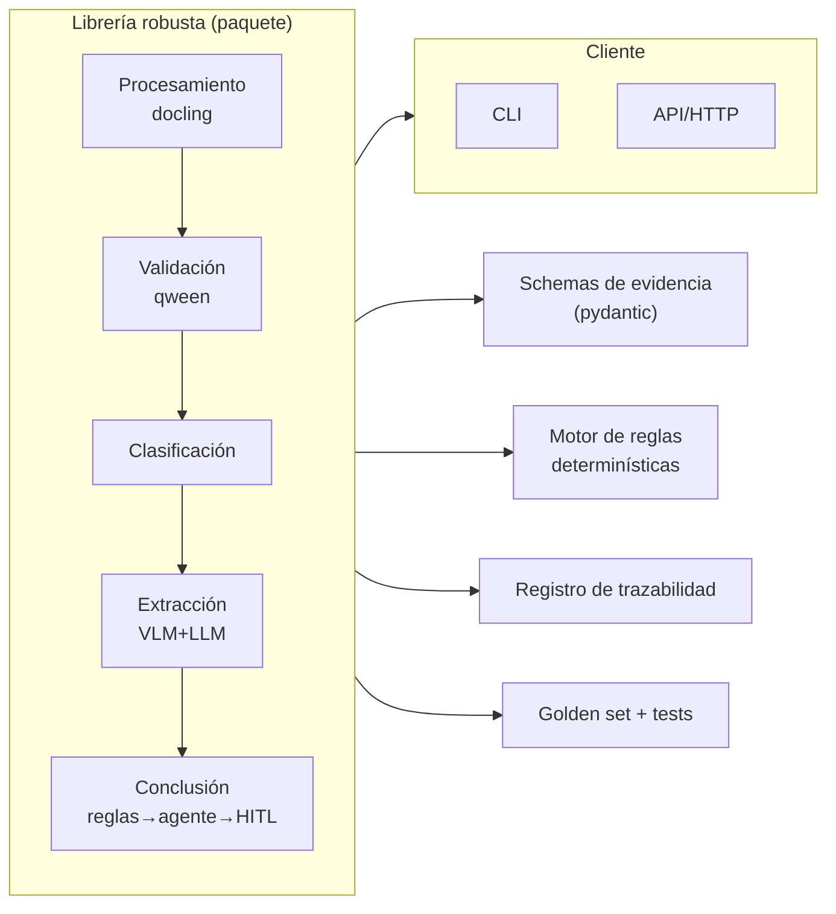
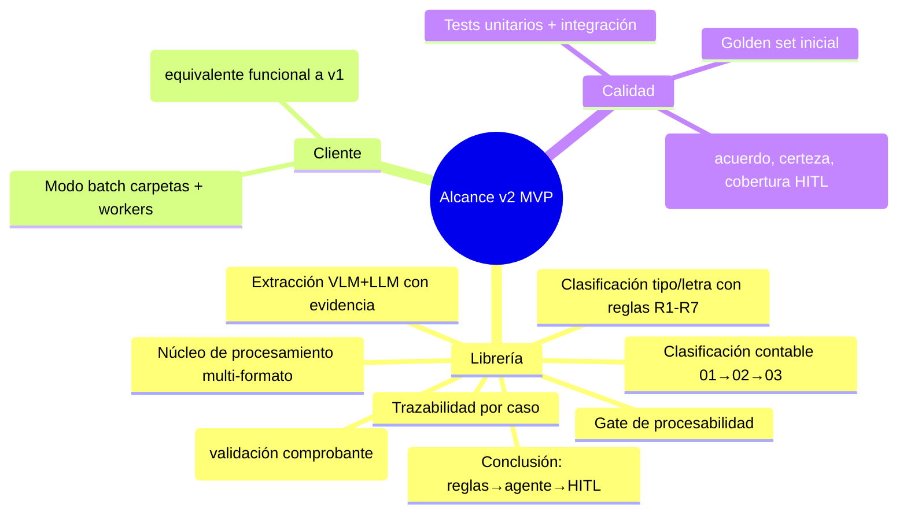
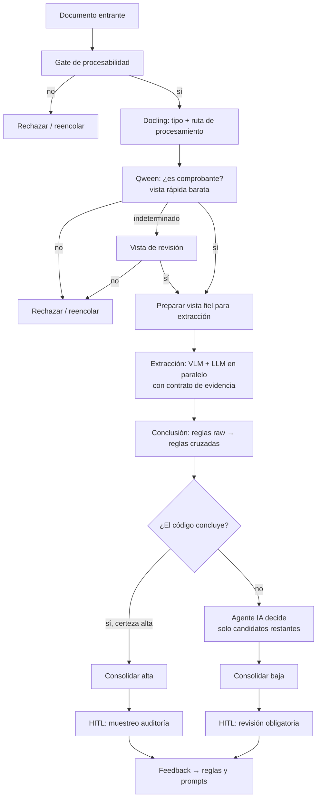

# 01 — Visión y alcance (BA)

> **Rol**: Business Analyst
> **Propósito**: definir el problema que resuelve v2, los objetivos, los
> entregables y el alcance (dentro/fuera, MVP vs. fases futuras).

---

## 1. Problema a resolver

Hoy el sistema vive como **scripts de propósito único en `v1/`**:

```text
v1/
  ocr_documents.py        # OCR recursivo con Docling -> .md con boxes ordenados
  document_extraction.py  # single-shot: aplica un prompt YAML a un .md/.jpg
  classification_pipeline.py  # cadena 01 -> 02 -> 03 (contable)
  extraction_pipeline.py      # extracciones 10 y 11 independientes
  full_pipeline.py            # OCR + extracción 10/11 + clasificación 01/02/03
  lib/ (converter, orientation, processor, pipeline)
  wip/ (consultar_arca.py, run2.py, run3.py, ...)   # prototipos sueltos
```

Problemas observados:

1. **Lógica de decisión embebida en prompts y scripts.** Las reglas fiscales
   (R1…R7 del WIP `deteccion_tipo_factura.yaml`) y el flujo de validación viven
   en prompts de texto y prototipos, no en código testeable.
2. **Sin gate de entrada.** No se decide si el documento es procesable ni si es
   comprobante antes de gastar OCR/llamadas a modelo (idea de "doble paso" de
   qween).
3. **Sin contrato de evidencia.** Cada modalidad (`vlm`/`llm`) devuelve JSON
   libre; no se puede comparar programáticamente ni justificar una decisión.
4. **Conclusión inexistente como etapa.** La "validación/consolidación" está
   descrita en `my_prompt.md` y en `ideas/algoritmo.md`, pero no implementada:
   no hay reglas programáticas, ni escalado a agente, ni HITL, ni trazabilidad.
5. **Código acoplado y no reutilizable.** Las funciones importan entre scripts
   por ruta (ver `full_pipeline.py`), los modelos se configuran en cada script y
   no hay una API estable ni un cliente.
6. **Procesamiento "a ciegas".** Docling se aplica igual a todo archivo; la idea
   `docling.md` pide decidir por tipo, calidad visual, orientación y complejidad
   y elegir motor OCR/VLM.

---

## 2. Visión del producto (v2)

> **Declaración de visión**
>
> Para el equipo que procesa y audita comprobantes de gasto, que hoy depende de
> scripts frágiles y de decisiones no trazables de modelos,
> **v2** es una **librería robusta** (núcleo de procesamiento, clasificación,
> extracción y conclusión con reglas determinísticas + agente IA + HITL) y un
> **cliente** que la invoca por CLI/API, de modo que cualquier comprobante se
> procese de forma **determinística cuando se puede, asistida cuando hace
> falta, siempre trazable y auditada**, y que cada refactor sea un módulo
> testeable de forma aislada.

Lo que **no cambia**: el objetivo funcional de negocio (OCR, clasificación
contable, extracción de datos y detección de tipo/letra de comprobantes
argentinos) y el uso de modelos locales vía Ollama (VLM + LLM).

Lo que **cambia**: la organización en librería + cliente, la incorporación del
patrón de **conclusión** (reglas → agente → HITL) y la **trazabilidad** como
requisito de primera clase.

---

## 3. Objetivos

| ID | Objetivo | Medible por |
|----|----------|-------------|
| OBJ-1 | Refactorizar **docling** (procesamiento multi-tipo adaptativo) en un módulo de la librería | Pipeline decide tipo de entrada y ruta correcta; pruebas por formato |
| OBJ-2 | Refactorizar **qween** (validación de comprobante / doble paso con distinta calidad) en un módulo | Gate "¿es comprobante?" barato antes de extracción costosa; vistas A/B distintas |
| OBJ-3 | Refactorizar la **clasificación** (tipo/letra + contable 01→02→03) | Reglas determinísticas R1-R7 fuera de prompts; cadena 01→02→03 estable |
| OBJ-4 | Refactorizar la **extracción** (flujos VLM + LLM paralelos con contrato común) | Evidencia con `fuente + fragmento + valor` para comparar |
| OBJ-5 | Refactorizar la **conclusión** (reglas raw + cruzadas → agente IA → HITL) | % casos certeza alta por programa crece; trazabilidad completa por caso |
| OBJ-6 | Entregar una **librería robusta** con API estable y testeable | Paquete instalable, tests por módulo, sin acoplamiento entre scripts |
| OBJ-7 | Entregar un **cliente** que invoque la librería | CLI/API que reproduce los casos de uso de `v1` (equivalencia verificable) |

---

## 4. Entregables



1. **Librería robusta** (paquete Python instalable, nombre propuesto
   `voucherflow` / `ibm_docling_v2`, a definir en ADR): módulos de
   procesamiento, validación, clasificación, extracción, conclusión, reglas,
   evidencia/schemas, trazabilidad y clientes de modelo.
2. **Cliente que la invoca**: CLI (reproduce y supera a los comandos actuales
   de `v1`) y, en fase 2, una API/HTTP o un modo *batch*.
3. **Documentación técnica** de la librería (este plan + ADRs) y **golden set**
   inicial con casos etiquetados.
4. **Suite de pruebas** automatizadas (unitaria por módulo + integración del
   pipeline + evaluación sobre golden set).

---

## 5. Alcance del proyecto

### 5.1 Alcance dentro (in-scope) — MVP



### 5.2 Alcance fuera (out-of-scope) — MVP

- **UI / dashboard** de revisión HITL (solo backend de cola + CSV/JSON exportable en MVP).
- **Soporte cloud / multi-tenant** de la librería (diseño pensado para poder agregarlo).
- **Soporte de documentos en otros idiomas/países** (el negocio es ARCA/AFIP Argentina).
- **Entrenamiento / fine-tuning** de modelos propios.
- **Migración retroactiva** de todo el histórico de `files/` (se usará como *dataset de validación*, no como requisito de migración).
- **Orquestación en cluster / cola distribuida** (queda para fase futura).
- **Consultas ARCA en línea obligatorias** en el MVP: se soporta el *hook* de evidencia adicional (decisión #3), pero no es requisito obligatorio para aprobar el MVP (puede ejecutarse como extensión).

### 5.3 MVP vs. fases futuras

```mermaid
flowchart LR
    subgraph F0["Fase 0 — Fundación"]
        A1[Schemas de evidencia]
        A2[Esqueleto librería + tests]
        A3[Golden set inicial]
    end
    subgraph F1["MVP (Fases 1-4)"]
        B1[Procesamiento docling]
        B2[Validación qween]
        B3[Clasificación]
        B4[Extracción VLM+LLM]
        B5[Conclusión + HITL básico]
        B6[CLI cliente]
    end
    subgraph F2["Futuro (post-MVP)"]
        C1[API/HTTP + cola]
        C2[Dashboard HITL]
        C3[Feedback loop automático a reglas]
        C4[Multi-idioma / otros países]
    end
    F0 --> F1 --> F2
```



---

## 6. Usuarios y casos de uso principales

| Actor | Necesidad | Caso de uso principal |
|-------|-----------|------------------------|
| **Operador de rendiciones** | Procesar lotes de comprobantes sin intervención | `CU-01` Procesar carpeta completa (batch) |
| **Contador / auditor** | Confiar en el veredicto y poder justificarlo | `CU-02` Auditar un caso (trazabilidad), `CU-03` Revisar casos de certeza baja (HITL) |
| **Desarrollador** | Reutilizar el pipeline en otras herramientas | `CU-04` Invocar la librería por API/CLI |
| **Equipo ML/Dev** | Medir y mejorar el sistema | `CU-05` Evaluar contra golden set y ver métricas |

### 6.1 Flujo de negocio de alto nivel



---

## 7. Requisitos funcionales de alto nivel (épicas)

> Desarrolladas con criterios de aceptación en [`02-epicas-historias-usuario.md`](02-epicas-historias-usuario.md).

| Épica | Descripción corta |
|-------|-------------------|
| **E-DOC** | Procesamiento adaptativo de documentos (refactor docling) |
| **E-QWE** | Validación de comprobante por doble paso (refactor qween) |
| **E-CLAS** | Clasificación: tipo/letra con reglas + cadena contable 01→02→03 |
| **E-EXT** | Extracción VLM+LLM en paralelo con contrato de evidencia |
| **E-CONC** | Conclusión: reglas determinísticas → agente IA → HITL con trazabilidad |
| **E-LIB** | Librería robusta (API estable, schemas, configuración, modelos) |
| **E-CLI** | Cliente CLI/API que invoca la librería (batch, workers, checkpoints) |

---

## 8. Requisitos no funcionales (resumen — detalle en SA)

| NFR | Objetivo |
|-----|----------|
| **Rendimiento** | Procesar un lote con tiempos comparables o mejores a `v1` (referencia: `full_pipeline.py` con `--workers N`) |
| **Robustez / resiliencia** | Reanudación por checkpoints; reintentos con backoff; gestión de temperatura del dispositivo (pausa de enfriamiento documentada en `my_prompt.md`) |
| **Determinismo controlado** | Misma entrada + mismas versiones de prompt/modelo ⇒ misma decisión de reglas (las llamadas a modelo son no-deterministas y se acotan a sus etapas) |
| **Seguridad** | Credenciales ARCA fuera del código (`.env`); sin datos sensibles en logs |
| **Observabilidad** | Diagnóstico por caso (SDK/diagnósticos), logs estructurados, métricas del pipeline |
| **Trazabilidad / auditabilidad** | Cada caso registra prompts, modelos, evidencia, reglas y decisión (requisito de negocio para auditoría fiscal) |
| **Portabilidad** | La librería no depende de la carpeta `files/`; recibe rutas o bytes |
| **Mantenibilidad** | Módulos con responsabilidad única, sin import circular entre scripts, API estable versionada |

---

## 9. Restricciones y supuestos

**Restricciones**
- Modelos locales vía Ollama en `http://localhost:11434` (VLM `qwen2.5vl:3b` por defecto hoy).
- Python 3.13+ (base actual `v1/requirements.txt`: `docling`, `PyYAML`, `Pillow`, `python-dotenv`).
- Entorno macOS local con limitaciones térmicas (pausas de enfriamiento).
- No modificar `v2/docs` existente: el plan vive en `v2/docs/plan/`.

**Supuestos**
- Los datos de `files/` y los JSON/Markdown generados por `v1` son la fuente de
  ejemplos reales para el golden set.
- La nomenclatura de prompts actual (`10`, `11`, `11.1`, `01`, `02`, `03`,
  `kvi`, `kvg`, `ccc`, `mcc`, `cfc`) debe mapearse al nuevo modelo sin
  pérdida de capacidad.
- El "agente IA" del flujo de conclusión puede implementarse con el mismo
  Ollama (LLM/VLM con un prompt de decisión estructurado); no requiere
  framework de agentes adicional en el MVP.

---

## 10. Enlaces

- Glosario y modelo de evidencia: [`00-glosario.md`](00-glosario.md)
- Historias de usuario: [`02-epicas-historias-usuario.md`](02-epicas-historias-usuario.md)
- Arquitectura: [`03-arquitectura-solucion.md`](03-arquitectura-solucion.md)
- Decisiones abiertas/ADRs: [`04-decisiones-abiertas-adr.md`](04-decisiones-abiertas-adr.md)
- Plan de ejecución: [`05-plan-ejecucion.md`](05-plan-ejecucion.md)
