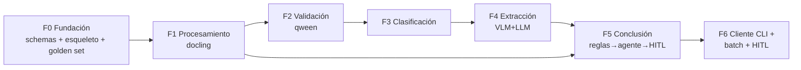
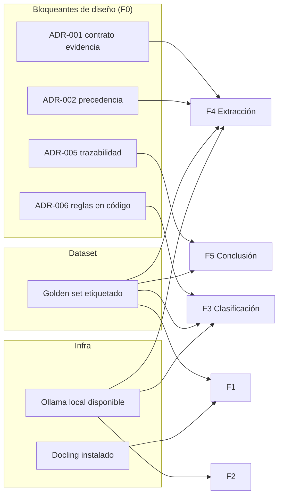
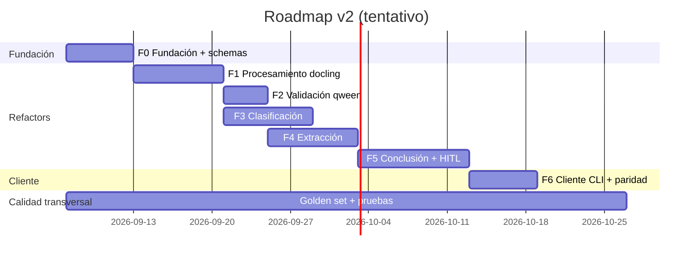

# 05 — Plan de Ejecución (PM)

> **Rol**: Project / Product Manager
> **Propósito**: backlog estructurado, fases con dependencias, priorización
> MoSCoW, estimaciones de orden de magnitud, riesgos y mitigaciones, y
> Definition of Ready / Definition of Done.
> **Enfoque**: el entregable es **librería robusta + cliente**; los 5 refactors
> (docling, qween, clasificación, extracción, conclusión) son los módulos.

---

## Seguimiento por fase

Cada fase tiene un archivo de seguimiento propio (estado, DoD, WBS tarea a
tarea y bitácora) dentro de `05-plan/`:

- [F0](05-plan/F0.md) — Fundación (schemas, esqueleto, golden set)
- [F1](05-plan/F1.md) — Procesamiento (refactor docling)
- [F2](05-plan/F2.md) — Validación (refactor qween)
- [F3](05-plan/F3.md) — Clasificación
- [F4](05-plan/F4.md) — Extracción
- [F5](05-plan/F5.md) — Conclusión + HITL
- [F6](05-plan/F6.md) — Cliente CLI/batch e integración final

---

## 1. Estrategia de entrega

Refactor **incremental por capacidad** con un **esqueleto de librería** desde el
día 1 (Fase 0) para que cada refactor aterrice en un módulo testeable. Cada fase
termina con **equivalencia verificable** contra v1 y/o contra las ideas, no con
"código movido".

> Las flechas indican **dependencia principal**; en la práctica hay solapamiento
> de diseño (p. ej. el contrato de evidencia de F0 condiciona F3, F4 y F5).

---

## 2. WBS / Fases con entregables y dependencias

### Fase 0 — Fundación (esqueleto, contratos, dataset)

| ID | Tarea | Depende de | Épica |
|----|-------|-----------|-------|
| T-001 | Definir y congelar schemas de evidencia (pydantic) | — | E-LIB-2 |
| T-002 | Crear esqueleto de paquete `src/` + `pyproject` + CI básico | T-001 | E-LIB |
| T-003 | Resolver ADR-001/002/005/006/007 (workshop) | T-001 | — |
| T-004 | Curar **golden set inicial** desde `files/` (≥ N casos etiquetados por tipo) | — | E-CONC / calidad |
| T-005 | Configuración centralizada (settings + env) y `OllamaClient` con retry/diagnóstico | T-002 | E-LIB-3 |
| T-006 | Adaptador Docling encapsulado | T-002 | E-DOC |

**Salida de F0**: paquete instalable con schemas validados, cliente Ollama
robusto y golden set de referencia.

### Fase 1 — Procesamiento (refactor docling)

| ID | Tarea | Depende de | Épica |
|----|-------|-----------|-------|
| T-101 | Detector de tipo de entrada + rutas por formato (pdf texto/escaneado, img, office, txt/csv/log/html/md) | T-006 | E-DOC-1 |
| T-102 | Gate de procesabilidad (imagen) + clasificador de imagen | T-101 | E-DOC-2 |
| T-103 | Preprocesamiento (perspectiva, calidad, binarización) y orientación | T-102 | E-DOC-2 |
| T-104 | Selección de motor OCR/VLM + exportador ordenado por posición | T-103 | E-DOC-2/3 |
| T-105 | Paridad funcional con `ocr_documents.py`/`run.py`/`run_raw.py` (mismo .md) | T-104 | E-DOC |

**DoD de F1**: procesar los formatos de las ideas produce Markdown ordenado
equivalente o superior a v1, con gate y elección de motor; cubierto por tests de
formato sobre golden set.

### Fase 2 — Validación (refactor qween)

| ID | Tarea | Depende de | Épica |
|----|-------|-----------|-------|
| T-201 | `preparar_vista_rapida` (thumbnail/calidad baja) | T-005 | E-QWE-1 |
| T-202 | Decisión binaria "¿es comprobante?" con prompt corto (3 salidas) | T-201 | E-QWE-1 |
| T-203 | `preparar_vista_revision` (indeterminado) y `preparar_vista_fiel` | T-202 | E-QWE-2 |
| T-204 | Tests: ahorro de costo (no extraer no-comprobantes) y calidad distinta | T-203 | E-QWE |

**DoD de F2**: el gate clasifica comprobante/no/indeterminado sobre el golden
set con métrica acordada; los no-comprobantes no llegan a extracción.

### Fase 3 — Clasificación

| ID | Tarea | Depende de | Épica |
|----|-------|-----------|-------|
| T-301 | Migrar R1-R7 del prompt WIP a motor de reglas en código | T-003 (ADR-006) | E-CLAS-1 |
| T-302 | Reescribir `11.1` para devolver **evidencia** (VLM recuadro + LLM texto) | T-301 | E-CLAS-1 |
| T-303 | Reglas raw por fuente + candidatos descartados/restantes | T-302 | E-CLAS-1 |
| T-304 | Refactor cadena contable 01→02→03 (con contratos entre pasos) | F1 (markdown) | E-CLAS-2 |
| T-305 | Paridad con `classification_pipeline.py` y `-M 11.1` de v1 | T-303/T-304 | E-CLAS |

**DoD de F3**: la letra se decide por reglas sobre evidencia (no por el prompt);
la cadena contable reproduce v1; tests de reglas R1-R7 unitarios.

### Fase 4 — Extracción (refactor extracción)

| ID | Tarea | Depende de | Épica |
|----|-------|-----------|-------|
| T-401 | Flujo VLM y flujo LLM en paralelo devolviendo `SourceEvidence` | T-001 (schemas) | E-EXT-1 |
| T-402 | Normalización key-value (CUIT, fechas, montos, ítems) reutilizando reglas de prompts 10/11/kvi/kvg | T-401 | E-EXT-3 |
| T-403 | Reglas raw por fuente (pasada 1) | T-401 | E-EXT-2 |
| T-404 | Combinación de evidencia con resolución por campo (precedencia ADR-002) | T-403 | E-EXT-1 |
| T-405 | Paridad con `extraction_pipeline.py` (10/11) y `document_extraction.py` (kvi/kvg) | T-402 | E-EXT |

**DoD de F4**: dos flujos siempre en paralelo con evidencia trazable; paridad de
extracción con v1 en campos normalizados sobre golden set.

### Fase 5 — Conclusión (refactor conclusión) y HITL

| ID | Tarea | Depende de | Épica |
|----|-------|-----------|-------|
| T-501 | Reglas cruzadas sobre evidencia combinada (negocio + fast-fail + conflicto R7) | T-404 | E-CONC-1 |
| T-502 | Detección de gaps + búsqueda de evidencia adicional con límite (hook ARCA) | T-501 | E-CONC-2 |
| T-503 | Consolidación "certeza alta por programa" | T-501 | E-CONC-1 |
| T-504 | Escalado a agente IA (candidatos restantes) + blindaje post-agente | T-502 | E-CONC-3 |
| T-505 | Cola HITL (revisión obligatoria baja + muestreo auditoría alta) + registro de correcciones | T-503/T-504 | E-CONC-4 |
| T-506 | Trazabilidad completa `CaseRecord` persistida (sidecar + índice) | T-503 | E-CONC-5 |
| T-507 | Métricas: % certeza alta, % agente, % rechazado, acuerdo VLM/LLM | T-506 | E-LIB-5 |

**DoD de F5**: el pipeline concluye con certeza/origen correctos; todo caso tiene
`CaseRecord`; el muestreo de alta y la cola de baja funcionan y registran
feedback.

### Fase 6 — Cliente (CLI/batch) e integración final

| ID | Tarea | Depende de | Épica |
|----|-------|-----------|-------|
| T-601 | CLI `voucherflow` con subcomandos (process/validate/classify/extract/run/batch/ask/arca/case/hitl) | F1-F5 | E-CLI |
| T-602 | Modo batch con workers, checkpoints y política de enfriamiento (ADR-010) | T-601 | E-CLI-1/3 |
| T-603 | Sidecars con trazabilidad y salida agregada | T-601 | E-CLI-2 |
| T-604 | Mapa de paridad v1→v2 verificado sobre carpetas reales de `files/` | F1-F5 | E-CLI |
| T-605 | Documentación de usuario + README v2 | T-601 | — |
| T-606 | API HTTP (fase 2, no bloqueante para MVP) | T-601 | — |

**DoD de F6**: los comandos de v1 tienen equivalente en v2 con resultados
comparables (o mejores) sobre una muestra acordada de `files/`; documentación
lista.

---

## 3. Dependencias críticas (resumen)

**Riesgo de dependencia**: si los ADR-001/002/006 no se resuelven al inicio, las
fases 3/4/5 se rediseñan sobre la marcha (ver R-01).

---

## 4. Priorización MoSCoW

| Prioridad | Épicas / tareas | Justificación |
|-----------|-----------------|---------------|
| **Must (MVP)** | E-LIB (schemas, config, modelos), E-DOC, E-QWE, E-CLAS-1 (tipo/letra), E-CLAS-2 (contable), E-EXT, E-CONC-1/2/3/4/5, E-CLI-1/2 | Son los 5 refactors + librería + cliente declarados en el readme v2. Sin esto no hay entregable. |
| **Should** | E-CLI-3 (enfriamiento/retries avanzados), ARCA online (T-502 activado), tasa de muestreo auditoría 100% configurable, API HTTP básica | Mejoran robustez/auditoría; pueden diferirse una iteración. |
| **Could** | Dashboard HITL gráfico, índice SQLite completo, feedback loop automático reglas→prompts, API HTTP completa, QA por zonas en comprobantes complejos | Valor alto pero no crítico para el MVP. |
| **Won't (ahora)** | Multi-idioma/otros países, fine-tuning de modelos, multi-tenant cloud, migración de todo el histórico | Fuera de alcance del MVP (ver `01-vision-alcance.md` §5.2). |

---

## 5. Estimaciones (orden de magnitud, en días-hombre)

> ±30%. Asume 1 persona full-stack (o reparto equivalente). No incluye
> definición de reglas con negocio ni curación masiva de dataset.

| Fase | Alcance | Est. (dh) | Optimista | Pesimista |
|------|---------|-----------|-----------|-----------|
| F0 | Fundación, schemas, golden set inicial | 6 | 4 | 10 |
| F1 | Procesamiento (docling adaptativo) | 8 | 6 | 12 |
| F2 | Validación (qween doble paso) | 4 | 3 | 6 |
| F3 | Clasificación (tipo/letra reglas + contable) | 8 | 6 | 12 |
| F4 | Extracción (VLM+LLM + evidencia) | 8 | 6 | 12 |
| F5 | Conclusión + HITL + trazabilidad | 10 | 7 | 15 |
| F6 | Cliente CLI/batch + paridad + docs | 6 | 4 | 9 |
| **Total MVP** | | **≈ 50 dh** | ≈ 36 | ≈ 76 |
| Buffer de calidad/pruebas | 15-20% | +8-10 | | |
| **Total con buffer** | | **≈ 58-60 dh** | | |

**Hitos tentativos** (calendario, trabajo continuo 5 dh/semana):

---

## 6. Riesgos y mitigaciones

| ID | Riesgo | Prob. | Impacto | Mitigación |
|----|--------|-------|---------|------------|
| R-01 | ADR-001/002/006 no resueltos a tiempo ⇒ rediseño de extracción/clasificación/conclusión | Alta | Alto | Workshop de decisión en F0; ADRs *propuestos* ya redactados (04) para acelerar; congelar contrato con criterio de cambio |
| R-02 | Migración de prompts (`11.1`, kvi/kvg, 10/11) degrada la calidad de extracción actual | Media | Alto | Golden set + comparación de paridad v1 vs v2 por fase; rollback por prompt versionado |
| R-03 | Reglas R1-R7 en código difieren de la casuística real (falsos positivos de "certeza alta") | Media | Alto | ADR-004 muestreo de auditoría + feedback; comenzar con tasa de muestreo 10% |
| R-04 | Modelos locales (Ollama) no disponibles o lentos; 429/errores de conexión | Media | Medio | `OllamaClient` con reintentos/backoff, timeout y mensajes claros; tests con mock |
| R-05 | Sobrecalentamiento del dispositivo en lotes largos (documentado en `my_prompt.md`) | Media | Medio | ADR-010 política de enfriamiento (cuenta al detener todos los workers); worker por proceso |
| R-06 | Golden set insuficiente o sesgado ⇒ métricas poco confiables | Media | Alto | Curar muestras por tipo/letra/formato desde `files/`; separar train/validación de reglas vs. evaluación |
| R-07 | Alcance creep (agregar UI, más formatos, API completa) durante el MVP | Media | Medio | MoSCoW explícito; "Won't now" en 01 §5.2; backlog separado post-MVP |
| R-08 | Acoplamiento heredado v1 (imports entre scripts, paths) dificulta extraer módulos | Alta | Medio | Esqueleto + adaptadores desde F0; mover lógica en vez de copiar; tests de humo por módulo |
| R-09 | El "agente IA" escala casos de más; carga HITL alta | Media | Medio | Métricas de % agente; feedback para codificar reglas; cola priorizada |
| R-10 | Dependencia de ARCA/WSCDC (credenciales, disponibilidad) si se activa | Baja | Medio | ADR-003: hook opcional, no bloquea MVP; `.env` y manejo de errores |

---

## 7. Definition of Ready (DoR) — por historia

Una historia/tarea está *Ready* cuando:

1. Tiene criterios de aceptación Gherkin verificables (ver `02`).
2. Se identificó su épica, módulo de la librería y dependencias de ADR resueltas.
3. Se definió el contrato de datos de entrada/salida afectado (schema de
   evidencia si aplica).
4. Cuenta con al menos 1 caso de golden set (o caso de prueba) para validarla.
5. Está estimada (orden de magnitud) y no excede el tamaño de iteración.
6. Se conocen los puntos de integración (dónde se enchufa en el pipeline).

---

## 8. Definition of Done (DoD) — por historia

Una historia está *Done* cuando:

1. El código está en el módulo correcto de la librería (sin acoplamiento a scripts v1).
2. Pasa tests unitarios del módulo + tests de integración del pipeline.
3. Cumple los criterios de aceptación Gherkin de la historia.
4. La **paridad o mejora** contra v1 quedó verificada sobre el golden set (cuando
   aplica al refactor).
5. La trazabilidad del caso registra prompts/modelos/reglas/decisión.
6. No introduce errores de lint/type-check y no rompe la API pública existente.
7. Documentación mínima actualizada (README/ADR si cambia una decisión).

### DoD transversal de fase (calidad)

Cada fase termina con: golden set actualizado, métricas de la fase reportadas
(ver `06`) y sin deuda técnica bloqueante conocida para la siguiente.

---

## 9. Recomendaciones de secuencia para el equipo

1. **Empezar por F0** (schemas + esqueleto + golden set) y **cerrar ADR-001/002/005/006/007** antes de codificar F3/F4/F5.
2. **Orden sugerido de refactors** por dependencia de datos: docling (F1) → qween (F2) → extracción (F4) → clasificación (F3) → conclusión (F5). Nota: F3 y F4 pueden ir en paralelo si hay 2 personas (ambas dependen de F1/F0).
3. **Paridad con v1 como criterio de salida de cada fase**: si un refactor no
   reproduce (o supera) el comportamiento actual sobre el golden set, no se da
   por terminado.
4. **Mantener el pipeline de v1 operativo** hasta que F6 confirme la paridad en
   carpetas reales; luego se declara el corte.
5. **Registrar ADRs** a medida que se cierran decisiones (estado *aceptado*) para
   que quede el rastro de por qué se hizo cada cosa.

---

## 10. Enlaces

- Alcance/objetivos: [`01-vision-alcance.md`](01-vision-alcance.md)
- Historias con criterios: [`02-epicas-historias-usuario.md`](02-epicas-historias-usuario.md)
- Arquitectura: [`03-arquitectura-solucion.md`](03-arquitectura-solucion.md)
- Decisiones/ADRs: [`04-decisiones-abiertas-adr.md`](04-decisiones-abiertas-adr.md)
- Calidad: [`06-estrategia-calidad.md`](06-estrategia-calidad.md)
