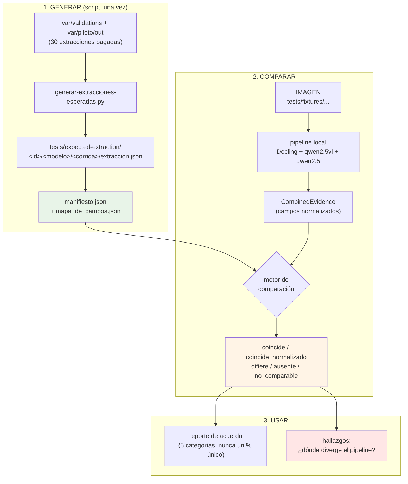

# 07 — Extracciones esperadas (dataset de referencia de lectura)

> **Documento**: especificación del artefacto `tests/expected-extraction/`
> **Rol**: BA (qué y por qué) + SA (cómo) + QA (cómo se verifica)
> **Fecha**: 2026-09-14 · **Estado**: 🟡 **Nivel A + B implementados** — corrido con el piso declarado (`--sustituir-llm`: el rol `llm` no está instalado, §12)
> **Complementa**: [`06-estrategia-calidad.md`](06-estrategia-calidad.md) §3 (golden set)
> **Versión**: v0.4 — implementado según §10. Ver el historial abajo.
>
> ### Historial de versiones
>
> | v | Cambio |
> |---|---|
> | v0.1 | Borrador. |
> | v0.2 | **5 de 28 CUIT de la referencia tienen el DV inválido** (§2.3) → pasó de 2 a 3 tiers y de 5 a 7 estados. Medido: **la referencia no es reproducible** (§2.4). |
> | v0.3 | **Decisiones cerradas** (§11) · **D-6 = no implementar el auto-chequeo** → vuelve a 5 estados, sin partición y sin marca (⛔ deuda declarada) · estructura `<id>/<modelo>/<corrida>` justificada por §2.4. |
> | v0.4 | **Implementado** (§12). §2.2 corregido: la presencia de `reintentos_esquema` es **por registro**, no por lote. |

> ## ✅ Estado de implementación (v0.4)
>
> | Paso (§10) | Estado |
> |---|---|
> | 2 · Copiar las 26 imágenes | ✅ hecho (`tests/fixtures/expected-extraction/`, 2,4 MB) |
> | 3 · Generador | ✅ `scripts/operacion/generar-extracciones-esperadas.py` |
> | 4 · Manifiesto + mapa + README | ✅ hecho (30 corridas, 29 documentos, 30/30 con imagen) |
> | 5 · Motor de comparación + nivel A | ✅ `src/voucherflow/llm/comparacion.py` + `tests/test_expected_extraction.py` (**46 tests**) |
> | 6 · Nivel B + reporte | ✅ `scripts/verificacion/acuerdo-extraccion.py` (ver §12) |
> | 7 · Correr y leer hallazgos | ✅ corrido **con `--sustituir-llm`** (el rol `llm` no está instalado). Hallazgos en §12.3 |
> | 8 · Docs | ✅ README raíz, `scripts/readme.md`, `06-estrategia-calidad.md` §3.5 |
>
> ⚠️ **El nivel B se corrió, pero con el piso declarado**: `qwen2.5:7b` (rol `llm`)
> **no está instalado**, así que las dos fuentes corrieron con `qwen2.5vl:3b`
> (`--sustituir-llm`). Eso **no** es el acuerdo de dos lecturas independientes: es
> un **piso medido con un modelo degradado**. Sin el piso, el pipeline resuelve
> **4 de 16 campos** (§12.1), así que se midió igual y se declara.

> ## ⚠️ Leer antes que nada
>
> **El nombre "valores esperados" es engañoso y este plan lo corrige (§1).** El
> artefacto **no** contiene la verdad: contiene la lectura de **otro modelo**, y
> esa lectura tiene errores medidos. Sirve para medir **acuerdo** y **divergencia**
> — nunca para declarar que el pipeline local es correcto.

---

## 1. Qué queremos y por qué

Hoy tenemos **30 extracciones pagadas** de `voucherflow-lab` (DeepSeek sobre el
corpus real), guardadas en `var/`. `var/` está en `.gitignore`: esas salidas
**no se versionan**, no las ve nadie más que esta máquina, y no sirven como
evidencia en un test.

El objetivo es **graduar una muestra de esas lecturas a un artefacto versionado**
que permita responder una pregunta que hoy no se puede contestar sin volver a
pagar:

> ¿El pipeline local (Docling + qwen2.5-vl + qwen2.5) lee el mismo comprobante
> **igual** que DeepSeek? ¿Y dónde **diverge**?

Y, como efecto secundario declarado por el usuario, dejar el lote como
**referencia para un entrenamiento posterior** (`my_prompt.md`).

### ⚠️ Formulación incorrecta que hay que desterrar

> ❌ *"Usar DeepSeek para crear los valores esperados, y así evaluar la **calidad**
> de la extracción local."*

Es la lectura natural del objetivo y es **incorrecta por tres motivos**, uno de
ellos medido (§2.3). Hay que decirla para matarla, porque el nombre
"valores esperados" invita exactamente a esa confusión.

| # | Por qué el acuerdo **no** es calidad |
|---|---|
| 1 | **Es circular como verdad.** Contra una referencia que es otro modelo, "coincide" significa "es parecido a DeepSeek", no "está bien". |
| 2 | **La referencia no es confiable, y hay prueba.** 5 de los 28 CUIT del dataset tienen el dígito verificador inválido (§2.3): son lecturas incorrectas, declaradas por el propio modelo. |
| 3 | **Castiga la mejora.** Si el pipeline local lee **bien** uno de esos CUIT, la comparación lo marca `difiere` — o sea, un acierto se cuenta como error. |

**Lo que sí se puede afirmar:** el dataset mide **acuerdo** y **divergencia**.
Nunca "el pipeline es correcto".

### 1.1 Cómo se usa el artefacto (el flujo completo)



⚠️ **El paso 1 corre una vez y se versiona; el paso 3 es el que tiene valor.** El
bucle de ajuste es: comparar → leer dónde diverge → cambiar el prompt o el
preprocesamiento → volver a comparar **sin volver a pagar el lab** (el artefacto
ya es local).

### 1.2 Lo que este artefacto **no** es

| | Golden set (`tests/golden/`) | **Extracciones esperadas** (esto) |
|---|---|---|
| Qué contiene | La **verdad** del negocio | La **lectura de un modelo** |
| Quién la produce | Un contador (validado por una 2ª persona) | DeepSeek, sin revisión |
| Sirve para | Medir **exactitud** | Medir **acuerdo** y detectar divergencias |
| Estado | Curado a mano | Automático |

⚠️ **La distinción no es cosmética: es la regla de honestidad del repo.** Comparar
contra una lectura de modelo **no mide si el pipeline acierta**; mide si
*coincide*. Si DeepSeek y el pipeline se equivocan igual, el acuerdo es 100 %.
Esto va escrito en el README del artefacto, no en una nota al pie — mismo criterio
que el `campos_fuera_de_paridad` de T-305/T-405: **"no comparable" no puede
leerse como "correcto"**.

### 1.3 Tres tiers de referencia (y el tier 1 quedó fuera de alcance)

Hay **tres** formas de saber si una lectura está bien, y el repo ya tenía el
concepto aplicado sin nombrarlo así:

| Tier | Quién lo emite | Qué permite | Costo | Estado |
|---|---|---|---|---|
| **1 · Auto-chequeos de código** | El **programa** (DV del CUIT, aritmética) | **Objetivo**: "esto está mal" | **$0** | ⛔ **no se implementa** (D-6) |
| **2 · Acuerdo entre modelos** | Lab ↔ pipeline | **Relativo**: divergencia | el lab ya se pagó | ✅ **este plan** |
| **3 · Etiqueta humana** | Un contador | **Absoluto**: exactitud | caro | golden, otro tier |

El tier 1 **ya existe en las dos puntas** y por eso era tentador: el lab calcula
el dígito verificador, y el evaluador **no le cree el `cierra_aritmetica` al
modelo** — lo recalcula en Python (`corrida.py:281`,
`llm/evaluador.py::verificar_aritmetica`). Ese es el precedente exacto de lo que
el tier 1 haría con el CUIT.

> ### ⛔ ALCANCE ACORDADO: el tier 1 **no se implementa ahora** (decisión D-6)
>
> **Decisión del usuario (2026-09-14)**: no se implementa el auto-chequeo por
> ahora. Queda documentado, no construido.
>
> | | |
> |---|---|
> | ✅ | El **hallazgo** de §2.3 (5 de 28 CUIT con DV inválido) sigue vigente: es una **medición con un script de una línea**, no una feature. |
> | ✅ | El aviso de §1 (medir acuerdo, no exactitud) **no depende** del auto-chequeo. |
> | ⛔ | **No** hay marca `referencia_dudosa`: los 5 CUIT malos viajan **sin marcar**. |
> | ⛔ | **No** hay estados `pipeline_dudoso` / `ambos_dudosos` (§8). |
> | ⛔ | **No** hay partición `limpio` / `ruidoso` (§8.2). |
>
> ⚠️ **Riesgo aceptado, y hay que declararlo**: si el pipeline local lee **bien**
> uno de los 5 CUIT, el reporte lo marca `difiere` y parece un error del pipeline
> cuando es una mejora. Sin auto-chequeo que lo desambigüe, la única defensa es la
> **lista concreta de los 5 casos en el README** (§2.3): quien lea un `difiere` en
> `cuit_emisor` de esos documentos consulta la lista. Es más débil que marcarlo en
> el dato, pero es honesto y cuesta cero.
>
> **Reabrir D-6 cuesta 0,3 dh** y no obliga a rehacer el artefacto: se agrega la
> marca y los estados.

### 1.4 La regla que ordenaría todo (si el tier 1 se implementara)

> Cuando un **auto-chequeo de código** puede decidir quién tiene razón, se le cree
> al código y se reporta **quién está mal**. Cuando no puede, sólo se reporta que
> **los dos difieren**, y no se declara un ganador.

⚠️ **Hoy el artefacto opera siempre en la segunda rama.** La tabla queda como
**diseño de referencia**, no como comportamiento actual: la columna "Hoy" es la
que aplica.

| Situación | Qué reportaría el diseño | **Hoy** |
|---|---|---|
| El lab falla el auto-chequeo | `referencia_dudosa`: no cuenta como acierto ni error | `difiere` (sin desambiguar) |
| El lab pasa y el pipeline no | `pipeline_dudoso` | `difiere` |
| Los dos fallan | `ambos_dudosos` | `difiere` |
| Sin auto-chequeo | `coincide` / `difiere`, sin veredicto | **igual** |

Esto evita los dos errores simétricos: **canonizar una lectura mala** como
estándar, y **reprocharle al pipeline** haber leído mejor que la referencia.
⚠️ **Los dos siguen ocurriendo hoy** (los 5 CUIT viajan sin marca). Es la deuda
que D-6 acepta conscientemente.

---

## 2. Inventario medido de lo que hay hoy

No es una estimación: es el conteo de `var/validations/` (10) + `var/piloto/out/` (20).

| | Valor |
|---|---|
| Archivos de extracción | **30** |
| Documentos únicos | **29** (1 documento está en los dos lotes: `9fa45f1d…`) |
| Modelo | `deepseek-flash` en los 30 |
| Costo total pagado | **US$ 0,1833** |
| Prompt | `mendel-validacion@1` (`modo: extraer`) |

### 2.1 Cobertura real (lo que se puede medir)

| Dimensión | Distribución | Lectura |
|---|---|---|
| `tipo_comprobante` | A ×23 · B ×1 · C ×1 · 090 ×1 · 083 ×1 · texto libre ×1 · `null` ×2 | **Muy sesgada a A.** No hay E, M, ni 099. |
| `codigo_afip` | 001 ×14 · 081 ×5 · 01 ×4 · 083 ×3 · 090 ×1 · 011 ×1 · `null` ×2 | — |
| `legibilidad` | `buena` ×30 | **Sin casos difíciles.** El corpus fue reducido a lado mayor ~1036 px, así que todas entran "legibles". |
| **DV del `cuit_emisor`** | válido ×23 · **inválido ×5** (§2.3) | **5 lecturas incorrectas**, detectables en código. La referencia no es confiable. |
| `cierra_aritmetica` (recalculado en Python) | `True` ×28 · `False` ×2 | 2 casos con la aritmética abierta: son **los más valiosos** para la comparación. |
| `reintentos_esquema` | ausente ×24 · 1 ×5 · 2 ×1 | El campo no existía en el esquema viejo (`piloto`). Hay que tolerar los dos. |

### 2.2 Los dos lotes no son homogéneos

⚠️ **Corregido al implementar (2026-09-14)**: la primera versión de este documento
decía que `var/piloto/out/` "es de un esquema anterior" y le faltaban
`reintentos_esquema` / `avisos_esquema`. **La versión por lote era inexacta.** Lo
que se midió:

| Campo | `validations` | `piloto` |
|---|---|---|
| `reintentos_esquema` | con 2 · sin 8 | **con 4 · sin 16** |
| `avisos_esquema` | con 2 · sin 8 | **con 4 · sin 16** |
| `esquema_validado` | con 10 · sin 0 | con 20 · sin 0 |

La presencia es **por registro, no por lote**: el campo se incorporó **a mitad del
lote piloto**, así que dentro del mismo lote hay registros con y sin él.

⚠️ **Consecuencia práctica (y es la lección)**: un cargador o un test que asuma
"el lote X no tiene el campo Y" **falla**, y la falla es del test, no del
artefacto. Ocurrió al implementar: el test escrito con ese supuesto falló contra
datos reales. Lo correcto es verificar **campo por campo contra el registro**.

Otro detalle medido: en el registro, `resultado` y `extraccion` son **byte a byte
idénticos**. Un test que lee el bloque equivocado no falla — lee lo mismo. El
generador fija `extraccion` como canónico (`clave_extraccion` en el manifiesto) y un
test exige que exista, para que un cambio de forma futuro no pase en silencio.

### 2.3 🔴 HALLAZGO: 5 de 28 CUIT del dataset son lectura incorrecta

**Esta es la medición que cambia el diseño del plan.** El CUIT lleva **dígito
verificador** (módulo 11 sobre los 10 primeros dígitos): se verifica en **código
puro**, sin modelo y sin contador. Corrido sobre las 30 extracciones:

| | |
|---|---|
| Documentos | 30 |
| `cuit_emisor` **completo** (11 dígitos) | **28** |
| …con dígito verificador **válido** | **23** |
| …con dígito verificador **INVÁLIDO** | **5** ← **18 % de los CUIT del dataset** |

Los cinco, con su emisor:

| CUIT (referencia) | Emisor | ¿Corregible con 1 dígito? |
|---|---|---|
| `30-62221785-4` | Diarco S.A. | **No** |
| `30586221578` | HOTEL JARDIN SRL | **No** |
| `30-71530218-5` | ROCK & FELLERS | **No** |
| `30-71144495-3` | José Genna Repuestos S.R.L. | **No** |
| `30-70715163-1` | ALESO S.R.L. - SAN LORENZO | **No** |

**Calibración del método** (para que el número sea creíble y no un artefacto del
script): 23 de 28 pasan el dígito verificador. Por azar pasaría ~1 de cada 10, así
que el algoritmo está bien y los 5 son lecturas reales malas. Se verificó además
contra CUITs conocidos.

**Que no cierren con un solo dígito es la parte importante:** se probaron las 10
posiciones × 10 dígitos con el prefijo intacto, y **ninguno** se arregla cambiando
un dígito. No son typos: es una transcripción mal leída (el modelo leyó otro
número, o pegó dígitos de un campo vecino).

**Y el lab lo sabe:** los 30 registros tienen `digito_verificador_cuit_valido`
coherente con el cálculo real → el modelo **declara** que esos 5 están mal. No es
un error oculto: es un error declarado que el plan anterior iba a canonizar.

#### Por qué esto obliga a cambiar el plan

| Si congelamos las salidas como "valores esperados" sin más… | Consecuencia |
|---|---|
| …el artefacto declara **correcto** un CUIT que no existe | Se canoniza una lectura mala como estándar |
| …el pipeline local lee **bien** ese CUIT | Se marca `difiere`: **un acierto se cuenta como error** |
| …el reporte promedia todo en "X % de acuerdo" | Los 5 casos envenenan la métrica y el motivo queda invisible |

⇒ Es exactamente el escenario del motivo 3 de §1: la comparación **castiga la
mejora**. De ahí las tres capas de §1.1 y la regla de §1.2.

#### ⛔ Y con D-6 = no implementar el auto-chequeo, estos 5 viajan **sin marcar**

Decisión del usuario (2026-09-14). Consecuencia concreta y aceptada:

| | |
|---|---|
| El dato | Los 5 CUIT inválidos quedan en `extraccion.json` **igual que los 23 válidos**: nada en el artefacto los distingue. |
| El reporte | Un `difiere` en `cuit_emisor` de esos 5 documentos **no se desambigua**. |
| La mitigación | La **lista concreta de arriba** va al README del artefacto. Es más débil que marcarlo en el dato (exige que el lector la consulte), pero cuesta cero y es honesta. |

⚠️ **El script de generación NO los marca** (sería implementar el auto-chequeo por
la puerta de atrás). Puede, como máximo, **contarlos** y declararlos en su salida
— misma distinción que el repo ya hace entre *declarar* y *decidir*.

### 2.4 🔴 La referencia no es reproducible: dos corridas del mismo modelo difieren

**Medido con el único caso que permite medirlo.** `9fa45f1d-f6ad-4cea-b585-432aa3b39dad`
es el único documento extraído **dos veces por el MISMO modelo** (`deepseek-flash`),
y está en los dos lotes por casualidad. Comparando las dos corridas:

| | Corrida 1 (`piloto`, 15:41) | Corrida 2 (`validations`, 17:05) |
|---|---|---|
| `completion_tokens` | 2.241 | **4.179** (1,9x) |
| `costo_usd` | US$ 0,002766 | **US$ 0,005092** (**1,8x**) |
| Campos del contrato que difieren | **0** | — |
| `observaciones` (prosa) | difiere | difiere |
| `rubro_emisor` (texto libre) | `"…(gas oil INFINIA DIESEL, factur…"` | `"…(YPF - INFINIA DIESEL)"` |
| `cantidad_comensales_personas` | `0` | `None` |

**Lectura del resultado, y es tranquilizadora donde importa:**

- ✅ **Los 23 campos estructurados del esquema coinciden exactamente** (mismo
  `cuit_emisor`, mismo `importe_total: 100000.01`, mismo `tipo_comprobante: A`,
  misma aritmética: cierra con diferencia `-0.0`). **La conclusión del documento
  no se mueve.**
- ⚠️ **Lo que cambia es la prosa** (`observaciones`, `rubro_emisor`) y **cuánto
  razona el modelo** (2.241 vs 4.179 tokens de completion).

⚠️ **Esto ya estaba documentado en el repo, y con más amplitud**: cuatro corridas
de la misma imagen dieron completion **528 / 3.346 / 8.999 / 12.632** — **10x de
dispersión** (memoria del repo, 2026-09-14). Causa: el *thinking mode* de DeepSeek
emite tokens de razonamiento invisibles que se facturan como `completion_tokens`.

#### Por qué esto importa para este plan

| Consecuencia | Detalle |
|---|---|
| **1. El acuerdo se mide sobre los campos estructurados, no sobre la prosa.** | `observaciones` y `rubro_emisor` **no pueden** entrar en el cálculo de acuerdo: el mismo modelo consigo mismo no coincide en ellos. Si entraran, el ruido del modelo se leería como desacuerdo de lectura. |
| **2. El costo de una corrida no es predecible** (§2, tabla de costo). | Dos corridas idénticas costaron 1,8x distinto. Proyectar "US$ 0,006/documento" es un orden de magnitud, no un presupuesto. |
| **3. Refuerza la decisión D-3.** | Ver §6.3: guardar **una** lectura por documento sería frágil, porque otra corrida del mismo modelo habría dado otro número. |

### 2.5 Los dos lotes: un solapamiento, y es el que se puede medir

| | |
|---|---|
| Documentos únicos | **29** (30 archivos) |
| Documentos en **ambos** lotes | **1** → `9fa45f1d…`, mismo modelo (§2.4) |
| Documentos con una sola corrida | 28 |

⚠️ **Con D-3 = `id/modelo/corrida`, la carpeta está preparada para n corridas, pero
hoy el dataset tiene n=1 en 28 de 29 documentos.** No conviene presentarlo como si
hubiera réplicas: la variabilidad de §2.4 se midió con **un** caso, y ese caso se
midió porque estuvo en los dos lotes **por casualidad**, no por diseño.


---

## 3. Los dos blockers medidos (esto es lo que hay que resolver)

### 3.1 🔴 Faltan las imágenes: 26 de 29 documentos no están en `tests/fixtures/`

Medido — de los 29 documentos con extracción, sólo **3** tienen su imagen
versionada:

| Documento | Dónde está | Lote |
|---|---|---|
| `2991f57d-c143-4b23-9f87-4dfb1214ef53.jpg` | `fixtures/golden/` | lab |
| `9e461da9-8f9b-44f8-a7e8-8da98c11abf4.jpg` | `fixtures/grandes/` | lab |
| `9fa45f1d-f6ad-4cea-b585-432aa3b39dad.jpg` | `fixtures/otros/` | lab + piloto |

Los otros **26** viven en `var/processed/…` (ignorado por git) o en
`var/piloto/lote/…` (hard-links a `var/files`, symlink a `~/Desktop/ibm-docling-2`).

**Consecuencia:** si sólo copiamos los JSON, el artefacto es **incompleto**: 26
extracciones no se pueden comparar con nada, porque el pipeline necesita la
imagen y la suite default no puede leer `var/`. Y la suite default **no puede
depender de `var/`**: es gitignored y en CI no existe.

**Opciones** (§11, D-1):

| | Cómo | Costo | Reproducible en CI |
|---|---|---|---|
| **A** | Copiar las 26 imágenes a `tests/fixtures/` | +~2,5 MB (las de `processed` pesan 78–125 KB) | ✅ sí |
| **B** | Versionar sólo las extracciones y marcar las 26 como `sin_imagen` | 0 MB | ⚠️ sólo 3 comparables |
| **C** | Ampliar con una corrida nueva del lab sobre documentos que **sí** están en `fixtures/` | US$ + ver §3.2 | ✅ sí |

⚠️ **Ojo con el peso medido**: las 284 imágenes de `var/processed/2025-08` y
`2025-09` suman **972 KB**; `tests/fixtures/` ya pesa **66 MB**. Copiar los 26 no
es un problema de tamaño.

⚠️ **Y hay una razón extra para copiarlas (§2.3)**: sin la imagen, los 26
documentos no se pueden comparar **ni** sirven para verificar en código si su
lectura de referencia es correcta. Un CUIT con DV inválido se detecta sobre el
JSON, pero **corregirlo o descartarlo** requiere mirar el comprobante.

> ⚠️ `tests/fixtures/**/*.md` está en `.gitignore` (línea 61). Si en algún momento
> el artefacto necesita el markdown de referencia, **no se puede** dejar ahí.

### 3.2 🔴 La comparación de tokens de imagen **no es válida**

El laboratorio registra `imagen.dimensiones` (ej. `[840, 1036]`). El pipeline
calcula sus propias dimensiones con Docling. Misma imagen → mismos píxeles →
mismos enteros.

**Pero usarlo como métrica de comparación sería un error**, por dos motivos
medidos:

1. `imagen.bytes` del lab (84.324) es el peso del **JPEG del lab**. Una fixture
   re-exportada o re-renderizada de un PDF da **los mismos píxeles y otros
   bytes** → un `difiere` que no es una divergencia de lectura.
2. `detalle` (`high`/`low`) y `tokens_estimados` son **conceptos del lab**, no
   del pipeline (OpenAI cobra por mosaicos, DeepSeek a tope fijo).

**Propuesta:** `dimensiones` se usa como **verificación de identidad** (¿la
fixture es la misma imagen?), jamás como métrica de calidad. Es exactamente el
patrón que el repo ya usa para detectar colisiones de destino en `corpus`
(memoria: *"el hash es la identidad, no el nombre"*).

### 3.3 🟠 El lab no guarda sostén (`fragmento_sustento`)

Medido: alimentando el motor de reglas del pipeline con una extracción del lab,
salen **17 debilidades por documento** del tipo *"declaró 'A' pero no citó
fragmento de sustento; la lectura no es auditable"*.

Eso **no es un hallazgo sobre la calidad de DeepSeek**: es que el lab pone la
evidencia en el campo de prosa `observaciones` (627–1 716 caracteres, con el
desglose completo: ítems, pagos, cálculos) en lugar del contrato por campo del
pipeline (ADR-001). Si la comparación pasa por `veredicto_raw_de_evidencia`,
**todas** las lecturas salen "dudosas" y la medición mide el formato, no la
lectura.

**Propuesta:** la comparación **no** evalúa sostén. Se declara explícitamente en
el reporte como `sosten_no_comparable`, y `observaciones` se preserva como dato
de contexto para revisión humana.

---

## 4. El mapeo de campos (medido, no supuesto)

El esquema del lab es **plano** y tiene **26** campos; el contrato del pipeline
(`CAMPOS_EXTRACCION`) tiene **16**. Se llaman distinto y se solapan parcialmente.

### 4.1 Mismo nombre — comparación directa (9)

`tipo_comprobante` · `razon_social_emisor` · `cuit_emisor` · `fecha_emision` ·
`moneda` · `subtotal` · `iva` · `impuestos_internos` · `otros_impuestos`

### 4.2 Mismo concepto, distinto nombre (4) — requieren un mapa declarado

| Lab | Pipeline |
|---|---|
| `nro_factura` | `nro_comprobante` |
| `importe_total` | `importe_total_facturado` |
| `no_gravado` | `monto_no_gravado` |
| `percepciones_iibb` | `percepcion_iibb` |

⚠️ **`percepciones_iibb` / `percepcion_iibb` se distinguen por un plural.** Es
justo el tipo de pareja que un renombre futuro rompe en silencio. El mapa va en
**un solo lugar** y con un test que exija que cada nombre del mapa siga existiendo
en las dos puntas (mismo criterio que `derivar_evidencia` y `_claves_reales` de
`test_env_example`).

### 4.3 El pipeline tiene y el lab no (3) — se declara `sin_contraparte`

`razon_social_receptor` · `cuit_receptor` · `descripcion`

⚠️ Los tres **existen en el lab pero dentro de `observaciones`**: en el caso
medido, el CUIT del receptor (`30-58221570-3`) y la razón social (`CUC S.A.`)
están en la prosa. **No se extraen con regex**: parsear prosa para fabricar un
"esperado" es inventar la contraparte y haría la comparación inauditable.

### 4.4 El lab tiene y el pipeline no (13) — se declara `fuera_del_contrato`

`legibilidad` · `codigo_afip` · `digito_verificador_cuit_valido` · `exento` ·
`discrimina_impuestos` · `cierra_aritmetica` · `rubro_emisor` ·
`categoria_gasto_sugerida` · `cantidad_comensales_personas` · `cantidad_litros` ·
`centro_de_costo` · `campos_no_legibles` · `observaciones`

La mayoría son **decisiones** que el pipeline resuelve en otra etapa a propósito
(ADR-001: `categoria_gasto` y `centro_de_costo` son de F3/F5, no de extracción).

⚠️ **Pero tres de estos son los auto-chequeos del tier 1 (§1.1), y son lo más
valioso del artefacto — aunque D-6 decidió NO implementarlos ahora.** No se
comparan *contra* el pipeline (el pipeline no emite esos campos): se usarían para
**juzgar la referencia** y para validar los campos que sí se comparan.

| Campo del lab | Cómo se usaría (⛔ no implementado, D-6) |
|---|---|
| `digito_verificador_cuit_valido` | Auto-chequeo del tier 1. Juzgaría si el `cuit_emisor` de la referencia es creíble (§2.3). Sería la entrada del estado `referencia_dudosa`. |
| `cierra_aritmetica` | Auto-chequeo de los importes. ⚠️ Se compararía contra `verificar_aritmetica()` del pipeline; **nunca** contra el `cierra_aritmetica` que el pipeline le devuelve al modelo (a ese no se le cree, por diseño). |
| `exento` / `no_gravado` | Contra los componentes de `COMPONENTES_DEL_TOTAL`. ⚠️ `exento` **no tiene contraparte** en `CAMPOS_EXTRACCION` (la extracción no lo pide), así que sólo entraría en el auto-chequeo aritmético, no en la comparación campo a campo. |

⚠️ **Lo que sí queda en vigor hoy**: los valores de esos campos se **versionan
igual** dentro de `extraccion.json` (son parte de la lectura del lab, y borrarlos
perdería información recuperable). Simplemente **no se interpretan**: se guardan
como dato crudo, no como veredicto.

⚠️ `campo_no_legible` merece trato especial: ver §5.3.

### 4.5 Guard de integridad (no negociable)

**Cada** campo de las dos puntas tiene que estar en exactamente una lista:
`comparables` / `comparables_por_mapa` / `sin_contraparte` / `fuera_del_contrato`
/ `auto_chequeo` (los tres de §4.4, **versionados pero no interpretados** con
D-6 = no implementar).

Un test lo exige. Sin ese guard, un campo nuevo desaparece de la medición **en
silencio** y el reporte parece cubrir todo el contrato sin cubrirlo. Es el mismo
guard que F4/T-405 ya tiene y que valió la pena: ahí destapó que
`razon_social_receptor` no tenía contraparte en los prompts de referencia.

⚠️ **La dirección que D-6 debilita**: el guard ya no exige que un campo
comparable tenga auto-chequeo disponible. Es coherente con no implementarlo, pero
significa que el guard **no protege** contra "un campo puede estar mal y nadie lo
detecta". Cuando se implemente D-6, agregar esa segunda dirección.

---

## 5. Normalización: qué se compara y cómo

### 5.1 Los valores vienen en espacios distintos

**Medido, y es el punto más delicado del diseño.** El lab devuelve el valor ya
interpretado; el pipeline espera el valor **tal como se lee** y normaliza en
código:

| | El lab devuelve | El pipeline espera |
|---|---|---|
| Monto | `52069.85` (número JSON) | `"52.069,85"` (texto impreso) → normaliza |
| Fecha | `"29/08/2025"` | igual, pero publica `"2025-08-29"` |
| Total | `importe_total: 73122.64` | `importe_total_facturado` → `73122.64` |

Medición del round-trip sobre las 10 extracciones del lab:

| Campo | Valores que difieren del canónico |
|---|---|
| `fecha_emision` | **9 de 10** (`29/08/2025` → `2025-08-29`) |
| todos los demás (no nulos) | **0** — coinciden exactamente |

⚠️ **Conclusión: sin normalizar, el 90 % de las fechas daría un `difiere` falso.**
Y no es que el normalizador "no sirva": es que **la comparación tiene que pasar
por el normalizador del pipeline** (`normalizar_campo` / `normalizar_evidencia`),
que ya maneja las dos formas (verificado: acepta `"52.069,85"` y `52069.85`).

**Propuesta:** se compara el **valor canónico de las dos puntas**. Nunca string
contra string.

### 5.2 Los `null` no se descartan

Medido: hay **19 valores `null`** en las 10 extracciones del lab.

Un `null` en el lab es una **declaración** ("no lo pude leer"), y en el caso
medido está acompañado de `campos_no_legibles: ["cuit_emisor", "domicilio_emisor", …]`.
Descartar los `null` antes de comparar borraría la diferencia más interesante que
hay en el dataset: **una punta dice "no lo leí" y la otra dice un valor** (o al
revés).

**Propuesta:** los `null` entran en la comparación como `ausente`, que es un
estado distinto de `difiere` y de `no_comparable`. La regla del repo ya lo dice
("un valor no normalizable conserva el crudo; *no normalizable* ≠ *ausente*").

### 5.3 `campos_no_legibles` cruza los dos mundos

El lab declara en prosa qué campos no pudo leer. El pipeline los reporta en
`campos_ausentes`. Son comparables **como conjuntos**, y la divergencia es
información de primera calidad:

| Lab | Pipeline | Lectura |
|---|---|---|
| `cuit_emisor` en `campos_no_legibles` | `cuit_emisor` en `campos_ausentes` | **Acuerdo**: los dos dicen "no está". |
| `cuit_emisor` en `campos_no_legibles` | `cuit_emisor` con valor | El pipeline **leyó más** que DeepSeek. |
| `null` sin declarar | `cuit_emisor` en `campos_ausentes` | DeepSeek **omitió declarar** la ilegibilidad (peor práctica, no peor lectura). |

**Propuesta:** `campos_no_legibles` se compara, pero en su propia tabla, porque
mide **honestidad al declarar**, no capacidad de lectura.

---

## 6. Estructura del artefacto (decidida)

> ✅ **Decisiones cerradas**: D-2 = `tests/expected-extraction/` · D-3 =
> `<id>/<modelo>/<corrida>/` · D-5 = regenerable con script versionado.

```text
tests/expected-extraction/
  README.md                       # qué es, qué mide, qué NO mide (§1, §8) + los 5 CUIT
  manifiesto.json                 # índice + procedencia + cobertura declarada
  mapa_de_campos.json             # el mapa de §4 (única fuente de verdad)
  <documento-id>/                 # = sha256 del archivo (identificador_de_archivo)
    <modelo>/                     # ej. deepseek-flash · gemini-2.5-flash · qwen2.5vl
      <corrida>/                  # ej. 20260914T170509Z
        extraccion.json           # la lectura, tal cual salió del lab
```

### 6.1 `manifiesto.json` — qué declara

Una entrada **por corrida** (no por documento), que es lo que la estructura de
§6.3 permite:

| Clave | Para qué |
|---|---|
| `documento_id` | El id (= sha256 del archivo, mismo criterio que `identificador_de_archivo`) |
| `archivo` | Nombre del archivo, para aparearlo con la fixture |
| `imagen_en_fixtures` | Ruta relativa o `null` si no está (el bloqueante §3.1, **en el dato**, no en un comentario) |
| `dimensiones` | Para la verificación de identidad de §3.2 |
| **`modelo`** | `deepseek-flash` (hoy); nivel 2 de la ruta |
| **`corrida`** | Timestamp UTC normalizado; nivel 3 de la ruta |
| `fuente_lote` | `validations` o `piloto` (los lotes no son homogéneos, §2.2) |
| `version_prompt` · `modo` | Procedencia |
| `costo_usd` · `uso` | Trazabilidad del gasto ⚠️ ver aviso abajo |
| `extraido_utc` | Cuándo |

⚠️ **`precios_usd_1m` y `costo_usd` se guardan como cita histórica**, marcados
como tal: si se versionan como dato vivo, un cambio de tarifa hace que el
artefacto "mienta" sobre lo que costó. Y por §2.4 el costo **no es proyectable**:
dos corridas idénticas difirieron 1,8x.

### 6.2 Qué se guarda: ¿crudo o normalizado?

**Decidido: crudo, y se normaliza en el test.**

| | Guardar normalizado | **Guardar crudo** (decidido) |
|---|---|---|
| Fidelidad para entrenamiento | ❌ se pierde la forma original | ✅ es lo que el modelo escribió |
| Riesgo de segunda verdad | 🔴 alto: dos copias que pueden divergir | ✅ ninguna |
| Normalización | a mano, una vez | **la del pipeline**, en cada corrida |

Guardar una versión normalizada a mano crearía un "esperado" que **no lo dijo el
modelo**: si el normalizador del pipeline mejora, el artefacto quedaría con la
normalización vieja y la comparación mediría la divergencia entre dos
normalizadores en vez de entre dos modelos. Es el mismo razonamiento que el
`_json_ejemplo` de `prompt_extraccion` (se genera, no se escribe a mano, "para
que el ejemplo impreso y el contrato validado no puedan divergir").

### 6.3 Por qué `<modelo>/<corrida>` (y no la carpeta plana que había antes)

⚠️ **Esta decisión dejó de ser una comodidad y pasó a estar justificada por lo
medido en §2.4.**

| Razón | Detalle |
|---|---|
| **El dataset está ampliando el eje `modelo`** (D-1 = copiar y, si se quiere cobertura fiscal, correr otros modelos). Con carpeta plana, agregar Gemini daría un nombre como `9fa45f1d…-gemini.json` y el mapeo pasaría a vivir en el nombre del archivo. | El nombre del archivo no es un contrato: nadie lo valida. La ruta sí (un test puede exigir `id/modelo/corrida`). |
| **La corrida tiene que ser distinguible, y es el hallazgo de §2.4.** | El mismo modelo, sobre el mismo documento, produce lecturas distintas (prosa) y cuesta 1,8x distinto. Sin el nivel `corrida`, dos lecturas del mismo modelo **se pisan** silenciosamente. |
| **El costo del nivel extra es cero.** | Son 30 archivos; el nivel de anidado no agrega peso ni complejidad de código. |
| **Habilita medir el ruido del propio modelo.** | Con ≥2 corridas del mismo modelo se puede separar *"el pipeline difiere de la referencia"* de *"la referencia no coincide consigo misma"*. Hoy hay 1 caso (§2.4); la estructura lo permite sin migrar nada. |

⚠️ **El nombre de la corrida**: usar un timestamp **normalizado y ordenable**
(`20260914T170509Z`, del `procesado_utc` del registro) y no la hora local. Un
nombre con `:` o con espacio rompe en Windows y en algunas herramientas; y la
hora local cambia con la máquina. `procesado_utc` ya es UTC.

⚠️ **Qué NO se puede deducir de la ruta**: el `prompt_hash`. Dos corridas del
mismo modelo pueden haber usado **prompts distintos** (el prompt es editable, y
el lab guarda `prompt_hash`). Por eso `version_prompt` y `prompt_hash` van en el
manifiesto, y un test debe exigir que **todo** lo que el reporte necesita para
interpretar una lectura esté declarado ahí — la ruta no es el único lugar donde
vive el contexto.

### 6.4 El script de generación (D-5 = regenerable)

**Decidido: se versiona un script que regenera el artefacto.**

⚠️ **"Regenerable" tiene un límite que hay que escribir en el README**, porque
no es obvio: el script puede **re-extraer** desde `var/` lo que ya está ahí, pero
**no puede recuperar** una lectura que `var/` ya no tenga. Y `var/` está en
`.gitignore` y se puede borrar. Consecuencia: si alguien borra `var/`, el
artefacto versionado sigue siendo la única copia de esas 30 lecturas — que es
justamente el motivo por el que se gradúa al repo.

| El script hace | El script **no** hace |
|---|---|
| Leer `var/` y copiar las lecturas al artefacto | Volver a llamar a la API (eso es correr el lab, y se paga) |
| Calcular el manifiesto (incluida la cobertura: qué quedó sin imagen) | Decidir qué modelos o qué corpus |
| Normalizar el timestamp de la corrida | Reescribir una lectura ya versionada |

⚠️ **No puede ser a mano**: copiar 30 JSON a mano garantiza que el manifiesto y
la carpeta diverjan. Y el script **declara en su salida** los documentos que
quedaron sin imagen — el mismo patrón que `corpus/lectura.py` cuando destapó que
264 PDF desaparecían en silencio (memoria del repo: *"en un barrido de carpeta lo
que no matchea desaparece"*).

⚠️ **Re-ejecutarlo no debe ser destructivo**: si una corrida ya está en el
artefacto, el script la respeta (no la pisa). Un regenerado que sobreescribe
borraría la única copia de una lectura cuyo original ya no está en `var/`.

---

## 7. Cómo se compara (dos niveles, como el resto del repo)

### Nivel A — suite default (sin Ollama, sin Docling, sin red)

Compara **lógica pura**, igual que `scripts/verificacion/etapa-extraccion.py`:

1. **Integridad del artefacto**: manifiesto ↔ carpeta ↔ documento; cada campo de
   cada punta en una lista de §4.5; el mapa de nombres existe en las dos puntas;
   **toda entrada del manifiesto tiene su `extraccion.json` y viceversa** (que una
   corrida no quede huérfana en disco sin declarar).
2. **Estructura de la ruta** (§6.3): cada lectura vive en `<id>/<modelo>/<corrida>/`
   y los tres niveles coinciden con lo declarado en el manifiesto. Es el test que
   hace que la ruta sea un contrato y no una convención.
3. **Normalización**: los valores canónicos del lab coinciden con el canónico del
   pipeline (el caso de la fecha, §5.1).
4. **Comparación** contra una `CombinedEvidence` **sintética** (construida en el
   test desde la lectura del lab). Verifica el motor de comparación, no la lectura.
5. **Round-trip**: `normalizar(leer(esperado)) == normalizar(pipeline)` para los
   campos comparables.
6. **Cobertura declarada**: todo documento sin fixture está listado como
   `sin_imagen` (que el silencio no se lea como cobertura).

⛔ **El test de auto-chequeo NO va** (D-6 = no implementar). Cuando se implemente,
es un paso más acá: fijar por test que los 5 CUIT de §2.3 sigan marcados, para que
un regenerado del artefacto no **pierda** la marca y vuelva a canonizarlos.

⚠️ **El punto 2 reemplaza a un test que no existe en ningún otro lugar del
repo**: hoy nada verifica que la ruta de un artefacto de datos sea coherente con
su índice. Es barato y es exactamente donde un regenerado manual introduciría el
error.

### Nivel B — verificación manual / `@pytest.mark.integration` (con Ollama)

Corre el pipeline **de verdad** sobre las fixtures y produce el reporte de
acuerdo. Es el único nivel que responde la pregunta de §1.

⚠️ **Bloqueante medido:** `modelos.llm` es `qwen2.5:7b` y **no está instalado** en
esta máquina (los instalados son `qwen2.5vl:3b`, `smollm2`, `deepseek-r1`).

⚠️ **Y no alcanza con «correr con el VLM en las dos fuentes», que es lo que esta
sección proponía**: medido, **no sube la cobertura** (el pipeline resuelve 4 de 16
campos igual, §12.1) y destapa lecturas inválidas — el mismo modelo forzado al modo
texto razona peor. Por eso el script **se niega a correr** sin el rol `llm`, y el
sustituto (`--sustituir-llm`) es una **bandera explícita** cuyo resultado es un
**piso declarado**, no «el acuerdo del pipeline».

| Nivel | Herramienta | Requiere |
|---|---|---|
| A | `tests/test_expected_extraction.py` (**46 tests**) | nada |
| B | `scripts/verificacion/acuerdo-extraccion.py` | Ollama + modelos (⚠️ el rol `llm` es obligatorio) |

---

## 8. El reporte de acuerdo: cómo se lee un resultado

Campo por campo, con **cinco** estados (⛔ con D-6 = no implementar el
auto-chequeo, no hay estados de "dudoso": ver el diseño completo en §1.2):

| Estado | Significa |
|---|---|
| `coincide` | Los dos leyeron lo mismo. |
| `coincide_normalizado` | Lo mismo tras normalizar (ej. la fecha). **Se cuenta aparte**: dice que los dos leyeron, con otra forma. |
| `difiere` | Valores distintos. **El hallazgo.** ⚠️ Sin auto-chequeo, el reporte **no sabe** si la diferencia es un error del pipeline o de la referencia (§1.2). |
| `ausente` | Una o las dos puntas no lo leyeron (`null` / `campos_ausentes`). |
| `no_comparable` | Sin contraparte, fuera del contrato, o sin sostén (§3.3). |

⚠️ **Lo que cambia por no tener auto-chequeo**: `difiere` vuelve a ser un estado
**ciego**. Antes de D-6, un `difiere` en `cuit_emisor` de uno de los 5 documentos
de §2.3 se reportaba como `referencia_dudosa` (o sea: "casi seguro el error es de
la referencia"). Ahora se reporta `difiere`, y la única forma de saber quién tiene
razón es mirar la lista de §2.3 a mano. **Es deuda aceptada, y va declarada en el
reporte** — no escondida.

### 8.1 Qué campos entran en el acuerdo (el ruido del modelo, §2.4)

⚠️ **No todos los campos pueden medir acuerdo.** Medido: el mismo modelo, sobre el
mismo documento, produce `observaciones` y `rubro_emisor` **distintos** entre dos
corridas idénticas. Si entraran en el cálculo, el ruido del modelo se leería como
desacuerdo de lectura.

| Grupo de campos | ¿Entra en el acuerdo? | Por qué |
|---|---|---|
| Los 13 **estructurados** del contrato (`cuit_emisor`, `importe_total_facturado`, `fecha_emision`, …) | ✅ **Sí** | Coincidieron **exactamente** en las dos corridas del mismo modelo (§2.4): son estables. |
| `observaciones` (prosa del lab) | ❌ **No** | Diferente entre dos corridas idénticas. |
| `rubro_emisor` (texto libre) | ❌ **No** | Ídem. |
| `descripcion` | ⚠️ **Con reserva** | Es texto libre en las dos puntas: puede diferir por forma. Se cuenta aparte, como `coincide_normalizado` o `no_comparable`. |

⚠️ **El costo de dejar la prosa afuera**: se pierde la comparación más rica (el
lab explica *qué* leyó en `observaciones`, y ahí está el detalle que el contrato
no captura: ítems, pagos, comprobantes asociados). Es el precio de no medir ruido.
Se preserva igual en el artefacto para revisión humana, pero **no puntúa**.

### 8.2 Por qué NO hay partición `limpio` / `ruidoso`

El diseño anterior partía el dataset por el resultado de los auto-chequeos. Con
D-6 = no implementar, **esa partición no existe** (no hay con qué calcularla).

⚠️ Lo que se pierde: no se puede decir "sobre los 23 documentos limpios, el
acuerdo fue X". Cualquier número de acuerdo que se reporte se calcula sobre los
**30**, incluidos los 5 de §2.3 — y por eso el reporte **nunca** publica un único
"% de acuerdo" (§8.3). Si se implementa D-6, la partición se agrega sin migrar
nada.

### 8.3 Lo que el reporte publica (y lo que no)

| ✅ Publica | ⛔ No publica |
|---|---|
| Las cinco categorías, campo por campo y por documento | Un único "% de acuerdo" |
| La lista de los 5 documentos con CUIT sospechoso (§2.3) | Un veredicto de quién tiene razón |
| El número de casos sin fixture (`sin_imagen`) | Proyecciones al corpus completo |
| La dispersión de costo, si hay ≥2 corridas del mismo modelo (§2.4) | Un costo promedio por documento |

⚠️ **"Nunca un único % de acuerdo" no es una preferencia estética**: con 5 de 28
CUIT malos en la referencia y 23 de 30 documentos siendo facturas A, ese número
sería simultáneamente **optimista** (la referencia comparte errores con cualquier
modelo que lea parecido) y **opaco** (no dice qué campo falla). Es el mismo
criterio que el README de `tests/golden/F4/`: una diferencia se **explica** o se
**declara**, nunca se promedia.

### Lo que explica una diferencia (y no es una regresión)

| Diferencia | Por qué **no** es una regresión |
|---|---|
| `tipo_comprobante` A vs `090` | Son vocabularios distintos a propósito: el lab acepta los códigos de tique; el motor R1-R7 de F3 los deja fuera por D-13. Comparar contra la **letra final** mezcla lectura con decisión. |
| `tipo_comprobante` `null` vs `INTERNACIONAL` | Los artefactos anteriores al **2026-09-15** no tienen la marca: el lab ahora la emite para un comprobante de un proveedor de otro país (una `INVOICE` sin letra AFIP), y la referencia lo dejaba en `null`. No es una regresión de la lectura: es un valor que antes no existía. |
| `moneda` `null` vs `"ARS"` | El pipeline **no asume** `ARS` sin indicio explícito: inventar la moneda sería peor que no leerla. |
| `descripcion` | Texto libre en las dos puntas; §8.1. |
| `observaciones` · `rubro_emisor` | **No entran en el acuerdo**: el mismo modelo no coincide consigo mismo (§2.4). |
| Campos de decisión | Fuera por ADR-001. No es un desacuerdo. |
| `cuit_emisor` en los 5 de §2.3 | ⚠️ **Puede ser un acierto del pipeline**, no un error. La referencia tiene esas 5 lecturas malas. |

### Honestidad de alcance (va en el reporte, arriba)

1. **No mide exactitud.** Mide acuerdo entre dos modelos (§1).
2. **La referencia tiene errores medidos**: 5 de 28 CUIT con DV inválido (§2.3).
   Y **no están marcados en el dato** (D-6): el reporte los lista aparte para que
   quien lea un `difiere` en `cuit_emisor` sepa dónde mirar.
3. **La referencia no es reproducible**: dos corridas del mismo modelo difieren en
   prosa y costaron 1,8x distinto (§2.4). Los campos que sí se comparan son
   estables, pero el resto no.
4. **El corpus está sesgado**: 23 de 30 son facturas A, todas `legibilidad: buena`,
   ninguna rotada ni borrosa (§2.1). **No se puede extrapolar** a "el pipeline
   lee el corpus".
5. **Un solo caso tiene réplica** (§2.5): la variabilidad de §2.4 se midió con n=1,
   no como estudio.
6. **La referencia es DeepSeek, y tiene errores conocidos de comportamiento**: en
   el caso medido declaró `cuit_emisor: null` correctamente (tapado por cinta) pero
   en otra corrida de la misma imagen **confundió emisor con receptor** (memoria
   del repo: `--esfuerzo none`). Un desacuerdo puede ser un error **de la
   referencia**.

---

## 9. Qué se toca si esto avanza

> ✅ Alcance cerrado por las decisiones de §11. **Ninguna línea de `src/` se toca.**

| Archivo | Cambio |
|---|---|
| `tests/expected-extraction/**` | **Nuevo**: el artefacto, con la estructura `<id>/<modelo>/<corrida>/` de §6. |
| `scripts/operacion/generar-extracciones-esperadas.py` | **Nuevo**: el generador + regenerador (D-5). Va en `operacion/` porque **prepara datos**, no verifica una etapa (mismo criterio que `generar-fixtures-negativos.py`). |
| `tests/test_expected_extraction.py` | **Nuevo**: nivel A (§7). |
| `tests/fixtures/**` | **Nuevo**: las **26 imágenes** faltantes (D-1 = copiarlas). ⚠️ Conservar el subdirectorio de procedencia (`grandes/`, `otros/`, `golden/`) para no romper `manifest.json` ni `casos.csv`. |
| `tests/fixtures/manifest.json` | ⚠️ **Decidir**: las 26 nuevas ¿entran al manifiesto de fixtures o se declaran solo en el de `expected-extraction`? Recomiendo lo segundo (son dos artefactos distintos), con un test que verifique que las dos listas no se contradicen. |
| `scripts/verificacion/acuerdo-extraccion.py` | **Nuevo**: nivel B (§7). |
| `README.md` (§ Documentación) | Mencionar el dataset y **su límite** (no mide exactitud). |
| `docs/plan/06-estrategia-calidad.md` §3 | Nota: el golden (contador, tier 3) y esto (tier 2) son **tiers distintos**. |
| `scripts/readme.md` | Fila del generador nuevo. |
| `.gitignore` | ⚠️ Verificar que `tests/expected-extraction/**/*.json` **no** caiga en una regla existente (⚠️ ya existe `tests/fixtures/**/*.md`, línea 61: **no** poner el artefacto bajo `fixtures/`). |

**No se toca**: `var/`, el lab, el pipeline, ni `extraction/key_value.py` (D-6: el
DV no se implementa, así que `cuit_completo()` queda **exactamente** como está).

---

## 10. Plan de ejecución (alcance acordado)

| # | Paso | Salida | Est. |
|---|---|---|---|
| 1 | ~~Cerrar §11~~ ✅ **hecho** (2026-09-14) | decisiones | — |
| 2 | Copiar las **26 imágenes** faltantes a `tests/fixtures/` (D-1) | fixtures | 0,3 dh |
| 3 | Generador: leer `var/`, armar `id/modelo/corrida`, escribir manifiesto | script + artefacto | 0,8 dh |
| 4 | `mapa_de_campos.json` + `README.md` (con los 5 CUIT y los límites) | artefacto | 0,3 dh |
| 5 | Motor de comparación + nivel A | tests | 0,6 dh |
| 6 | Nivel B + reporte (5 categorías, §8.3) | script | 0,5 dh |
| 7 | Correr nivel B y **leer los hallazgos** | reporte | 0,3 dh |
| 8 | Docs (§9) | docs | 0,2 dh |

**Total ≈ 3,0 dh** (el generador subió de 0,5 a 0,8: ahora hace el anidado de §6.3
y la normalización del timestamp de corrida, no solo copiar).

⛔ **Sin el paso de auto-chequeos** (D-6): la estimación original era 2,8 dh con él.

### 10.1 Qué NO hay que hacer (para que no se cuele por la puerta de atrás)

| ⛔ | Por qué |
|---|---|
| **No** marcar los 5 CUIT en el manifiesto | Sería implementar el auto-chequeo, que D-6 dejó fuera. El generador puede **contarlos** y declararlos en su salida, nada más. |
| **No** tocar `extraction/key_value.py` | `cuit_completo()` documenta que **no** valida el DV a propósito, y hay un test que lo fija (`test_no_valida_el_digito_verificador`). Es correcto: la extracción no rechaza lecturas (el padrón es la autoridad). |
| **No** publicar un "% de acuerdo" único | §8.3: con 5 de 28 CUIT malos en la referencia, ese número sería optimista y opaco a la vez. |
| **No** hacer la copia de JSON a mano | El manifiesto y la carpeta divergirían. Es lo que el script existe para evitar. |

### 10.2 Si se amplía el dataset con corridas nuevas (D-1, opción abierta)

⚠️ **D-1 quedó resuelto como "copiarlas", pero eso cubre el dataset actual.** Si en
el futuro se corre el lab sobre documentos nuevos, la regla de aceptación
sugerida (ℹ️ **propuesta, no decidida**) es mirar el DV **antes** de aceptar:

| Chequeo | Qué haría |
|---|---|
| DV del `cuit_emisor` inválido | La lectura se sospecha mala: revisar la imagen antes de aceptarla como referencia. |
| Aritmética abierta | **Sí se acepta**: una aritmética que no cierra es material valioso (señala un importe mal leído). |

En el dataset actual esto significa que **5 de 30 no se habrían aceptado** sin
revisión. ⚠️ **Es un chequeo manual en el momento de generar, no código** (D-6).

---

## 11. Decisiones (✅ resueltas 2026-09-14)

| # | Decisión | Resuelto |
|---|---|---|
| **D-1** | Las 26 imágenes que faltan (§3.1) | ✅ **Copiarlas** a `tests/fixtures/` (~2,5 MB) → 29/29 comparables y la suite puede correr el nivel B. |
| **D-2** | Nombre de la carpeta | ✅ **`tests/expected-extraction/`** (no `test/expected-extration/`: `tests/` es el directorio real y `extration` un typo). |
| **D-3** | Un documento o un lote por archivo | ✅ **`<id>/<modelo>/<corrida>/`** — justificado por §2.4 y desarrollado en §6.3. |
| **D-4** | ¿Comparar también el markdown / OCR? | ✅ **No por ahora.** El lab no produce markdown: lee la imagen directo. Sería otro artefacto y otro plan. |
| **D-5** | ¿Congelado o regenerable? | ✅ **Regenerable con script versionado** (§6.4). ⚠️ Con el límite escrito: no recupera lo que `var/` ya no tenga. |
| **D-6** | Auto-chequeo del dígito verificador | ✅ **No se implementa por ahora** (§1.1). ⚠️ Deuda aceptada: los 5 CUIT viajan **sin marcar** (§2.3) y `difiere` queda ciego. |

### Consecuencias que hay que tener presentes

| ⚠️ | Detalle |
|---|---|
| **D-6 deja un hueco real** | Un `difiere` en `cuit_emisor` puede ser un **acierto** del pipeline. Mitigado solo por la lista del README. |
| **Reabrir D-6 es barato** | 0,3 dh (paso 4 original). No obliga a rehacer el artefacto: se agrega la marca y los estados. |
| **D-3 pide contexto en el manifiesto** | La ruta guarda `id`/`modelo`/`corrida`, pero **no** el `prompt_hash`. Dos corridas del mismo modelo pueden haber usado prompts distintos (§6.3). |
| **D-5 no es un respaldo** | El script regenera desde `var/`; si `var/` se borra, el artefacto versionado es la **única** copia (§6.4). |
| **D-1 suma ~2,5 MB** | Sobre los 66 MB de `tests/fixtures/`: irrelevante. |

### Nota sobre el nombre (D-2)

⚠️ **"esperadas" se lee como "correctas", y 5 de los 28 CUIT no lo son** (§2.3).
Se conserva `expected-extraction` por ser el nombre pedido, **a condición** de que
el README del artefacto abra con el aviso de §1 y la lista concreta de los 5 casos.
Si más adelante el nombre genera confusión en la práctica, la alternativa es
`tests/lecturas-de-referencia/`, que no promete que la referencia sea la verdad.

---

## 12. Nivel B implementado y corrido (2026-09-14)

### 12.1 🔴 Hallazgo previo: sin el rol `llm` el pipeline resuelve **4 de 16 campos**

Medido antes de correr nada, sobre **un** documento del artefacto:

| Configuración | Campos en la combinación | Lecturas descartadas por inválidas | Fuentes |
|---|---|---|---|
| `llm` = `qwen2.5:7b` (rol roto, **no instalado**) | **4 de 16** | 0 | solo `vlm` |
| `llm` = `qwen2.5vl:3b` (sustituto) | **4 de 16** | **6** | `vlm` + `llm` |

**Consecuencia de diseño:** el script **se niega a correr** sin el rol `llm`. Un
reporte en ese estado mediría la **ausencia de un modelo**, no la lectura — el
mismo error que este plan combate al prohibir el «% único de acuerdo». Publicarlo
habría sido peor que no medir.

⚠️ **Y el sustituto NO es un equivalente**: medido en un documento, **no sube la
cobertura** (4 campos igual) y además **destapa 6 lecturas inválidas** — el mismo
modelo, forzado al modo texto, razona peor. (En la corrida de 3 documentos fueron
**8** en total.) Por eso el sustituto exige la bandera `--sustituir-llm` y el
reporte lo declara arriba.

### 12.2 Lo que se agregó al nivel B

| Agregado | Por qué |
|---|---|
| **`ausente` separado por causa** (`ninguna` / `solo_referencia` / `solo_pipeline`) | Sumarlos confunde «los dos acordan que no está» con «el pipeline no llegó a leerlo». La causa se deriva de los **valores**, no del texto de la `nota`: retocar una redacción no puede cambiar los números en silencio. |
| **`--sustituir-llm`** con el aviso de que las dos fuentes son el mismo modelo | La salida declarada del bloqueante, sin disfrazarla de medición completa. |
| **Bloque de contexto de la corrida** (modelos, sustituto, workers) | Un reporte hecho con el sustituto no puede leerse como si fuera el pipeline completo. |
| **`--workers` ahora paraleliza de verdad** | Estaba declarado y **no leído** (el `_medir` recibía el número como si fuera un límite de hilos). ⚠️ Y la ganancia está **medida**: 2 documentos **55,8 s → 46,1 s (1,2x)**, porque **Ollama serializa la inferencia**. |
| **8 tests de la lógica del reporte** (`TestNivelBClasificacionDeAusentes`, `TestNivelBPreflight`) | El script es el único que necesita servicios reales, pero su clasificación y su preflight son puros. Se cargan por `importlib`, sin ejecutar `main`. |

### 12.3 Hallazgos de la corrida (⚠️ piso, con el sustituto)

Reporte crudo: `var/acuerdo-extraccion.json` (gitignored). **30/30 corridas**
medidas, 0 no medibles, `--workers 2`, `--sustituir-llm`.

| Estado | N |
|---|---|
| `coincide` | 25 |
| `coincide_normalizado` | **0** |
| `difiere` | 58 |
| `ausente` | 307 |
| `no_comparable` | 60 |
| **campos comparables** | **83** |

⚠️ **`coincide_normalizado` = 0 es un dato, no un detalle.** El plan §5.1 midió que
**9 de 10 fechas** necesitarían normalizarse; en la corrida no hubo **ni una**. La
lectura: **la mayoría de los campos ni llegaron a compararse** (299 `ausente` son
`solo_referencia`), y **no queda documentado el caso que el motor existe para
resolver**. Que ese contador sea 0 no valida ni invalida el normalizador: dice que
este piso no lo ejercitó.

⚠️ **La lectura honesta del piso**: **299 de 307 `ausente` son `solo_referencia`** —
la referencia leyó el campo y el pipeline no. Eso **no** mide la calidad de la
lectura (el modelo textual está degradado): mide **cuánto falta** para poder
medirla. Y el desglose por causa es justamente lo que evita leer ese 307 como «los
dos acordaron que no está».

⚠️ **Otra señal de la degradación del sustituto**: **122 lecturas descartadas por
inválidas** y **25 de 29 documentos donde las dos fuentes del pipeline no
coinciden**. Con un rol `llm` sano, la fuente textual debería coincidir con la
visual en la mayoría de los campos.

Los tres campos que concentran **los 58 `difiere`**:

| Campo | Casos | Qué es |
|---|---|---|
| `tipo_comprobante` | **28 de 30** | ⚠️ **Mezcla dos cosas**: vocabularios distintos a propósito (el lab acepta códigos de tique 083/090; R1-R7 los deja fuera por D-13) **y** desacuerdo **dentro** del pipeline (VLM `TICKET DE VENTA` vs. LLM `FACTURA` en el mismo documento). El propio reporte declara que **no puede distinguir cuál aplica**. |
| `razon_social_emisor` | **20 de 30** | Texto libre: las dos puntas transcriben distinta porción del rótulo (`LUIS LARUMBE S.R.L. (PUMA - RUTA 18)` vs. `PUMA - RUTA 18`; `José Genna…` vs. `JOSE GEMNA…`). **No hay normalizador** que lo salve: exigiría distancia de edición, que el plan no contempla. |
| `cuit_emisor` | **10 de 30** | 🔴 **Uno es un defecto del pipeline** (§12.4); **8 son errores de lectura reales** (abajo). |

#### Los 10 `cuit_emisor`: barrido del tier 1 (§1.3) sobre las dos puntas

⚠️ **Esto es un análisis, no una feature**: D-6 dejó el auto-chequeo fuera de
alcance, así que nada de esto está en el código ni marca el dato. Se calculó a
mano, con el mismo módulo 11 del generador, para poder decir **quién tiene razón**.

| Documento | Referencia | Pipeline | Referencia | Pipeline |
|---|---|---|---|---|
| `14f76410` | `30-71144495-3` | **`0005`** | DV inválido | **NO-CUIT (4 díg.)** |
| `4293c2ff` | `30586221578` | **`CU.LI.`** | DV inválido | **NO-CUIT (0 díg.)** |
| `7259b2ac` | `30-70715163-1` | `3058219705` | DV inválido | NO-CUIT (10 díg.) |
| `5263d096` | `30-70719828-8` | `30-70719826-8` | ok | DV inválido (un dígito cambiado) |
| `8fc6425d` | `20060443204` | `20064433204` | ok | DV inválido (un dígito) |
| `da93d57e` | `30711946140` | `30532215703` | ok | DV inválido (**dos** dígitos) |
| `55b39d02` | `30-51808998-2` | `30-5180998-2` | ok | NO-CUIT (10 díg.) |
| `bacd76fe` | `30-63700712-9` | `0928215763` | ok | NO-CUIT (10 díg.) |
| `cfde829a` | `30-70941587-1` | `30582215703` | ok | **ok — los dos válidos y distintos** |
| `d44551e5` | `20-06044320-4` | `20060443204` | ok | ok (⚠️ **mismo dato, otra forma**: §12.5) |

| Resumen | |
|---|---|
| Referencia con DV inválido | **3 / 10** (los tres ya conocidos de §2.3) |
| Pipeline con DV inválido | **3 / 10** |
| Pipeline con **una lectura que no puede ser un CUIT** (≠ 11 dígitos) | **5 / 10** |
| Mismo dato, otra forma (falso `difiere`) | **1 / 10** |
| Los dos válidos y distintos (desacuerdo real, sin ganador) | **1 / 10** |

⚠️ **Lo que esto significa para el reporte**: el `difiere` de `cuit_emisor` **no se
lee igual en los 10 casos**. En 3 la referencia está mal (y el pipeline puede estar
mejor); en 5 el pipeline publicó algo que no es un CUIT; en 1 no hay desacuerdo de
fondo. **Hoy el reporte los presenta idénticos**, y es exactamente el escenario que
§1.3 anticipó: `difiere` queda **ciego**.

### 12.4 🔴 Caso `14f76410`: el pipeline publica una advertencia y consolida el valor igual

| | |
|---|---|
| Valor **crudo** que leyó el VLM | `'0005 - 00013948'` |
| Sostén declarado | «Encabezado superior derecho con el CUIT del emisor» |
| Valor **publicado** | **`'0005'`** |
| Estado en la combinación | **válido** (no se descartó; `fuente=vlm`, `PREC_1`) |

**Qué es en realidad**: `0005 - 00013948` es el **punto de venta + número de
comprobante**, no un CUIT (11 dígitos). El modelo se equivocó de campo.

⚠️ **Corrección al diagnóstico fácil**: **no es cierto que «nada lo frenó»**. El
pipeline **sí lo detectó** y lo dejó registrado:

```
'avisos_normalizacion': ['quedó 4 dígitos, no los 11 del CUIT completo
  (NN-NNNNNNNN-N); el OCR pudo truncar o pegar el campo siguiente — se corta
  como pide la regla 2b de el crudo y se conserva lo leído (T-402)']
'meta['raw_valida']: False   ·   'raw_gravedad': 'invalida'
```

| ✅ Lo que ya existe | 🔴 Lo que el caso muestra |
|---|---|
| El normalizador **cuenta los 11 dígitos** y avisa (`debilidad=True`) que quedó con 4. | El aviso queda **dentro de `meta`** de la lectura de una fuente. |
| El veredicto raw marcó esa lectura como **inválida**. | Aun así, **`campo.valor` se consolidó como `'0005'`** con `fuente=vlm`, y el `difiere` del reporte es lo único que lo expone. |

⇒ El dato **no viaja limpio**, pero **tampoco hay una alerta de caso**: el aviso vive
donde un consumidor del veredicto (F5, el CLI, la API) no lo mira. **La pregunta que
abre este caso no es «¿por qué nadie avisó?», sino «¿por qué un aviso que existe no
bloquea la publicación del valor?»**.

⚠️ **No se corrige acá**: D-6 dejó el auto-chequeo fuera de alcance y §10.1 prohíbe
reintroducirlo por la puerta de atrás. **Pero este caso es más fuerte que los 5 CUIT
de §2.3**: aquellos son lecturas *de la referencia* que el pipeline puede leer
mejor; **este es el pipeline publicando un valor que no puede ser un CUIT,
teniendo la advertencia en la mano**.

| Opción | Costo | Qué implicaría |
|---|---|---|
| Reabrir D-6 (auto-chequeo del DV) | 0,3 dh | Detecta **este** caso y los de §2.3. Mejor relación costo/beneficio. |
| **Ascender el aviso que ya existe** a alerta del caso | **bajo** | No hace falta lógica nueva: el aviso `debilidad=True` ya se emite. Solo hay que **decidir quién lo lee**, en vez de dejarlo en `meta`. Es la opción más barata y la que el caso pide. |
| Rechazar `cuit_emisor` con < 11 dígitos | bajo | Chequeo **estructural** (no de DV): más débil, pero agarraría este caso sin tabla de referencia. |
| Declararlo y no tocarlo | 0 | Honesto, pero el próximo comprobante con un `cuit_emisor` basura vuelve a pasar. |

⚠️ **Evidencia de que no es un artefacto del sustituto**: el valor crudo y el sostén
son del **VLM**, la fuente que sí está en su rol correcto.

### 12.5 🔴 Hallazgo en el motor de comparación: el CUIT no se compara normalizado

El caso `d44551e5` reporta `difiere` con **el mismo dato en otra forma**:

| | |
|---|---|
| Referencia | `20-06044320-4` |
| Pipeline | `20060443204` |
| Dígitos | **idénticos** |

⚠️ **Es un falso `difiere`, y contradice la promesa del módulo.** `comparacion.py`
abre su docstring diciendo que «se compara el **valor canónico de las dos puntas**»,
y §5.1 midió que sin normalizar el 90 % de las fechas daría un `difiere` falso. Para
`fecha_emision` funciona:

```
normalizar_referencia({'fecha_emision': '29/08/2025'})  →  {'fecha_emision': '2025-08-29'}  ✅
```

Pero para `cuit_emisor` **no normaliza los guiones**, y el pipeline sí los publica:

| Entrada | `normalizar_campo` (el pipeline) | `normalizar_referencia` (la comparación) |
|---|---|---|
| `20-06044320-4` | `20-06044320-4` | `20-06044320-4` |
| `20060443204` | `20060443204` | `20060443204` |

⇒ `'20-06044320-4' != '20060443204'` y sale `difiere`, aunque los 11 dígitos sean
los mismos.

⚠️ **La causa no es un normalizador «apagado»: son dos preguntas distintas que hoy
comparten una sola regla.** `NORM_CUIT` **conserva los guiones tal como se
leyeron**, y eso es **deliberado**: la regla 2b del sistema anterior toma los
caracteres que pertenecen al número y no inventa formato, para que la lectura sea
auditable. Lo dice el propio módulo:

```python
cuit_completo(valor):  # «Solo cuenta dígitos (los guiones son formato)»
```

O sea: **el pipeline publica `20060443204` o `20-06044320-4` según cómo lo leyó, y
las dos son correctas.** El artefacto conserva lo mismo del lado de la referencia
(`20060443204` en `8fc6425d`, `30711946140` en `da93d57e` también sin guiones).

⇒ **El defecto está en la comparación, no en la extracción**: `_equivalente()`
compara los dos strings literalmente, y para **identidad** de un CUIT el formato es
basura. Se está usando la regla de la *lectura* (preservar lo leído) para responder
la pregunta de la *comparación* («¿es el mismo CUIT?»). Para las fechas no pasa
porque `NORM_FECHA` **sí** cambia la forma a ISO; para los CUIT, por diseño, no.

| Corregir | Costo | Efecto medido |
|---|---|---|
| Dar a la comparación un **canon de identidad** para los campos numéricos (dígitos, sin formato), en vez de reutilizar la regla de la extracción | bajo | Este caso pasa de `difiere` a `coincide_normalizado`. ⚠️ **Y haría que `coincide_normalizado` deje de ser 0**: el contador pasaría a documentar el caso que el motor existe para resolver. |

⚠️ **No se corrige acá**: el alcance de esta tarea era **implementar y correr** el
nivel B. Cambiar el motor de comparación (41 tests, contrato del artefacto) merece
su propia tarea, con el test de frontera que fije el caso de los guiones. **Queda
declarado como el hallazgo que más barato se arregla, y el único que es un defecto
del código de la comparación** (los otros son hallazgos sobre las lecturas).

### 12.6 Lo que el piso **no** dejó medir

| Quedó sin medir | Por qué |
|---|---|
| El acuerdo VLM↔LLM real | Las dos fuentes fueron el mismo modelo. ⚠️ Y en **25 de 29** documentos **no coincidieron entre sí**: con el modelo textual degradado, ese número mide el sustituto, no el pipeline. |
| El caso que la normalización existe para resolver | `coincide_normalizado` = 0 (§12.3). |
| La lectura "buena" del pipeline | 299 de 307 `ausente` son `solo_referencia`: casi no hay campos comparables. |

**Lo que sí quedó medido y es accionable**: un `cuit_emisor` basura que se consolida
con la advertencia en la mano (§12.4), un falso `difiere` por formato (§12.5), y el
barrido del tier 1 sobre los 10 CUIT (§12.3), que muestra que **el `difiere` de ese
campo no se lee igual en los 10 casos**.

---

## 13. Enlaces

- [`06-estrategia-calidad.md`](06-estrategia-calidad.md) §3 — golden set (el tier 3).
- [`tests/golden/F4/README.md`](../../tests/golden/F4/README.md) — el precedente de
  "qué explica una diferencia": el criterio que este plan reutiliza.
- [`docs/laboratorio-llm.md`](../laboratorio-llm.md) — el lab que produce las salidas.
- [`manual/user/llm.md`](../../manual/user/llm.md) — la guía del lab.
- `src/voucherflow/extraction/prompt_extraccion.py` — `CAMPOS_EXTRACCION` (el contrato).
- `src/voucherflow/extraction/key_value.py` — los normalizadores (§5.1) y
  `cuit_completo()` (⚠️ **cuenta 11 dígitos, no valida el DV**: es correcto, no
  cambiarlo — ver §10.1).
- `src/voucherflow/llm/evaluador.py` — `COMPONENTES_DEL_TOTAL` y
  `verificar_aritmetica` (el precedente del tier 1: **al modelo no se le cree el
  `cierra_aritmetica`, se recalcula en código**).
- `src/voucherflow/llm/corrida.py` — línea 281: dónde se sobrescribe el
  `cierra_aritmetica` del modelo con el recalculado.
