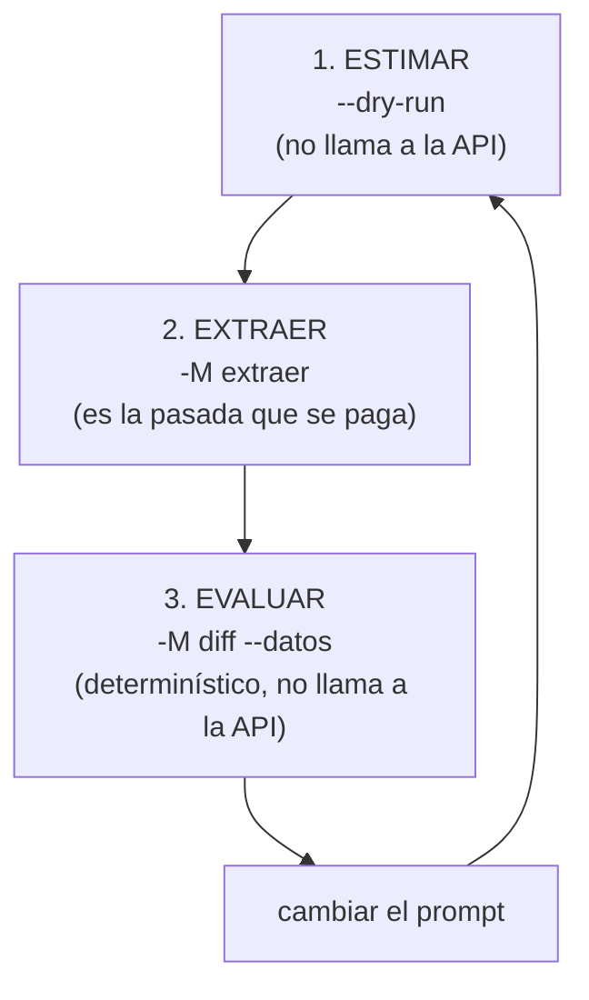

# `voucherflow-lab` — leer comprobantes con modelos externos

Extrae los datos de un comprobante y **evalúa el prompt** contra lo que el
empleado cargó en Mendel, usando modelos externos (OpenAI, DeepSeek, Gemini).

```bash
voucherflow-lab <ruta|carpeta>... [opciones]
```

Es un **laboratorio**, no el pipeline: `voucherflow run` procesa con Ollama
local; acá se prueba el prompt con modelos más potentes, se mide su calidad y se
decide qué vale la pena llevar al pipeline.

> ### Nota de uso previsto
>
> **Este utilitario es la vara con la que vamos a medir la calidad del run que
> estamos trabajando.** El procedimiento es: correr el lote, comparar las lecturas
> contra la verdad de negocio con `-M diff --datos`, y leer los números del
> resumen (estados, aritmética que cierra y cuántos fallaron).
>
> Dos propiedades hacen que sirva como vara:
>
> - **Mide en código, no con la opinión del modelo.** Las 15 reglas del evaluador
>   están implementadas en Python: la comparación de importes, CUIT y fechas no se
>   le pregunta al LLM. Es determinístico y repetible sobre el mismo lote.
> - **Medir no gasta.** El `diff` es local: se puede correr cuantas veces haga
>   falta sobre una extracción ya pagada, sin volver a llamar a la API.
>
> ⚠️ **Dos límites que conviene tener presentes al usarlo como vara:**
>
> - **Sin datos cargados no hay calidad que medir.** `-M extraer` solo transcribe;
>   para juzgar si una lectura está bien hace falta contra qué compararla
>   (`--datos`). Sin eso, el único control automático es la aritmética del
>   comprobante y la legibilidad declarada.
> - **La vara es tan buena como los datos.** Si la carga de Mendel tiene un error,
>   el informe va a marcar una discrepancia que es de la carga, no de la lectura.
>   Ante una discrepancia, la primera duda es cuál de las dos puntas está mal.
>
> Para el detalle de qué mide cada operación, ver [Evaluar sin gastar](#evaluar-sin-gastar)
> y [La aritmética no la hace el modelo](#la-aritmetica-no-la-hace-el-modelo).

La ayuda de la terminal es la fuente más actualizada:

```bash
voucherflow-lab --help
```

---

## Cuándo usarlo

| Situación | Conviene |
|---|---|
| Ajustar el prompt del control de comprobantes | **Sí.** Es su motivo. |
| Medir la calidad de un modelo sobre comprobantes reales | **Sí.** Contra los datos cargados, no contra una impresión. |
| Procesar el corpus en producción | **No.** Para eso está `voucherflow run` (Ollama local). |
| Bajar el peso de las imágenes antes de mandarlas | Antes: `voucherflow <corpus>` (ver `corpus.md`). |

⚠️ **Esto gasta dinero.** Cada corrida de `extraer` o `validar` llama a una API
paga; cada reintento por formato del JSON se paga también. Por eso el flujo
empieza midiendo (`--dry-run`) y el comando guarda el costo de cada documento.

---

## El ciclo de ajuste



El paso 3 es el que hace que el ciclo tenga sentido: mide **contra la verdad de
negocio** y sin volver a gastar. Sin él, «el prompt mejoró» es una impresión.

---

## Empezá siempre midiendo

```bash
voucherflow-lab var/processed --dry-run
```

No llama a la API ni escribe nada: estima el costo del lote completo.

```
archivos          : 3542
tokens por archivo: entrada ≈ 2,769 (texto+esquema) + 1,024 de imagen (deepseek) | salida ≈ 240
tokens totales    : entrada 13,434,182 | salida 850,080
COSTO ESTIMADO    : US$ 40.1400   (≈ US$ 0.0113 por comprobante)
precios usados    : US$ 0.3/1M entrada, US$ 1.2/1M salida, US$ 0.006/1M entrada-caché (deepseek-flash)
postura del precio: PICO (01:00-04:00 y 06:00-10:00 UTC, L-V) y SIN caché: es el techo; off-peak cuesta la mitad
confianza         : fórmula (3.92 car/token; medido contra la API)
```

⚠️ **El costo de la imagen depende del proveedor**, así que el número cambia con
`-p`. La línea «tokens por archivo» nombra el proveedor con el que se estimó:

| | DeepSeek | OpenAI |
|---|---|---|
| Cómo cobra | **tope fijo**: redimensiona a ~1300×1300 (y **agranda** las chicas) | **mosaicos de 512**: `85 + 170 × mosaicos` |
| Una foto 4000×3000 | 1.024 (igual que cualquier tamaño) | 765 |
| Un A4 a 300 dpi | 1.024 | **1.105** |
| Una miniatura 120×90 | 1.024 | 255 |
| `--detalle low` | 1.024 (no ahorra) | **85** (ahorra hasta 12×) |

O sea: **en DeepSeek el peso y la resolución son irrelevantes** (40 MB y 4 KB
cuestan igual); **en OpenAI manda la resolución, no los bytes** (una de 40 MB y
una de 4 MB con las mismas medidas cuestan lo mismo). Gemini se estima a tope
fijo: su capa compatible no documenta la fórmula de mosaicos ni acepta `--detalle`.

Tres cosas más que el número **declara** en vez de disimular:

- **Recorre todo el lote**, incluidas las imágenes ya procesadas. Saltear lo hecho
  es cosa de la corrida real (que reanuda); para simular el gasto total eso sería
  justamente lo que no querés. Por eso `--forzar` acá **no cambia nada** (si lo
  pasás, se avisa).
- **La postura del precio es el techo**: tarifa pico y sin caché. La corrida real
  sale igual o menos.
- **`confianza` dice de dónde salió el número**: `formula` (la proporción medida
  de caracteres por token), `historico` (calibrada con extracciones ya pagas de
  esa carpeta) o `mixta` (texto por una vía, salida por la otra). Una estimación
  nunca se presenta como una factura.

Con `--detalle-log` agrega una línea por archivo.

---

## Extraer el corpus

```bash
voucherflow-lab var/processed -M extraer -p deepseek --workers 4 \
  -o var/validations/deepseek
```

Un archivo JSON por documento, con la lectura **y su procedencia**: qué modelo,
qué prompt (hash), cuántos tokens y cuánto costó.

```
a procesar: 40 de 40  (raíz: derivada de las rutas)
  ✓ fec99960-….jpg

=== Resumen ===
archivos          : 40
  ok              : 40
  errores         : 0
tokens API        : prompt 120,680 | completion 9,840
caché de contexto : 110,240 entrada-caché | 10,440 entrada-normal (se cobran distinto)
tokens img (est.) : 40,960
costo (est.)      : US$ 0.168432
modo / modelo     : extraer / deepseek-flash
```

**Es reanudable**: lo ya hecho se saltea. Y un documento con `error` **no cuenta
como hecho** — se reintenta en la corrida siguiente. (Si contara, una corrida que
falló por red quedaría «completa» y nadie volvería a procesarla.)

El registro del fallo **sí se guarda**, con su uso de tokens. No es contradictorio
con lo anterior: se guarda para poder auditarlo —y para que el gasto de los
reintentos no se pierda— pero la reanudación lo ignora porque no es un resultado.
Sin ese archivo, un fallo de la API que consumió tokens no aparecería nunca en el
reporte de gastos.

---

## Evaluar sin gastar

```bash
voucherflow-lab var/processed -M diff --datos datos_mendel.json
```

Compara cada extracción ya guardada contra los datos cargados, con las **15
reglas de negocio implementadas en código** —no le pregunta al modelo si los
números coinciden—. Es determinístico, auditable y **no toca la red**.

Necesita la extracción previa: si no está, el documento se registra con un error
que lo dice (no se llama a la API para completarla).

| Estado | Qué significa |
|---|---|
| `OK` | Todos los campos verificables coinciden. |
| `REVISAR` | Hay discrepancias relevantes (lista cuáles). |
| `INCOMPLETO` | La imagen no permite verificar los campos clave. |

### Los datos cargados (`--datos`)

Acepta tres formas:

- **Un JSON de un documento**: si tiene alguna de las claves que lo identifican
  (`tipo_comprobante`, `importe_total_facturado`, `razon_social_emisor`,
  `nro_factura`), se aplica a **todas** las imágenes.
- **Un JSON que es un mapa** `clave → documento`.
- **Una carpeta** con un `<clave>.json` por documento.

La **clave** es cómo se apareja cada dato con su imagen: se prueba el nombre del
archivo, el de la carpeta que lo contiene (el hash del lote) y la ruta relativa
sin extensión.

---

## Elegir proveedor

```bash
voucherflow-lab --listar-proveedores
```

| | OpenAI | DeepSeek | Gemini |
|---|---|---|---|
| Endpoint | (el default del SDK) | `api.deepseek.com` | capa compatible de Google |
| Credencial | `OPENAI_API_KEY` | `DEEPSEEK_API_KEY` | `GEMINI_API_KEY` |
| Modelo por defecto | `gpt-4o` | `deepseek-flash` | `gemini-2.5-flash` |
| Impone el esquema | **sí** (`strict`) | no → valida local | no → valida local |
| Temperatura | tiene efecto | **la ignora** → se declara | tiene efecto |
| Esfuerzo | — | `none/low/high/max` | `none/minimal/low/medium/high` |
| Entrada cacheada | — | **expone** (se cobra más barato) | — |
| Costo de la imagen | **por resolución** (mosaicos) | **fijo** (no mira el tamaño) | fijo (estimado) |
| `--detalle low` | **ahorra hasta 12×** (85 tokens) | no cambia el costo | no lo acepta |

El modelo por defecto lo declara cada proveedor: si no pasás `-m`, se usa el
suyo (no el de otro proveedor, que haría estimar el costo con precios ajenos).

**Comparar modelos** es correr el mismo comando con distinto `--proveedor`:

```bash
for p in openai deepseek gemini; do
  voucherflow-lab var/processed -p $p -o var/validations/$p
  voucherflow-lab var/processed -p $p -o var/validations/$p -M diff --datos datos.json
done
```

Como el evaluador es el **mismo** para los tres, lo que se mide es la diferencia
del modelo, no la de la vara.

---

## La credencial

Se resuelve en este orden:

1. `--api-key` (explícita; **nunca** se imprime ni se guarda en la salida).
2. La variable de entorno **del proveedor elegido**.
3. El `.env`: el `./.env` del directorio de trabajo **se carga solo si existe**,
   y `--env ARCHIVO` apunta a otro (ninguno de los dos pisa lo que ya esté en el
   entorno, así podés probar otra clave sin editar el archivo).

```bash
# Con un .env en el directorio de trabajo alcanza con esto:
voucherflow-lab var/processed -p deepseek

# Otro archivo, o un .env que no está en el cwd:
voucherflow-lab var/processed --env .env.produccion -p deepseek
```

El arranque **declara qué `.env` leyó**, para que un archivo en el lugar
equivocado no se confunda con una clave inválida:

```
proveedor : deepseek
operación : extraer
prompt    : …/validacion-mendel.yaml (mendel-validacion@1)
salida    : var/validations
credencial: .env
```

Si falta, el comando sale con código `2` y un mensaje que nombra la variable que
esperaba:

```
error: falta la credencial: definí DEEPSEEK_API_KEY en el entorno o pasala con --api-key
```

⚠️ Un `--env ARCHIVO` que **no existe** sí es un error (ahí afirmaste que
estaba); el `./.env` por defecto es opcional, porque la credencial puede venir
del entorno.

⚠️ `voucherflow-lab` es la **única** herramienta que carga el `.env` por sí
misma. El resto del CLI lee el entorno del proceso:

```bash
set -a && source .env && set +a
```

---

## El prompt

El prompt **efectivo** vive en
`src/voucherflow/llm/prompts/validacion-mendel.yaml` y se edita ahí: el código lo
lee. Al lado, `validacion-mendel.md` es el **documento** que lo explica (de dónde
salió, qué decide cada regla, qué no hay que tocar) y no lo duplica: si copiara
las reglas habría dos versiones y una mentiría.

```bash
voucherflow-lab var/processed --prompt mi-prompt.yaml
```

El YAML tiene tres claves, separadas porque el código las trata distinto:

| Clave | Qué es |
|---|---|
| `system` | Las 15 reglas de negocio del dominio. |
| `user` | El pedido + el *template* del JSON con los datos cargados. |
| `ejemplo_salida` | El formato de la respuesta esperada. |

**Dos modos de armado** (no confundir con `-M`, que es la operación):

- **`validar`**: el template se usa tal cual, para comparar contra los datos.
- **`extraer`**: el cierre de comparación del `system` se reemplaza por
  instrucciones de transcripción, y el **ejemplo de salida se genera del esquema
  que valida** — así no pueden divergir. El bug original fue justo ese: el ejemplo
  del `.md` era el de comparar y el modelo lo copiaba.

Cada salida guarda el **hash del prompt efectivo** (después de adaptarlo): es lo
que permite auditar con qué prompt se generó cada lectura. Hashear el texto crudo
identificaría como iguales dos corridas que mandaron prompts distintos.

---

## Banderas

### Qué hacer

| Bandera | Qué hace |
|---|---|
| `rutas...` | Archivos y/o carpetas de imágenes (recursivo). |
| `-M, --operacion {extraer,validar,diff}` | Qué hacer (default: `extraer`). |
| `--datos ARCHIVO\|DIR` | Datos cargados. **Obligatorio** en `validar` y `diff`. |
| `--prompt ARCHIVO` | Documento del prompt (default: `validacion-mendel.yaml`). |
| `-o, --salida DIR` | Carpeta de salida (default: `var/validations`). |
| `--limite N` | Procesa solo las primeras N (`0` = todas). Útil para probar. |
| `--forzar` | Reprocesa lo ya hecho (por defecto **reanuda**). |
| `--workers N` | Concurrencia (default: `4`). |
| `--dry-run` | Estima el costo y sale, sin llamar a la API ni escribir. |
| `--detalle-log` | Una línea por archivo. |
| `--json ARCHIVO` | Escribe el resumen (o la estimación) en JSON. |
| `--listar-proveedores` | Muestra las capacidades de cada proveedor y sale. |

### Modelo y proveedor

| Bandera | Qué hace |
|---|---|
| `-p, --proveedor {deepseek,gemini,openai}` | Proveedor (default: `deepseek`). |
| `-m, --modelo MODELO` | Modelo (default: el del proveedor). |
| `--detalle {low,high,auto}` | Detalle de la imagen (default: `high`). |
| `--temperatura F` | Temperatura. Se **declara** si el proveedor la ignora. |
| `--esfuerzo NIVEL` | Esfuerzo de razonamiento (valores según proveedor). |
| `--max-tokens N` | Techo de tokens de salida (default: el del proveedor). |
| `--prompt-fiel` | Incluye siempre el ejemplo de salida del prompt, aunque el proveedor imponga el esquema (cuesta tokens: solo para comparar). |
| `--api-key CLAVE` | Credencial explícita (no se imprime). |
| `--env ARCHIVO` | `.env` con la credencial (sin pisar el entorno). Default: `./.env`, si existe. |

### Precios

Los precios **cambian** y dependen del modelo y de la cuenta: la tabla interna es
un arranque editable, y lo que entra por la línea de comandos la pisa.

| Bandera | Qué hace |
|---|---|
| `--precios LISTA` | Por modelo: `"gpt-4o=2.5/10, *=1/3"`. |
| `--precio-entrada F` | USD por 1M de entrada (aplica a todos los modelos). |
| `--precio-salida F` | USD por 1M de salida. |
| `--precio-cache F` | USD por 1M de entrada **cacheada**. |

### Reporte de gastos

| Bandera | Qué hace |
|---|---|
| `--reporte-gastos ARCHIVO.json` | Lee el histórico de la carpeta de salida, imprime el reporte y lo guarda. |
| `--csv-gastos ARCHIVO.csv` | Además, escribe un CSV por extracción. |
| `--csv-delim C` | Delimitador del CSV (default: `,`; Excel es-AR usa `;`). |
| `--csv-decimal C` | Separador decimal del CSV (default: `.`; Excel es-AR usa `,`). |
| `--tz ZONA` | Zona horaria del reporte: `local`, `UTC` o un offset como `-03:00`. |

---

## Códigos de salida

| Código | Significado |
|---|---|
| `0` | Todo bien (o no había nada que hacer). |
| `1` | Hubo **algún fallo** (una imagen ilegible o un error de la API alcanza). |
| `2` | Error de uso: falta la credencial, `--datos` faltante, bandera inválida. |
| `130` | Interrumpido con Ctrl-C. |

Detalle de los casos que más se ven:

- **Un rechazo de la API no es un fallo de uso**: se registra como error del
  documento y el código de salida es `1`.
- **`--dry-run` y `diff` salen `0`** si no hubo fallos: no gastan.
- **El reporte de gastos sale `1`** si el total es un **piso** (hay extracciones
  sin precio o con precio a medias). No es un error de ejecución: es que el número
  que muestra no es confiable.
- **Sin imágenes que procesar**: `0`, con un aviso por `stderr`.
- **Ctrl-C** (`130`): los documentos ya procesados **quedan guardados**, así que
  la corrida siguiente reanuda desde ahí. Se imprime el resumen parcial para que
  se sepa dónde quedó.

---

## El reporte de gastos

```bash
voucherflow-lab --reporte-gastos gastos.json -o var/validations --tz -03:00
voucherflow-lab --reporte-gastos gastos.json --csv-gastos gastos.csv \
    -o var/validations --csv-delim ';' --csv-decimal ','
```

Lee **todo el histórico** de la carpeta de salida (no la última corrida) y agrupa
por día, modelo y modo. Como es una consulta, **no recorre rutas ni necesita
credencial**: alcanza con `-o` (o la carpeta de la configuración).

```
=== Reporte de gastos (API) ===
período           : 2026-09-13 → 2026-09-14 (UTC-03:00)
extracciones      : 40
tokens            : prompt 120,680 (de los cuales 110,240 de caché) | completion 9,840
costo total       : US$ 0.168432

-- por día --
  2026-09-13    25 ext.    75,425 tokens  US$ 0.105270
  2026-09-14    15 ext.    45,255 tokens  US$ 0.063162

-- por modelo --
  deepseek-flash       40 ext.  US$ 0.168432

-- por modo --
  extraer       40 ext.  US$ 0.168432
```

**Qué no cuenta** como gasto:

- Un `--dry-run`: no se llamó a la API.
- El modo `diff`: es local y determinístico.
- Un registro sin `usage`: si el proveedor no lo reportó, no se puede afirmar que
  gastó.

**Qué sí cuenta, declarado aparte**: un fallo que consumió tokens (por ejemplo,
tras reintentar por formato del JSON). Se suma al total —se pagó— y se declara:

```
  ⚠ FALLOS PAGADOS: 2 intento(s) que terminaron en error pero **consumieron tokens**
     (US$ 0.004128). Ya están dentro del costo total; se declaran porque no son
     extracciones.
```

**Dos avisos que no se esconden:**

- **SIN PRECIO**: el modelo no está en la tabla; esas extracciones suman US$ 0 y
  el costo real es **mayor**. Se corrige con `--precios` o con
  `--precio-entrada`/`--precio-salida`.
- **PARCIAL**: solo se conoce uno de los dos precios; el total es un **piso**.

### Deduplicación

Los apuntes se identifican por **documento real + momento** (más modo, modelo y
fuente). Dos consecuencias:

- El mismo comprobante escrito en **dos carpetas** (por invocar el comando con
  otra raíz de espejado) **no** se cobra dos veces.
- **Reprocesarlo en otro momento sí cuenta**: se pagó de nuevo. Si se colapsara,
  el reporte escondería justamente el gasto que se quiere vigilar.

### El CSV

Va con **BOM** (`utf-8-sig`) para que Excel respete los acentos, y trae una fila
por extracción con el `prompt_hash` y la `version_prompt`, así que cada peso se
puede rastrear hasta el prompt que lo generó.

---

## Qué se paga por una imagen

⚠️ **No se paga el peso del archivo.** Se pagan **píxeles**, y cada proveedor los
cuenta distinto. Una imagen de 40 MB y una de 4 KB cuestan lo mismo **si miden lo
mismo**.

| | DeepSeek | OpenAI |
|---|---|---|
| Cómo cobra | **tope fijo** | **mosaicos de 512** |
| Qué hace con la imagen | la redimensiona a ~1300×1300 y **agranda** las chicas | la recorta a 2048 el lado mayor y a 768 el menor (nunca agranda) |
| Una foto 4000×3000 | 1.024 | 765 |
| Un A4 a 300 dpi (2480×3508) | 1.024 | **1.105** |
| Una miniatura 120×90 | 1.024 | 255 |
| Con `--detalle low` | 1.024 (no ahorra) | **85** (ahorra hasta 12×) |

Dos consecuencias prácticas:

- **En DeepSeek la resolución no importa**: 40 MB y 4 KB cuestan igual, y una foto
  más grande que 1300×1300 tampoco cuesta más (la baja antes de leerla).
- **En OpenAI sí importa, pero es la resolución y no los bytes**: dos imágenes con
  las mismas medidas cuestan igual pesen 0,5 MB o 40 MB. Y `--detalle low` es el
  ahorro más grande disponible ahí.

Gemini se estima a tope fijo: su capa compatible no documenta la fórmula de
mosaicos ni acepta `--detalle`. Si se mide lo contrario, se cambia en
`proveedores.py` (una línea).

⚠️ **El peso sí importa para otro límite**: cada proveedor limita el *payload* en
base64 (que infla un 33 %), y el tope **no es el mismo para todos** — Gemini
~15 MB de archivo, DeepSeek ~24 MB, OpenAI no limita en la práctica. Ver
[El límite de peso](#el-limite-de-peso).

---

## La caché de contexto

DeepSeek cobra **mucho más barato** la parte de la entrada que sirvió de su caché
(`prompt_cache_hit_tokens`): en el lote el prefijo (system + imagen) es idéntico,
así que la mayor parte de la entrada se cobra a una fracción.

```
caché de contexto : 110,240 entrada-caché | 10,440 entrada-normal (se cobran distinto)
```

El costo que se guarda por documento **ya incluye** ese descuento, y el reporte
respeta el costo persistido (no lo recalcula hacia atrás). La tabla de referencia
tiene una tarifa de caché por modelo, pisable con `--precio-cache`.

---

## La aritmética no la hace el modelo

El prompt le pide al modelo que verifique si los importes suman el total, pero su
respuesta **no se usa**: la suma se hace en Python
(`evaluador.verificar_aritmetica`) y ese resultado es el que manda.

⚠️ No es desconfianza teórica: en una corrida real el modelo declaró
`cierra_aritmetica: true` con diferencias de $10,00 y $548,46. Cuando no cierra,
el registro lo dice y nombra los campos que quedaron en `null` como candidatos:

```
Los importes leídos suman 52,069.85 y el total impreso es 73,122.64 (diferencia 21,052.79).
Puede faltar alguno de: no_gravado, exento, iva.
```

El resumen de la corrida cuenta los tres casos (`cierra`, `no_cierra`,
`no_calculable`), así que es la primera cosa a mirar cuando una lectura parece
dudosa.

---

## Casos de uso

```bash
# 1. ¿Cuánto cuesta procesar el corpus?
voucherflow-lab var/processed --dry-run

# 2. Extraer con DeepSeek, 4 en paralelo, con reporte JSON
voucherflow-lab var/processed -M extraer -p deepseek --workers 4 \
  -o var/validations/deepseek --json var/validations/deepseek/resumen.json

# 3. Evaluar contra los datos cargados (no gasta)
voucherflow-lab var/processed -M diff --datos datos.json -o var/validations/deepseek

# 4. Probar con 5 y ver el detalle antes de lanzar el lote
voucherflow-lab var/processed --limite 5 --detalle-log --forzar

# 5. Retomar un lote cortado (sin --forzar: saltea lo hecho)
voucherflow-lab var/processed -M extraer -o var/validations/deepseek --workers 4

# 6. Comparar dos modelos sobre el mismo corpus
voucherflow-lab var/processed -p gpt-4o -o var/validations/openai
voucherflow-lab var/processed -p deepseek -o var/validations/deepseek

# 7. Cuánto se gastó en total, en hora argentina, y el CSV para Excel
voucherflow-lab --reporte-gastos gastos.json --csv-gastos gastos.csv \
  -o var/validations --csv-delim ';' --csv-decimal ',' --tz -03:00
```

---

## Dónde queda cada archivo

**La salida espeja el árbol desde la raíz de la entrada**, sin repetir el nombre
de la carpeta de entrada. Con `var/processed/2025-08/2D2C9343/foto.jpg`:

```
var/validations/2025-08/2D2C9343/foto.extraccion.json
```

El sufijo distingue la operación, así que **una corrida no pisa la otra**:

| Operación | Sufijo |
|---|---|
| `extraer` | `.extraccion.json` |
| `validar` | `.validacion.json` |
| `diff` | `.validacion.json` |

Cada JSON trae la lectura, el `uso` real de tokens, los precios aplicados, el
`costo_usd`, el `prompt_hash` y el `procesado_utc`.

⚠️ **La raíz de espejado no depende de cómo invocás el comando**: se **sube**
hasta un nivel estable (salteando carpetas de mes como `2025-08` y hashes de
lote). Sin esa regla, procesar `var/processed` y `var/processed/2025-08` escribía
en dos lugares distintos y la reanudación **volvía a pagar** documentos ya
hechos. Pasó de verdad. Si el corpus no tiene esa forma, fijala con la
configuración de `paths.validations`.

**Nada se escribe sobre la entrada**, y la escritura es **atómica** (temporal +
`replace`): un archivo a medio escribir se leería como «hecho» y el dato quedaría
corrupto sin que nadie lo note.

---

## Notas técnicas

**Un error no es un paso completado.** El registro con `error` no cuenta como
hecho al reanudar, así que la corrida siguiente lo reintenta. Es la misma regla
que los checkpoints del pipeline. Pero **el archivo sí se escribe**: es la única
evidencia del gasto que ese fallo pudo haber consumido.

**Un parámetro ignorado se declara, no se calla.** Si pedís `--temperatura` a
DeepSeek, el registro lleva `nota_temperatura` diciendo que no tuvo efecto: creer
que un ajuste influyó cuando no cambió nada hace inauditable la comparación de
prompts.

### El límite de peso

⚠️ Una imagen se manda como *data URL* en base64, y el base64 infla un 33 % (4
caracteres por cada 3 bytes). El proveedor limita ese **payload**, no el archivo,
así que el corte es un 25 % menor que el número que publica:

| Proveedor | Límite de payload | Archivo máximo |
|---|---|---|
| Gemini | 20 MB (request total: prompt + imagen) | **~15 MB** |
| DeepSeek | 32 MiB | **~24 MB** |
| OpenAI | 512 MB | no limita en la práctica |

El comando rechaza la imagen **antes** de mandarla, con un aviso que distingue las
dos cifras:

```
la imagen pesa 30.8 MB y en base64 ocupa 41.0 MB, y el proveedor acepta hasta
32 MB de payload (archivo de hasta ~24 MB): reducíla con `voucherflow corpus`
```

Sin ese chequeo la petición viajaría para volver con un error del servidor por un
límite que se podía verificar gratis. Para reducirlas está `voucherflow corpus`,
que baja el peso sin cambiar la resolución (ver [Qué se paga por una imagen](#que-se-paga-por-una-imagen)).

Cada proveedor declara el suyo y `--listar-proveedores` lo muestra, junto con el
archivo máximo equivalente.

**Si el proveedor no impone el esquema, la validación es local y se paga.** OpenAI
con `strict` garantiza la forma en el servidor; DeepSeek no. Ahí el núcleo valida
contra el esquema y, si no cierra, **reintenta pasándole el error al modelo** (hasta
3 veces). Dos cuidados que hacen la diferencia:

- Una diferencia **de forma** se normaliza sin repreguntar: que el modelo devuelva
  «Buena» donde el esquema dice «buena» costaba una llamada entera.
- Los reintentos se **suman** al costo. Contar solo el último haría parecer más
  barata una corrida que gastó de más justo por un prompt flojo.

**El error nunca filtra la lectura del comprobante.** Los mensajes de validación
nombran el problema por su **tipo** («falta una propiedad obligatoria», «se
esperaba el tipo declarado») en vez de citar el valor recibido, porque ese texto
viaja al registro y al log.

**Es un laboratorio, no un servicio.** No reemplaza al pipeline, no elige el
modelo por vos y no esconde las diferencias entre proveedores.

---

## Referencia técnica

| Módulo | Qué tiene |
|---|---|
| `voucherflow.llm.cli` | El comando `voucherflow-lab`. |
| `voucherflow.llm.corrida` | El recorrido, la reanudación, el costo y los reportes. |
| `voucherflow.llm.ejecucion` | El ciclo de llamada, que se adapta a las capacidades del proveedor. |
| `voucherflow.llm.proveedores` | Los adaptadores y sus capacidades declaradas. |
| `voucherflow.llm.protocolo` | El contrato `Capacidades` (qué sabe hacer cada proveedor). |
| `voucherflow.llm.evaluador` | Las 15 reglas, en código. |
| `voucherflow.llm.costos` | Precios, tokens y cálculo del gasto. |
| `voucherflow.llm.prompts` | Armado y hash del prompt efectivo. |
| `voucherflow.llm.esquemas` | Los esquemas de extracción y validación. |

Para el detalle de diseño y el ciclo de ajuste, ver `docs/laboratorio-llm.md`.
