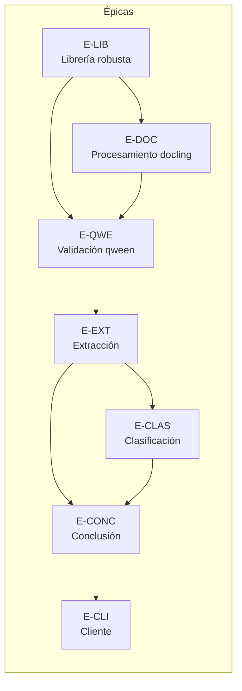

# 02 — Épicas e Historias de Usuario (BA)

> **Rol**: Business Analyst
> **Estándar**: Historias INVEST con criterios de aceptación en formato Gherkin
> (Given-When-Then). Cada épica corresponde a un refactor o entregable.

---

## 0. Convenciones y trazabilidad

- **Formato**: `E-<ÁREA>-<n>` = épica; `US-<ÁREA>-<n>` = historia de usuario.
- **DoR/DoD** aplicables: ver [`05-plan-ejecucion.md`](05-plan-ejecucion.md).
- Los criterios de aceptación de nivel **épica** se validan en la estrategia de
  calidad ([`06-estrategia-calidad.md`](06-estrategia-calidad.md)).
- Prioridad MoSCoW: ver [`05-plan-ejecucion.md`](05-plan-ejecucion.md#priorización-moscow).



---

## Épica E-DOC — Procesamiento adaptativo de documentos (refactor docling)

> Fuente de ideas: `v2/docs/ideas/docling.md`. Convierte el OCR "a ciegas" de v1
> en un procesador que decide por tipo de archivo, calidad visual, orientación y
> complejidad, y elige el mejor motor (OCR clásico o VLM).

### E-DOC-1 · Detección del tipo de entrada y ruta de procesamiento

**Como** sistema de procesamiento,
**quiero** detectar el tipo de documento de entrada (PDF texto, PDF escaneado,
imagen, DOCX, XLSX, PPTX, TXT, CSV, LOG, HTML/Markdown o no soportado)
**para** elegir la ruta de extracción correcta (texto nativo, imagen+OCR, tabla,
rechazo/reencolado).

**Criterios de aceptación:**

```gherkin
Regla: PDF con texto extraíble
  Dado un PDF con capa de texto válida
  Cuando se procesa el documento
  Entonces se extrae el texto directamente SIN OCR visual
  Y la salida es una representación estructurada (Markdown)

Regla: PDF escaneado
  Dado un PDF sin capa de texto (escaneado)
  Cuando se procesa el documento
  Entonces se convierte a imagen
  Y se procesa por la ruta de imagen (OCR/VLM)

Regla: formatos Office y planos
  Dado un DOCX/XLSX/PPTX/TXT/CSV/LOG/HTML/Markdown
  Cuando se procesa el documento
  Entonces se aplica la ruta específica del formato
  Y se normaliza a la representación estructurada común

Regla: formato no soportado
  Dado un archivo de formato desconocido o corrupto
  Cuando se procesa el documento
  Entonces se marca como rechazado o reencolado
  Y NO se intenta forzar un OCR
```

### E-DOC-2 · Procesamiento adaptativo de imágenes

**Como** sistema,
**quiero** clasificar la imagen (foto de documento, escaneo plano, captura
digital/screenshot, manuscrito/sello/firma), preprocesar si hace falta,
enderezar perspectiva, detectar orientación y elegir motor OCR/VLM
**para** maximizar la calidad de lectura de cada tipo de imagen.

**Criterios de aceptación:**

```gherkin
Regla: clasificación de imagen
  Dado una imagen con perspectiva notable
  Cuando se procesa la imagen
  Entonces se clasifica como fotografía de documento
  Y se endereza la perspectiva antes de OCR

  Dado una imagen de baja resolución o ruido
  Cuando se procesa la imagen
  Entonces se aplica preprocesamiento (mejora de calidad / binarización) antes de OCR

Regla: orientación
  Dado una imagen rotada (vertical predominante)
  Cuando se detecta la orientación
  Entonces se rota a la orientación correcta
  Y el texto resultante se ordena según la orientación (center_y o center_x)

Regla: elección de motor
  Dado una imagen con texto impreso legible y estructura estándar
  Cuando se elige el motor
  Entonces se usa OCR tradicional

  Dado una imagen con texto manuscrito, firma o sello
  Cuando se elige el motor
  Entonces se prioriza un modelo visual (VLM)
```

### E-DOC-3 · Salida ordenada y estructura de lectura

**Como** consumidor de la salida (flujo LLM),
**quiero** recibir texto ordenado por posición visual real
**para** que el razonamiento sobre el texto no pierda el orden del documento.

**Criterios de aceptación:**

```gherkin
Dado un documento horizontal
Cuando se exporta la representación
Entonces los boxes se agrupan por center_y y se ordenan por posición en la línea

Dado un documento vertical
Cuando se exporta la representación
Entonces los boxes se agrupan por center_x y se ordenan por posición en la columna

Dado un documento con tablas detectadas
Cuando se exporta la representación
Entonces las tablas se conservan como tablas Markdown
```

---

## Épica E-QWE — Validación de comprobante (refactor qween, doble paso con distinta calidad)

> Fuente: `v2/docs/ideas/qween.md`. Regla central: *decisión rápida y
> económica para saber si es comprobante; extracción deliberada y precisa con la
> mejor calidad.*

### E-QWE-1 · Gate de decisión rápida "¿es comprobante?"

**Como** sistema de rendiciones,
**quiero** decidir con una vista barata y un prompt binario si un documento es
comprobante
**para** no gastar calidad/costo en documentos que no corresponden.

**Criterios de aceptación:**

```gherkin
Regla: respuesta binaria con vista reducida
  Dado un documento candidato
  Cuando se ejecuta la validación rápida
  Entonces se usa una vista simplificada/thumbnail (calidad baja/moderada)
  Y el modelo responde solo: comprobante | no_comprobante | indeterminado

Regla: no comprobante
  Dado que la validación rápida responde no_comprobante
  Cuando se procesa el documento
  Entonces se rechaza o reencola
  Y NO se ejecuta la extracción costosa

Regla: indeterminado
  Dado que la validación rápida responde indeterminado
  Cuando se procesa el documento
  Entonces se prepara una vista de revisión de mayor calidad
  Y se vuelve a decidir; si sigue sin ser comprobante, se rechaza
```

### E-QWE-2 · Preparación de vista fiel para extracción

**Como** sistema,
**quiero** preparar una versión limpia, orientada y de alta fidelidad del
documento cuando ya es comprobante
**para** que la extracción final no pierda texto pequeño, sellos, QR o detalle.

**Criterios de aceptación:**

```gherkin
Dado un documento confirmado como comprobante
Cuando se prepara la vista de extracción
Entonces NO se reutiliza la vista rápida degradada
Y se entrega una versión con resolución suficiente, orientación corregida y limpieza leve
Y la salida conserva tabla, sello, firma, QR y texto pequeño cuando existen

Regla: complejidad
  Dado un comprobante complejo (tabla + sello + firma)
  Cuando se extrae
  Entonces se considera un enfoque por zonas o por partes si el envío único fuera ambiguo
```

---

## Épica E-CLAS — Clasificación (refactor clasificación)

> Dos subcapacidades: (a) tipo/letra de comprobante con reglas de negocio
> (fuente WIP `deteccion_tipo_factura.yaml`, R1-R7) y (b) clasificación contable
> 01→02→03 (centro de costo → macro categoría → concepto/código).

### E-CLAS-1 · Detección de tipo y letra de comprobante (con reglas determinísticas)

**Como** auditor contable,
**quiero** que la letra (A/B/C/M/E) se determine cruzando la condición fiscal
esperada por negocio y la letra detectada en el documento
**para** detectar inconsistencias y evitar aceptar comprobantes no válidos para
crédito fiscal.

**Criterios de aceptación:**

```gherkin
Regla: R1 emisor monotributo/exento
  Dado un emisor Monotributo o Exento
  Cuando se aplican las reglas de negocio
  Entonces el tipo esperado es C (independiente del receptor)

Regla: R2A / R2B responsabilidad fiscal
  Dado un emisor Responsable Inscripto y un receptor Responsable Inscripto
  Cuando se aplican las reglas de negocio
  Entonces el tipo esperado es A

  Dado un emisor Responsable Inscripto y un receptor Monotributo/Exento/Consumidor Final
  Cuando se aplican las reglas de negocio
  Entonces el tipo esperado es B

Regla: R3 exportación
  Dado un receptor con país distinto de Argentina
  Cuando se aplican las reglas de negocio
  Entonces el tipo esperado es E (prioridad sobre R1/R2)

Regla: R4/R5 extracción OCR/VLM
  Dado un documento con recuadro de letra grande en el encabezado
  Cuando se detecta la letra en el documento
  Entonces se usa la letra del recuadro (VLM prioriza lo que ve)
  Y si no hay recuadro, se usa regex sobre el texto (FACTURA [A-CME])

Regla: R6 inferencia por campos totales
  Dado que no hay letra visible en recuadro ni texto
  Cuando se infiere el tipo
  Entonces se usa el desglose de campos totales (discriminado => A candidato; subtotal único => B/C)

Regla: R7 conflicto financiero
  Dado un emisor Responsable Inscripto, receptor Responsable Inscripto y letra detectada B
  Cuando se aplican las reglas de conflicto
  Entonces se dispara alerta de comprobante inválido para crédito fiscal
  Y el resultado conserva el tipo esperado por negocio con confianza media y la discrepancia documentada

Regla: candidatos
  Cuando se produce el resultado de clasificación
  Entonces se incluyen candidatos_descartados, candidatos_restantes y reglas_aplicadas
```

### E-CLAS-2 · Clasificación contable 01→02→03 (centro de costo → macro categoría → concepto/código)

**Como** área de administración,
**quiero** clasificar cada comprobante en centro de costo, macro categoría y
concepto/código final usando la cadena de prompts encadenados
**para** asignar correctamente el gasto.

**Criterios de aceptación:**

```gherkin
Dado un comprobante con proveedor, descripcion y monto
Cuando se ejecuta el paso 01
Entonces devuelve hasta tres centros de costo ordenados por probabilidad
Y cada opción incluye codigo, centro, confianza, senal_usada y justificacion

Dado el primer centro de costo resultante del paso 01
Cuando se ejecuta el paso 02
Entonces devuelve hasta tres macro categorías

Dado el primer resultado de 02 + condición impositiva
Cuando se ejecuta el paso 03
Entonces devuelve concepto y código final

Regla: default
  Dado un gasto sin señal específica
  Cuando se ejecuta el paso 01
  Entonces se devuelve CC0006 con confianza baja y senal_usada=none
```

---

## Épica E-EXT — Extracción (refactor extracción)

> Fuente: `algoritmo.md` y `flujo_deteccion_tipo_comprobante.md`. Dos flujos en
> paralelo (VLM sobre imagen, LLM sobre OCR) con **el mismo contrato de
> evidencia**, validados por reglas raw antes de combinarse.

### E-EXT-1 · Flujos VLM y LLM en paralelo con contrato de evidencia

**Como** sistema,
**quiero** ejecutar siempre ambos flujos (VLM y LLM) sobre cada comprobante y que
cada uno devuelva evidencia con el mismo esquema (campo, valor, fuente,
fragmento de sustento)
**para** poder compararlos programáticamente en la conclusión.

**Criterios de aceptación:**

```gherkin
Dado un comprobante confirmado
Cuando se ejecuta la extracción
Entonces corren el flujo VLM (imagen) y el flujo LLM (OCR/Markdown) en paralelo
Y cada flujo devuelve evidencia por campo con fuente y fragmento de sustento

Regla: ambos siempre
  Dado cualquier comprobante
  Cuando se ejecuta la extracción
  Entonces NO se elige un flujo u otro por documento: corren ambos

Regla: modalidades de la librería v1
  Dado un archivo .md o .jpg
  Cuando se invoca el modo de extracción equivalente a kvi/kvg/10/11
  Entonces el resultado conserva la capacidad actual (JSON plano normalizado)
  Y agrega el envoltorio de evidencia
```

### E-EXT-2 · Validación de evidencia cruda por fuente (pasada 1)

**Como** sistema,
**quiero** validar la evidencia de cada fuente por separado antes de mezclarla
**para** marcar como debilitada a una fuente internamente inconsistente (ej.
dice Factura A pero no detectó los dos CUIT que exige esa letra).

**Criterios de aceptación:**

```gherkin
Dado que la evidencia VLM dice Factura A sin detectar dos CUIT
Cuando se aplican las reglas raw
Entonces la fuente VLM queda marcada como debilitada antes de combinarse

Dado que la evidencia de una fuente pasa sus propias reglas
Cuando se combinan las fuentes
Entonces esa evidencia participa de la combinación con su trazabilidad
```

### E-EXT-3 · Campos de extracción key-value normalizados

**Como** consumidor de datos,
**quiero** recibir los campos fiscales y comerciales normalizados
(CUIT, fechas ISO, montos, tipo, punto de venta, número, ítems)
**para** alimentar la clasificación contable y la conciliación.

**Criterios de aceptación:**

```gherkin
Regla: normalización
  Dado el OCR de un comprobante
  Cuando se extraen campos
  Entonces los CUIT son solo dígitos y guiones propios (corte ante caracteres extraños)
  Y las fechas se normalizan a YYYY-MM-DD
  Y los montos son numéricos sin separadores de miles
  Y se separa punto_venta y numero_comprobante de PPPPP-NNNNNNNN

Regla: no inventar
  Dado un dato ausente o ilegible
  Cuando se extraen campos
  Entonces se omite o se deja null; NO se inventa

Regla: validación de comprobante
  Dado un texto que no es comprobante o está corrupto
  Cuando se extrae con el modo auditoría
  Entonces comprobante_valido=false y se completa motivo_rechazo
```

---

## Épica E-CONC — Conclusión (refactor conclusión)

> Fuente: `algoritmo.md` + `flujo_deteccion_tipo_comprobante.md`. Reglas
> programáticas determinísticas (raw + cruzadas) → búsqueda puntual de
> evidencia adicional → escalado a agente IA (solo candidatos restantes) →
> HITL autoridad final → trazabilidad.

### E-CONC-1 · Reglas cruzadas sobre evidencia combinada (pasada 2)

**Como** sistema,
**quiero** aplicar reglas determinísticas de negocio tributario, fast-fail por
letra y conflicto sobre la evidencia combinada
**para** concluir el caso con certeza alta cuando el código alcanza.

**Criterios de aceptación:**

```gherkin
Dado evidencia combinada de VLM y LLM
Cuando se aplican las reglas cruzadas
Entonces corren reglas de negocio tributario, fast-fail por letra y conflicto
Y el resultado incluye: concluye, certeza, origen, candidatos y reglas aplicadas

Regla: concluye por programa
  Dado que las reglas concluyen de forma consistente
  Cuando se consolida el resultado
  Entonces se marca certeza=alta y origen=programa
  Y NO pasó por el agente de IA para decidir
```

### E-CONC-2 · Búsqueda puntual de evidencia adicional (con límite)

**Como** sistema,
**quiero** buscar evidencia adicional solo cuando hay un gap concreto y con un
límite de reintentos (ej. consulta al padrón ARCA)
**para** cubrir datos faltantes sin entrar en un loop abierto de búsqueda.

**Criterios de aceptación:**

```gherkin
Dado que faltan datos (resultado.faltan_datos)
Cuando se ejecuta la conclusión
Entonces se busca evidencia adicional por gap concreto con max_reintentos=N
Y al agotar el límite sin resolver, el caso escala al agente IA

Regla: no loop abierto
  Dado que la evidencia adicional no cubre el gap
  Cuando se alcanza el límite de reintentos
  Entonces NO se sigue buscando indefinidamente
  Y el caso continúa al siguiente paso del flujo
```

### E-CONC-3 · Escalado a agente IA (solo entre candidatos no descartados)

**Como** sistema,
**quiero** escalar a un agente de IA únicamente cuando el código no concluye y
solo entre los candidatos que sobrevivieron al descarte
**para** que el agente no pueda resucitar una opción ya eliminada con certeza.

**Criterios de aceptación:**

```gherkin
Dado que el código no concluye
Cuando se escala al agente de IA
Entonces el agente recibe evidencia, reglas que fallaron y candidatos_restantes
Y NO puede elegir candidatos ya descartados por el código

Dado que el agente decide
Cuando se consolida el resultado
Entonces se marca certeza=baja y origen=agente_ia
Y el caso se encola a HITL con prioridad alta
```

### E-CONC-4 · HITL como autoridad final y muestreo de auditoría

**Como** contador revisor,
**quiero** revisar todo caso de certeza baja y una muestra periódica de casos de
certeza alta
**para** corregir decisiones del agente y detectar reglas que matchean por
accidente.

**Criterios de aceptación:**

```gherkin
Dado un caso de certeza baja (resuelto por agente IA)
Cuando se consolida
Entonces llega a revisión humana (HITL) con prioridad alta

Dado un caso de certeza alta (resuelto por programa)
Cuando se consolida
Entonces entra en un muestreo de auditoría periódico con prioridad baja

Regla: feedback
  Dado que el HITL corrige una decisión
  Cuando se registra la corrección
  Entonces la corrección queda disponible como señal para ajustar reglas y prompts
```

### E-CONC-5 · Trazabilidad completa por caso

**Como** auditor externo o interno,
**quiero** poder reconstruir qué pasó con cada caso (versión de prompt, modelo,
evidencia por fuente, regla disparada y quién decidió)
**para** justificar una clasificación fiscal si alguna vez se audita.

**Criterios de aceptación:**

```gherkin
Dado un caso procesado
Cuando se consulta su trazabilidad
Entonces incluye versión de prompt, modelo usado, evidencia de cada fuente,
reglas disparadas y origen de la decisión (programa | agente_ia | hitl)

Regla: persistencia
  Dado cualquier caso consolidado
  Cuando se guarda el resultado
  Entonces la trazabilidad se persiste junto al resultado (JSON sidecar o store)
```

---

## Épica E-LIB — Librería robusta

> Entregable central declarado en `v2/docs/readme.md`: "tener una librería
> robusta y luego un cliente para invocar al utilitario".

### E-LIB-1 · API estable de alto nivel

**Como** desarrollador,
**quiero** una API de librería simple (`processar_documento`, `procesar_imagen`,
`validar_y_procesar`, `concluir_caso`, …) que abstraiga el pipeline
**para** integrarla sin conocer los detalles internos.

**Criterios de aceptación:**

```gherkin
Dado un documento (bytes o ruta)
Cuando llamo a la API de alto nivel
Entonces obtengo un resultado tipado (VoucherResult) con estado, certeza, origen y trazabilidad
Y la API expone un punto de entrada por sub-capacidad (procesar, validar, clasificar, extraer, concluir)

Regla: sin acoplamiento a scripts
  Dado el paquete instalado
  Cuando se importa en otro proyecto
  Entonces no depende de la estructura de carpetas de este repo
```

### E-LIB-2 · Esquemas de evidencia validados (contrato)

**Como** equipo,
**quiero** modelos de datos tipados (pydantic) para evidencia, combinación,
resultado y trazabilidad
**para** que VLM/LLM/reglas/agente hablen el mismo contrato y los errores de
schema se detecten temprano.

**Criterios de aceptación:**

```gherkin
Dado un JSON devuelto por un flujo
Cuando se valida contra el schema de evidencia
Entonces se rechaza si faltan campo/valor/fuente/fragmento
Y se registra un error de contrato claro

Dado un resultado de conclusión
Cuando se valida
Entonces cumple el schema VoucherResult con sus enumerados (certeza, origen, estado)
```

### E-LIB-3 · Configuración centralizada y clientes de modelo

**Como** operador,
**quiero** configurar modelos, endpoints, tiempos y políticas en un solo lugar
**para** no repetir la configuración en cada script (hoy está dispersa en v1).

**Criterios de aceptación:**

```gherkin
Dado un archivo de configuración (yaml/env)
Cuando se inicializa la librería
Entonces se cargan modelos por rol (OCR, VLM, LLM, agente), URLs y parámetros

Regla: Ollama por defecto
  Dado que no hay configuración explícita
  Cuando se usa la librería
  Entonces usa http://localhost:11434 y el modelo por defecto actual
  Y maneja errores de conexión con mensajes claros (equivalente a v1 ask_ollama)
```

### E-LIB-4 · Motor de reglas determinísticas

**Como** equipo de negocio,
**quiero** que las reglas (R1-R7, fast-fail, precedencia por campo, gaps) sean
código declarativo y testeable
**para** madurar la casuística sin depender de que un modelo "se sienta seguro".

**Criterios de aceptación:**

```gherkin
Dado un set de reglas declarativas
Cuando se ejecuta sobre evidencia
Entonces cada regla reporta id, condición evaluada y resultado
Y el motor permite ordenar reglas por prioridad y registrar cuáles se dispararon

Regla: extensibilidad
  Dado que el HITL detecta un caso nuevo recurrente
  Cuando se incorpora una regla nueva
  Entonces se agrega sin modificar el resto del pipeline
```

### E-LIB-5 · Trazabilidad y diagnóstico (observabilidad)

**Como** equipo de operaciones,
**quiero** logs estructurados, diagnóstico por caso y métricas del pipeline
**para** monitorear latencias, errores 429 y cuellos de botella.

**Criterios de aceptación:**

```gherkin
Dado un caso con latencia mayor a un umbral o con status inesperado
Cuando se procesa
Entonces el log incluye el diagnóstico del SDK/cliente de modelo

Dado el procesamiento de un lote
Cuando termina
Entonces se producen métricas: documentos procesados, % certeza alta, % agente, % rechazados, latencias
```

---

## Épica E-CLI — Cliente que invoca la librería

### E-CLI-1 · CLI por archivo y por carpeta (equivalente funcional a v1)

**Como** operador,
**quiero** un CLI que procese un archivo o una carpeta recursiva con las
capacidades actuales (OCR, extracción, clasificación, pipeline completo)
**para** reemplazar los comandos de `v1` sin perder funcionalidad.

**Criterios de aceptación:**

```gherkin
Dado un archivo imagen/pdf/md
Cuando se ejecuta el CLI con el subcomando correspondiente
Entonces se produce la salida equivalente a v1 (markdown, JSON de extracción/clasificación/pipeline)

Dado una carpeta
Cuando se ejecuta el CLI recursivo
Entonces recorre subcarpetas y procesa todos los archivos soportados
Y respeta --force, --orientation, --condicion-impositiva, --model y --workers

Regla: checkpoint/resumir
  Dado un procesamiento interrumpido
  Cuando se vuelve a ejecutar sobre la misma carpeta
  Entonces retoma desde los checkpoints sin repetir pasos completados
```

### E-CLI-2 · Salidas y sidecars con trazabilidad

**Como** contador,
**quiero** que cada resultado incluya la evidencia y trazabilidad del caso
**para** poder auditar la decisión.

**Criterios de aceptación:**

```gherkin
Dado un documento procesado por el CLI
Cuando se guarda el resultado
Entonces se genera un JSON con resultado + evidencia + trazabilidad (sidecar)
Y en modo lote se puede consolidar en un único JSON agregado
```

### E-CLI-3 · Manejo de recursos (workers, temperatura, reintentos)

**Como** operador de máquina local,
**quiero** controlar paralelismo, pausas de enfriamiento por temperatura y
reintentos
**para** no degradar el dispositivo en lotes largos.

**Criterios de aceptación:**

```gherkin
Dado un lote grande
Cuando se usa --workers N
Entonces cada worker inicializa su propio convertidor de Docling
Y al superar un tiempo de procesamiento continuo se detienen los workers
Y la cuenta de enfriamiento inicia cuando TODOS los workers están detenidos

Regla: reintentos con backoff
  Dado un error transitorio (429 o conexión)
  Cuando se reintenta
  Entonces se aplica backoff y un máximo de intentos configurable
```

---

## 1. Matriz de trazabilidad épicas ↔ objetivos ↔ ideas

| Épica | Objetivos | Idea fuente | Módulo librería |
|-------|-----------|-------------|-----------------|
| E-DOC | OBJ-1 | `ideas/docling.md` | `processing/` |
| E-QWE | OBJ-2 | `ideas/qween.md` | `validation/` |
| E-CLAS | OBJ-3 | `11.1` + `prompts/wip/deteccion_tipo_factura.yaml` + prompts 01/02/03 | `classification/` |
| E-EXT | OBJ-4 | `algoritmo.md`, `flujo_deteccion_tipo_comprobante.md` | `extraction/` |
| E-CONC | OBJ-5 | `algoritmo.md`, `flujo_deteccion_tipo_comprobante.md` | `conclusion/` + `rules/` |
| E-LIB | OBJ-6 | readme v2 | núcleo `voucherflow` |
| E-CLI | OBJ-7 | readme v2 + comandos v1 | `cli/` |
