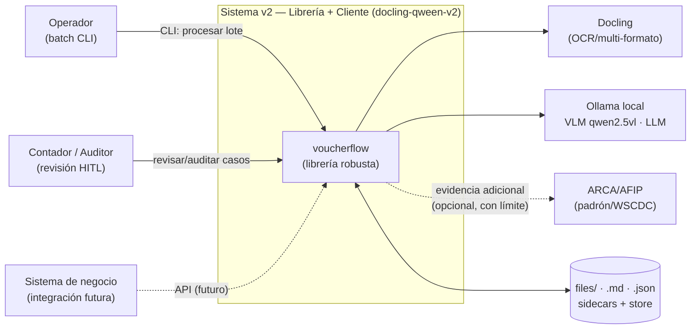
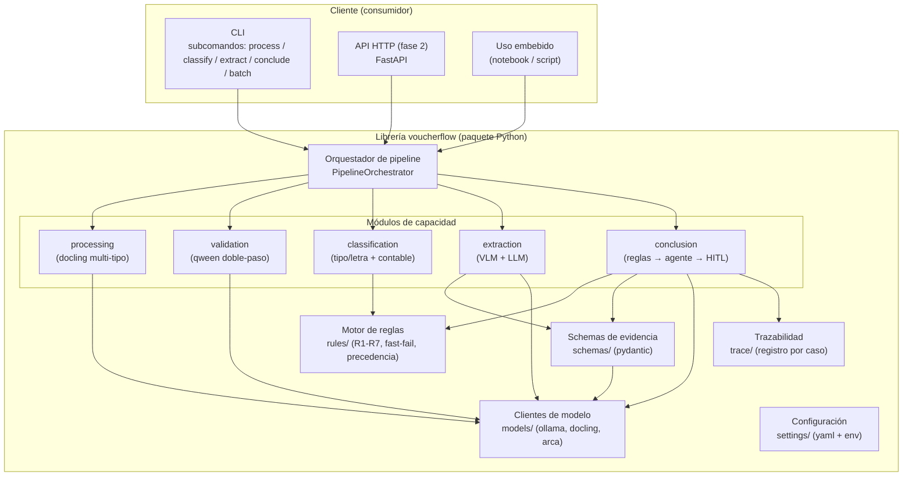
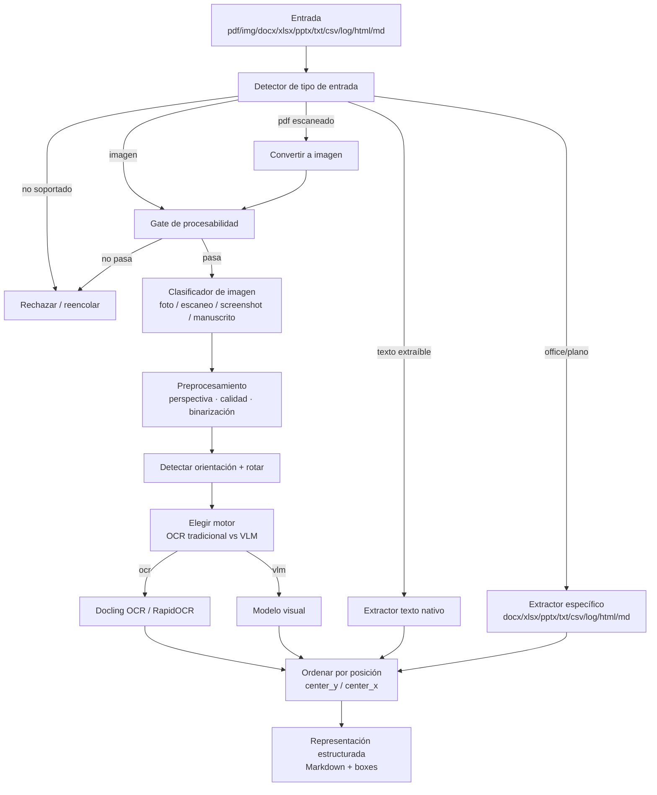
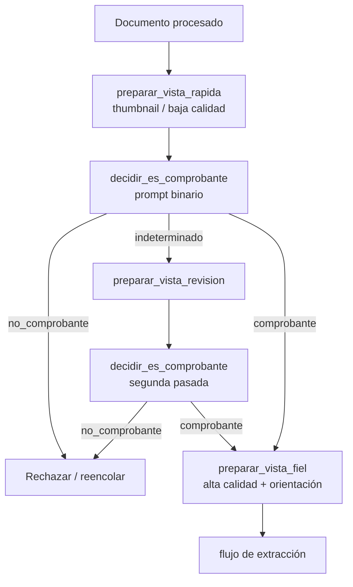
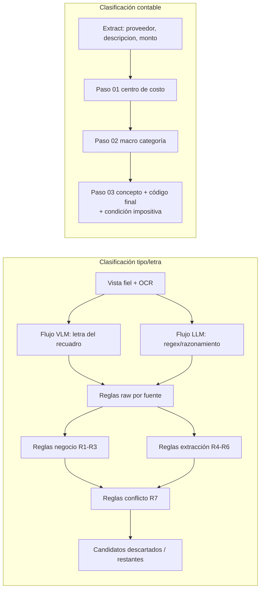
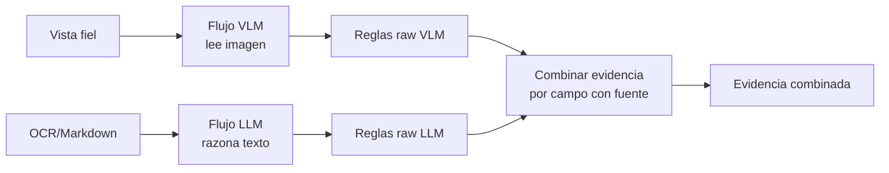
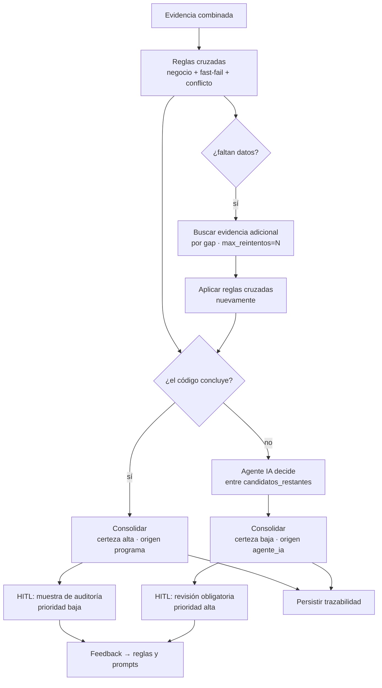
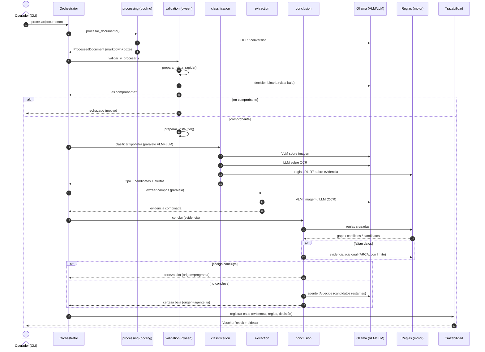
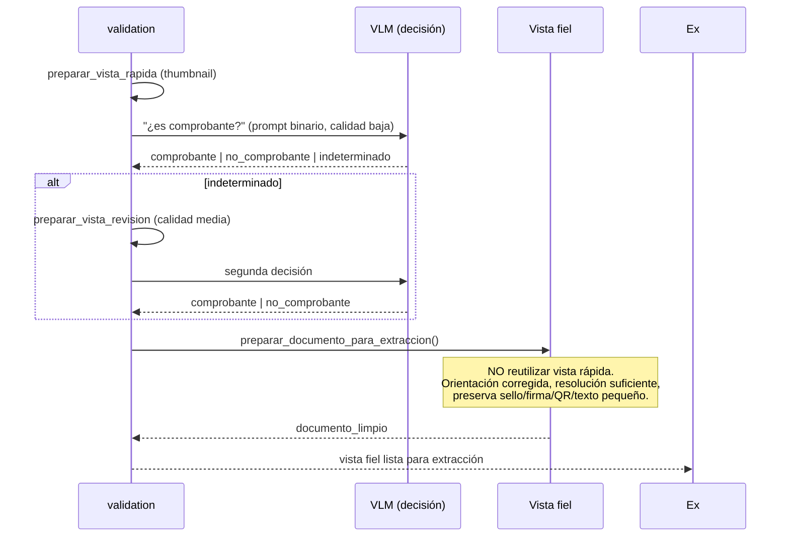
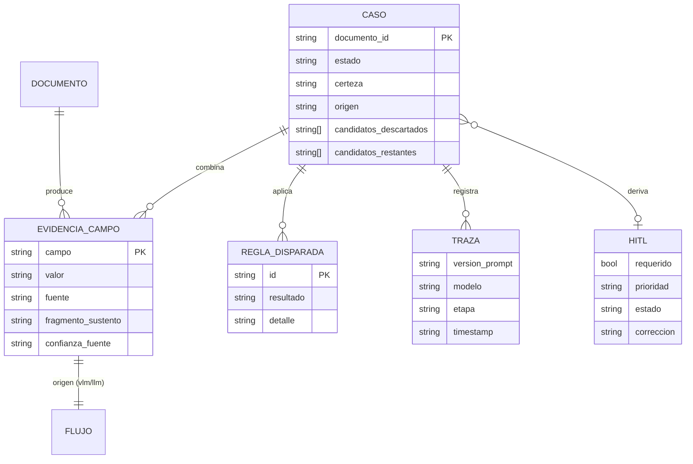

# 03 — Arquitectura de Solución (SA)

> **Rol**: Solution Architect
> **Objetivo**: diseño de alto nivel de la **librería robusta**, el **pipeline**
> clasificación → extracción → conclusión y el **cliente** que la invoca.
> Fuentes: `v2/docs/ideas/*.md`, estado actual de `v1/` y `prompts/`.

---

## Seguimiento por módulo

> Cada módulo de la librería (y los elementos transversales) tiene un archivo de
> seguimiento que traza su arquitectura contra épicas, fases, contratos y ADRs.
> Ver el índice en [`03-arquitectura/README.md`](03-arquitectura/README.md).

- [PROC](03-arquitectura/PROC.md) — Módulo `processing` (docling multi-tipo)
- [VAL](03-arquitectura/VAL.md) — Módulo `validation` (qween doble-paso)
- [CLAS](03-arquitectura/CLAS.md) — Módulo `classification` (tipo/letra + contable)
- [EXT](03-arquitectura/EXT.md) — Módulo `extraction` (VLM + LLM)
- [CONC](03-arquitectura/CONC.md) — Módulo `conclusion` (reglas → agente → HITL)
- [SCHEMAS](03-arquitectura/SCHEMAS.md) — Módulo `schemas/` (contrato de evidencia pydantic)
- [RULES](03-arquitectura/RULES.md) — Módulo `rules/` (motor de reglas R1-R7, precedencia, gaps)
- [MODELS](03-arquitectura/MODELS.md) — Módulo `models/` (adaptadores: OllamaClient, DoclingConverter, ArcaClient)
- [TRACE](03-arquitectura/TRACE.md) — Módulo `trace/` (CaseRecord, trazabilidad, sidecar)
- [ORCH-CLI](03-arquitectura/ORCH-CLI.md) — Orquestador + API de alto nivel + Cliente CLI (`orchestrator.py`, `api.py`, `cli/`)

---

## 1. Principios de diseño

1. **Etapa decide certeza** — la certeza nace de qué etapa resolvió el caso
   (programa = alta; agente IA = baja → HITL), nunca de la confianza
   autodeclarada del modelo.
2. **Evidencia como contrato** — toda fuente (VLM/LLM/programa/ARCA/HITL)
   produce evidencia con el mismo esquema para poder compararla
   programáticamente.
3. **Determinista primero, modelo después** — se agota el código
   (reglas raw + cruzadas) antes de escalar a un agente; el agente solo elige
   entre candidatos no descartados.
4. **Doble calidad** — la validación es barata (vista reducida); la extracción
   es fiel (vista limpia y de alta calidad). Nunca se reutiliza la vista rápida
   para extraer.
5. **Trazable por diseño** — cada caso persiste prompts, modelos, evidencia,
   reglas y decisión para poder auditarse.
6. **Librería primero, cliente después** — el núcleo es un paquete instalable
   sin acoplamiento a carpetas; el CLI/API es un consumidor más.
7. **Modular y testeable** — cada sub-capacidad (docling, qween, clasificación,
   extracción, conclusión) es un módulo con interfaz estable y tests aislados.

---

## 2. Arquitectura de contexto (C4 — Nivel 1)



**Nota**: Ollama y Docling son dependencias externas locales. ARCA es opcional
en el MVP (decisión abierta #3).

---

## 3. Arquitectura de contenedores (C4 — Nivel 2)



---

## 4. Vista de componentes de la librería (detalle)

### 4.1 Módulo `processing` (refactor docling)

Responsabilidades: decidir tipo de entrada, elegir ruta, normalizar, y en
imágenes: gate de procesabilidad → clase de imagen → preprocesamiento →
orientación → motor OCR/VLM → salida ordenada.



**Interfaz**:
```python
@dataclass
class ProcessedDocument:
    tipo_entrada: str            # "pdf_texto" | "pdf_escaneado" | "imagen" | ...
    ruta: str
    markdown: str                # representación ordenada
    boxes: list[Box] | None      # opcional (para debug)
    orientacion: str             # "horizontal" | "vertical"
    motor: str | None            # "ocr" | "vlm" | None (texto nativo)
    calidad: QualityReport | None
```

### 4.2 Módulo `validation` (refactor qween)



**Interfaz**:
```python
@dataclass
class ValidationResult:
    decision: str                # "comprobante" | "no_comprobante" | "indeterminado"
    vista_usada: str             # "rapida" | "revision"
    evidencia: SourceEvidence    # modelo + fragmento de sustento de la decisión
```

### 4.3 Módulo `classification`

Dos subflujos: **tipo/letra** (usa reglas R1-R7 + VLM/LLM) y **contable**
(cadena 01→02→03).



### 4.4 Módulo `extraction`



### 4.5 Módulo `conclusion` (el corazón del patrón)



**Interfaz**:
```python
@dataclass
class ConclusionResult:
    concluye: bool
    certeza: str                 # "alta" | "baja"
    origen: str                  # "programa" | "agente_ia" | "hitl"
    candidatos_descartados: list[str]
    candidatos_restantes: list[str]
    reglas_aplicadas: list[str]
    alertas: list[Alerta]
    hitl: HitlDecision           # requerido / prioridad / estado
```

### 4.6 Módulo `models` (adaptadores)

- `OllamaClient` (chat VLM/LLM): encapsula `ask_ollama` de v1 (URL,
  `json_format`, `num_ctx`, manejo de 429/backoff, log de diagnóstico).
- `DoclingConverter`: adaptador sobre Docling para conversión multi-formato.
- `ArcaClient` (opcional): consulta WSCDC/padrón (reutiliza lógica de
  `v1/wip/consultar_arca.py`), con límite de reintentos y timeout.

### 4.7 Módulo `trace`

Registro persistente por caso (`CaseRecord`): entrada, decisiones por etapa,
prompts (hash/versión), modelos, evidencia, reglas y resultado. Salida a JSON
sidecar y/o a un store simple (SQLite) en fases posteriores.

---

## 5. Pipeline end-to-end (secuencia)

### 5.1 Secuencia general (Mermaid sequence)



### 5.2 Secuencia del "doble paso" qween (detalle)



---

## 6. Modelos de datos / schemas de evidencia

> Contrato completo definido en [`00-glosario.md`](00-glosario.md#2-modelo-de-evidencia-contrato-central).
> Aquí se fijan los esquemas pydantic que la librería debe implementar.

```python
# schemas/evidence.py (borrador)
from enum import Enum
from pydantic import BaseModel, Field

class Fuente(str, Enum):
    vlm = "vlm"
    llm = "llm"
    programa = "programa"
    arca = "arca"
    hitl = "hitl"

class Certeza(str, Enum):
    alta = "alta"
    baja = "baja"

class Origen(str, Enum):
    programa = "programa"
    agente_ia = "agente_ia"
    hitl = "hitl"

class EvidenceField(BaseModel):
    campo: str
    valor: str | float | int | None
    fuente: Fuente
    fragmento_sustento: str
    confianza_fuente: str = "media"   # autoevaluación, no es la certeza final
    meta: dict = Field(default_factory=dict)  # modelo, version_prompt, timestamp

class SourceEvidence(BaseModel):
    fuente: Fuente
    campos: dict[str, EvidenceField]
    valida: bool = True                # resultado pasada 1 (reglas raw)
    reglas_aplicadas: list[str] = []
    debilidades: list[str] = []

class FieldResolution(BaseModel):
    ganador: Fuente | None
    regla: str | None                  # ej. "PREC_1"
    motivo: str | None

class CombinedEvidence(BaseModel):
    documento_id: str
    campos: dict[str, dict[Fuente, EvidenceField] | FieldResolution]  # ver nota
    decision: Decision
    trazabilidad: dict = Field(default_factory=dict)

class Decision(BaseModel):
    concluye: bool
    certeza: Certeza
    origen: Origen
    candidatos_descartados: list[str] = []
    candidatos_restantes: list[str] = []
    reglas_aplicadas: list[str] = []
    alertas: list[dict] = []

class VoucherResult(BaseModel):
    estado: str                        # aprobado | rechazado | revision
    tipo_comprobante: str | None
    certeza: Certeza | None
    origen: Origen | None
    campos_extraidos: dict = {}
    clasificacion_contable: dict = {}  # centro_costo, macro_categoria, concepto, codigo
    evidencia: CombinedEvidence | None
    hitl: dict = Field(default_factory=dict)
    trazabilidad: dict = Field(default_factory=dict)
```

> **Nota de diseño**: la combinación por campo se modela como
> `{ campo: { "vlm": EvidenceField, "llm": EvidenceField, "resolucion": FieldResolution } }`
> para que las reglas de precedencia puedan evaluar ambos lados y registrar la
> resolución. El diagrama ER siguiente lo muestra simplificado.



---

## 7. Reglas de negocio como motor declarativo

La fuente `prompts/wip/deteccion_tipo_factura.yaml` ya define R1-R7 de forma
declarativa. El refactor las mueve del prompt a un **motor de reglas en código**
(registro de reglas) manteniendo el mismo id para trazabilidad:

```python
# rules/tipo_comprobante.py (borrador)
REGLA_R1 = Rule(
    id="R1",
    prioridad=1,
    condicion=lambda ctx: ctx.emisor.condicion_fiscal in {"Monotributo", "Exento"},
    resultado="C",
    tipo="negocio",
)
REGLA_R2A = Rule(
    id="R2A",
    prioridad=2,
    condicion=lambda ctx: (ctx.emisor.condicion_fiscal == "Responsable Inscripto"
                           and ctx.receptor.condicion_fiscal == "Responsable Inscripto"),
    resultado="A",
    tipo="negocio",
)
# ... R2B, R3 (exportación, prioridad 0), R4-R6 (extracción), R7 (conflicto)
```

- El **LLM/VLM** ya no "aplican reglas" libremente: devuelven *evidencia*
  (letra detectada, condiciones fiscales detectadas, desglose) y el motor decide.
- El prompt `11.1` se reescribe para **devolver evidencia**, no la decisión
  final (ver decisión abierta #1 y #6).
- Con el tiempo, la casuística observada en HITL se codifica como nuevas reglas
  (objetivo: crece el % de certeza alta por programa).

---

## 8. El cliente que invoca la librería

### 8.1 CLI propuesto

```bash
# Procesamiento / docling
voucherflow process archivo.pdf|imagen|docx ... [--orientation auto] [--workers N] [--output dir]

# Validación qween (gate "¿es comprobante?")
voucherflow validate archivo.jpg --quick

# Clasificación tipo/letra + contable
voucherflow classify archivo.md [--condicion-impositiva 21]

# Extracción (modos heredados mapeados)
voucherflow extract archivo.md --mode kvi|kvg|10|11
voucherflow extract-detect archivo.jpg --mode 11.1        # tipo/letra con VLM/LLM

# Pipeline completo (equivalente a full_pipeline.py v1)
voucherflow run archivo|carpeta [--workers N] [--force] [--condicion-impositiva 21] [-o salida.json]

# Lote
voucherflow batch files/2025-08 [--workers N] [--cooling-policy on] [-o resultados.json]

# Auditoría / HITL
voucherflow hitl list --certeza baja
voucherflow case show <documento_id>          # trazabilidad completa
```

### 8.2 Mapeo v1 → v2 (equivalencia verificable)

| Comando v1 | v2 (CLI) | Módulo |
|-----------|----------|--------|
| `ocr_documents.py files` | `voucherflow process files` | processing |
| `run_raw.py --input X` | `voucherflow process X --raw` | processing |
| `document_extraction.py -M kvi/kvg/11.1` | `voucherflow extract --mode ...` | extraction/classification |
| `classification_pipeline.py` (01→02→03) | `voucherflow classify` | classification |
| `extraction_pipeline.py` (10/11) | `voucherflow extract --pipeline 10+11` | extraction |
| `full_pipeline.py` | `voucherflow run` | orchestrator |
| `ask.py` | `voucherflow ask <file> -q ...` | extraction/QA |
| `wip/consultar_arca.py` | `voucherflow arca check ...` (opcional) | models/ArcaClient |

---

## 9. Contratos de integración

| Contrato | Descripción | Fuente |
|----------|-------------|--------|
| `ProcessedDocument` | Salida de `processing` (markdown + boxes + metadatos) | E-DOC |
| `ValidationResult` | Decisión del gate qween | E-QWE |
| `EvidenceField` / `SourceEvidence` | Evidencia por campo con sustento | E-EXT |
| `CombinedEvidence` | Evidencia combinada con resolución por campo | E-EXT/E-CONC |
| `VoucherResult` | Resultado consolidado final (estado, certeza, origen) | E-CONC |
| `CaseRecord` | Registro de trazabilidad completo | E-CONC-5 |

**Formato de prompts**: se conserva el formato YAML `system/system_llm/system_vlm
/user/user_vlm` con placeholders, pero el contrato de salida pasa a ser el
schema de evidencia (ver ADR-004).

---

## 10. Consideraciones de despliegue y recursos (NFR)

- **Paralelismo**: procesamiento por lotes con `ProcessPoolExecutor`; cada
  worker con su `DoclingConverter` (patrón actual de `full_pipeline.py`).
- **Temperatura**: política de enfriamiento configurable; la cuenta de pausa
  arranca cuando **todos** los workers están detenidos (requisito explícito en
  `my_prompt.md`).
- **Reanudación**: checkpoints por documento (sidecar) con escritura atómica
  (patrón `write_results` de `lib/pipeline.py` v1).
- **Observabilidad**: logs estructurados por caso; capturar diagnóstico del SDK
  ante latencia > umbral o status inesperado (guía Cosmos DB / buenas prácticas
  de clientes HTTP).
- **Seguridad**: credenciales ARCA en `.env` (fuera del repo); sin datos
  sensibles en logs; hash del documento como id (`sha256`).

---

## 11. Estructura de paquete propuesta (borrador)

```text
v2/
  pyproject.toml
  src/voucherflow/
    __init__.py
    api.py                    # API de alto nivel (facade)
    orchestrator.py           # PipelineOrchestrator
    schemas/
      evidence.py             # EvidenceField, SourceEvidence, CombinedEvidence...
      result.py               # VoucherResult, CaseRecord
    processing/
      type_detector.py
      image_classifier.py
      preprocessing.py
      orientation.py
      ocr.py                  # adaptador docling/rapidocr
      markdown_exporter.py
    validation/
      qween.py                # doble-paso (vistas rápida/revisión/fiel)
    classification/
      tipo_comprobante.py     # letra A/B/C/M/E (reglas R1-R7 + flujos)
      contable.py             # cadena 01 → 02 → 03
    extraction/
      flows.py                # flujo VLM y flujo LLM
      key_value.py            # normalización de campos (kvi/kvg/10/11)
    conclusion/
      engine.py               # reglas cruzadas, gaps, agente, HITL
      agent.py                # agente IA
      hitl.py                 # cola HITL + muestreo auditoría
    rules/
      registry.py             # motor de reglas
      tipo_comprobante_rules.py   # R1-R7
      precedencia.py          # tabla de precedencia por campo
      gaps.py
    models/
      ollama.py               # cliente chat VLM/LLM (retry, diagnóstico)
      docling.py
      arca.py                 # opcional
    trace/
      recorder.py             # CaseRecord + persistencia
    settings/
      config.py               # carga yaml/env
  cli/
    main.py                   # typer/click: subcomandos
  tests/                      # unit + integración + golden set
    golden/                   # dataset etiquetado (no código)
  docs/
    plan/                     # este plan
```

> El nombre del paquete y la ubicación `src/` vs. plano son decisiones abiertas
> (ADR-001). La estructura anterior es una **propuesta de trabajo**, no una
> decisión tomada.

---

## 12. Enlaces

- Contratos y glosario: [`00-glosario.md`](00-glosario.md)
- Historias: [`02-epicas-historias-usuario.md`](02-epicas-historias-usuario.md)
- Decisiones abiertas y ADRs: [`04-decisiones-abiertas-adr.md`](04-decisiones-abiertas-adr.md)
- Plan de ejecución: [`05-plan-ejecucion.md`](05-plan-ejecucion.md)
