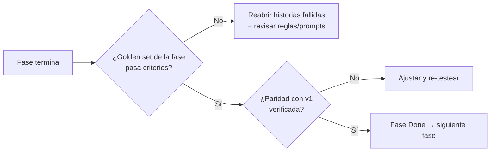

# 06 — Estrategia de Calidad (puente hacia DEV/QA)

> **Roles**: BA/SA/PM → **DEV/QA**
> **Propósito**: definir qué pruebas y criterios de aceptación validan cada fase,
> cómo se construye el *golden set*, qué métricas se reportan y cuándo una fase
> se considera *lista para producción (o para la siguiente fase)*.

---

## 1. Principios de calidad

1. **La certeza se mide por etapa, no por confianza del modelo.** La métrica
   principal es la distribución de `origen` (programa vs. agente IA) y su
   exactitud contra el veredicto humano.
2. **Paridad verificable**: todo refactor debe reproducir o superar el
   comportamiento de v1 sobre una muestra acordada antes de darse por cerrado.
3. **Contrato primero**: los schemas de evidencia se prueban como contrato
   (validación de JSON de modelos) antes que la lógica de negocio.
4. **Determinismo testeable**: el motor de reglas es 100% determinista ⇒ se
   prueba con fixtures; las llamadas a modelo se *mockean* en pruebas unitarias
   y se ejercitan contra golden set en pruebas de integración/evaluación.
5. **Datos reales y etiquetados**: las decisiones de calidad se toman sobre el
   golden set, no sobre impresiones de unos pocos archivos.

---

## 2. Pirámide de pruebas

```mermaid
flowchart TB
    subgraph E2E["Evaluación / E2E (pocas, caras)"]
        E1[Evaluación contra golden set<br/>por fase y por tipo de documento]
    end
    subgraph INT["Integración (medias)"]
        I1[Pipeline completo sobre archivos reales<br/>paridad v1 vs v2]
        I2[Contrato de evidencia end-to-end<br/>VLM+LLM → reglas → conclusión]
    end
    subgraph UNIT["Unitarias (muchas, rápidas)"]
        U1[Motor de reglas R1-R7<br/>con fixtures deterministas]
        U2[Schemas pydantic<br/>validación de contrato]
        U3[Procesamiento: tipo de entrada,<br/>orientación, orden de boxes]
        U4[Validación qween: lógica de vistas<br/>y decisiones (modelo mockeado)]
        U5[Normalización de campos<br/>CUIT/fechas/montos]
        U6[Runner: checkpoints, workers,<br/>política de enfriamiento (simulada)]
    end
    U1 --> I2
    U2 --> I2
    U3 --> I1
    U4 --> I1
    U5 --> I1
    U6 --> I1
    I1 --> E1
    I2 --> E1
```

---

## 3. Golden set (dataset de referencia etiquetado)

### 3.1 Origen de datos
- Muestras reales de `files/` (2025-08 … 2026-*) con sus `.md` y `.raw.md`
  generados por v1.
- Etiquetado manual (HITL/contador) de: tipo/letra de comprobante, condición
  fiscal de emisor/receptor, campos clave (CUIT, fecha, total), veredicto de
  "es comprobante" y clasificación contable de referencia.

### 3.2 Estructura mínima propuesta

```text
tests/golden/
  casos.csv                # índice: id, archivo, tipo, letra, etiquetas, split
  casos/                   # copias normalizadas de documentos (sin PII innecesaria)
    2025-08_<id>/
      original.jpg
      original.md          # markdown de referencia (v1)
      etiqueta.json        # verdad de referencia
  splits/
    reglas_train.json      # para calibrar reglas (F3/F5)
    evaluacion.json        # para medir (nunca se entrena sobre esto)
```

### 3.3 Cobertura objetivo del MVP

| Dimensión | Cobertura objetivo |
|-----------|--------------------|
| Tipos de entrada | pdf texto, pdf escaneado, imagen (foto/escaneo/screenshot), docx, txt/csv/log/html/md |
| Letras | A, B, C, M, E + casos 090/099 |
| Condiciones fiscales | RI+RI, RI+Monotributo, RI+Consumidor Final, Monotributo/Exento |
| Calidad | nítido, ruidoso, baja resolución, rotado, con perspectiva |
| Complejidad | factura simple, factura con tabla, ticket, con sello/firma, con QR |
| Clasificación contable | casos por centro de costo CC0001-CC0008 |
| Negativos | no-comprobantes (para validar el gate qween) |

### 3.4 Reglas del golden set
- Separación estricta **train/evaluación** (las reglas se calibran con un split y
  se *miden* con otro).
- El etiquetado lo valida una segunda persona (contador) sobre una muestra.
- Versionado: cada versión del golden set se referencia en los resultados para
  poder comparar métricas entre versiones de la librería.

---

## 4. Estrategia de pruebas por fase

### Fase 0 — Fundación
- **Unitarias**: schemas pydantic (campos requeridos, enums, rechazo de JSON
  inválido del modelo), `OllamaClient` con mock de HTTP (retry/backoff/429).
- **Aceptación**: T-001/002/005 cumplen criterios de `E-LIB-2`/`E-LIB-3`.
- **Métrica**: % de respuestas de modelo que *no* cumplen el contrato (objetivo
  < 5% sobre golden de humo).

### Fase 1 — Procesamiento (docling)
- **Unitarias**: detector de tipo por fixture (una muestra por formato);
  orientación y orden de boxes (horizontal `center_y`, vertical `center_x`);
  conservación de tablas.
- **Integración**: procesar una muestra real y comparar Markdown con el de v1
  (`run.py`/`run_raw.py`).
- **Aceptación** (E-DOC-1/2/3): cada regla Gherkin pasa; formato no soportado se
  rechaza sin forzar OCR.
- **Métrica**: paridad de Markdown (estructural) ≥ umbral acordado sobre la
  muestra; % de imágenes que requirieron VLM vs. OCR.

### Fase 2 — Validación (qween)
- **Unitarias**: lógica de vistas y ramas de decisión con modelo mockeado.
- **Integración**: gate sobre casos positivos y negativos del golden set.
- **Aceptación** (E-QWE-1/2): no-comprobantes no llegan a extracción;
  indeterminado resuelve con vista de revisión.
- **Métricas**: exactitud del gate (comprobante/no), % indeterminado, ahorro de
  llamadas costosas (no-comprobantes evitados / total).

### Fase 3 — Clasificación
- **Unitarias**: motor de reglas R1-R7 con fixtures deterministas (cada regla por
  separado y combinadas); candidatos descartados/restantes.
- **Integración**: flujo VLM/LLM (mockeados) → reglas → tipo final; cadena
  contable 01→02→03 con datos de referencia.
- **Aceptación** (E-CLAS-1/2): reglas Gherkin; paridad con v1 `-M 11.1` y
  `classification_pipeline.py`.
- **Métricas**: exactitud de letra (por categoría A/B/C/M/E), % de casos con
  alerta R7 correctamente disparada, % acuerdo negocio-vs-documento.

### Fase 4 — Extracción
- **Unitarias**: normalización de campos (CUIT truncado, fechas, montos, ítems,
  `punto_venta`/`numero_comprobante`).
- **Integración**: VLM y LLM en paralelo devuelven `SourceEvidence` válida;
  combinación con precedencia (ADR-002).
- **Aceptación** (E-EXT-1/2/3): ambos flujos corren siempre; reglas raw marcan
  fuentes débiles; paridad con `kvi/kvg/10/11` en campos planos.
- **Métricas**: exactitud por campo sobre golden (CUIT, fecha, total, razón
  social), tasa de acuerdo VLM vs. LLM, % campos con fragmento de sustento.

### Fase 5 — Conclusión + HITL
- **Unitarias**: reglas cruzadas, gaps y límite de reintentos; blindaje del
  agente (no puede elegir descartados) con agente mockeado.
- **Integración**: casos del golden → distribución de `origen` y `certeza`;
  correcciones HITL registradas y disponibles para feedback.
- **Aceptación** (E-CONC-1/2/3/4/5): código que concluye ⇒ certeza alta;
  agente ⇒ baja + HITL; trazabilidad completa persistida.
- **Métricas clave** (definidas en §5): exactitud por origen, % certeza alta,
  acuerdo programa-vs-humano, cobertura HITL.

### Fase 6 — Cliente
- **Unitarias/integración**: subcomandos CLI, checkpoints/reanudación,
  política de enfriamiento simulada, salida agregada.
- **Paridad E2E**: correr los comandos equivalentes de v1 y v2 sobre una misma
  carpeta de `files/` y comparar resultados (estructura + campos).
- **Aceptación** (E-CLI-1/2/3): mapa de paridad documentado y verificado;
  interrupción+reanudación no repite pasos completados.

---

## 5. Métricas de calidad del sistema (reporte por fase y por lote)

| Métrica | Definición | Objetivo MVP |
|---------|-----------|--------------|
| **Exactitud global** | % de casos cuyo veredicto final coincide con la etiqueta humana | ≥ umbral acordado (sugerido 90%+ en golden de evaluación) |
| **% certeza alta por programa** | casos resueltos por reglas (origen=programa) / total | Creciente por iteración (objetivo de madurez) |
| **% casos agente IA** | casos resueltos por agente / total | Decreciente por iteración (casuística → reglas) |
| **Exactitud por origen** | exactitud dentro de casos `programa` y dentro de casos `agente` | programa ≥ agente (valida la tesis de certeza por etapa) |
| **Acuerdo VLM/LLM** | % de campos donde ambas fuentes coinciden | Reportar; los desacuerdos altos señalan formatos nuevos |
| **Tasa de alertas R7** | % de casos con alerta de conflicto | Reportar; revisar falsos positivos |
| **Cobertura HITL** | % de casos de certeza baja revisados + % de muestreo de alta efectivamente revisado | 100% baja; tasa de muestreo alta configurada (5-10%) |
| **Tasa de rechazo (gate)** | no-comprobantes rechazados / total | Reportar por lote |
| **Latencia p50/p95 por etapa** | tiempo de procesamiento, extracción, conclusión | Reportar; capturar diagnóstico ante latencia > umbral |
| **Error de contrato** | % de respuestas de modelo que no validan el schema | < 5% |

### 5.1 Criterio de salida (Go/No-Go) por fase



---

## 6. Herramientas y entorno de QA (sugerido)

- **Framework de tests**: `pytest` + `pytest-cov` (cobertura por módulo ≥ 80% en
  reglas/schemas; el resto orientativo).
- **Mock de modelos**: fixtures que responden JSON según el contrato para las
  pruebas unitarias (no depender de Ollama en CI).
- **Tipado**: `pydantic` v2 + `mypy`/`pyright` en modo estricto para los
  schemas.
- **CI local**: comando único `make test` / `pytest` + `make eval` (golden set).
- **Reporte**: cada ejecución de evaluación genera un JSON de métricas versionado
  junto con la versión de la librería y del golden set.

---

## 7. Datos sintéticos vs. reales y privacidad

- Preferir **datos reales anonimizados** de `files/` para el golden set (fidelidad).
- Para casos límite (rotación, baja resolución, perspectiva) se pueden **derivar
  variantes sintéticas** de un real (rotar, degradar, añadir ruido) siempre que
  se marquen como derivadas.
- No subir datos con PII innecesaria al repositorio; mantener el golden set fuera
  de control de versiones o en un almacén acordado (decisión operativa).

---

## 8. Criterios de aceptación transversales por épica (resumen QA)

| Épica | QA valida que… | Artefacto |
|-------|----------------|-----------|
| E-DOC | rutas por tipo, gate, orientación, motor | Markdown comparable a v1 |
| E-QWE | gate decide sin gastar extracción costosa | registro de vistas usadas |
| E-CLAS | letra decidida por reglas (no por prompt); cadena contable estable | `reglas_aplicadas`, candidatos |
| E-EXT | VLM+LLM en paralelo con contrato y sustento | `SourceEvidence` por fuente |
| E-CONC | certeza por etapa; agente acotado; HITL; trazabilidad | `VoucherResult` + `CaseRecord` |
| E-LIB | API estable, schemas validados, config central | paquete instalable + tests |
| E-CLI | paridad v1→v2, batch/checkpoints/enfriamiento | mapa de paridad + corridas E2E |

---

## 9. Enlaces

- Historias y criterios Gherkin: [`02-epicas-historias-usuario.md`](02-epicas-historias-usuario.md)
- Fases/WBS y DoR/DoD: [`05-plan-ejecucion.md`](05-plan-ejecucion.md)
- Contratos de evidencia: [`00-glosario.md`](00-glosario.md)
