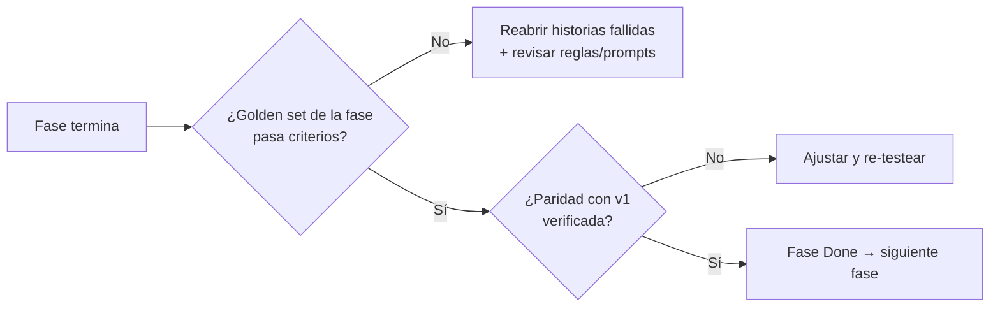

# 06 — Estrategia de Calidad (puente hacia DEV/QA)

> **Roles**: BA/SA/PM → **DEV/QA**
> **Propósito**: definir qué pruebas y criterios de aceptación validan cada fase,
> cómo se construye el *golden set*, qué métricas se reportan y cuándo una fase
> se considera *lista para producción (o para la siguiente fase)*.

---

## 1. Principios de calidad

1. **La certeza se mide por etapa, no por confianza del modelo.** La métrica
   principal es la distribución de `origen` (programa vs. agente IA) y su
   exactitud contra el veredicto humano.
2. **Paridad verificable**: todo refactor debe reproducir o superar el
   comportamiento de v1 sobre una muestra acordada antes de darse por cerrado.
3. **Contrato primero**: los schemas de evidencia se prueban como contrato
   (validación de JSON de modelos) antes que la lógica de negocio.
4. **Determinismo testeable**: el motor de reglas es 100% determinista ⇒ se
   prueba con fixtures; las llamadas a modelo se *mockean* en pruebas unitarias
   y se ejercitan contra golden set en pruebas de integración/evaluación.
5. **Datos reales y etiquetados**: las decisiones de calidad se toman sobre el
   golden set, no sobre impresiones de unos pocos archivos.

---

## 2. Pirámide de pruebas

```mermaid
flowchart TB
    subgraph E2E["Evaluación / E2E (pocas, caras)"]
        E1[Evaluación contra golden set<br/>por fase y por tipo de documento]
    end
    subgraph INT["Integración (medias)"]
        I1[Pipeline completo sobre archivos reales<br/>paridad v1 vs v2]
        I2[Contrato de evidencia end-to-end<br/>VLM+LLM → reglas → conclusión]
    end
    subgraph UNIT["Unitarias (muchas, rápidas)"]
        U1[Motor de reglas R1-R7<br/>con fixtures deterministas]
        U2[Schemas pydantic<br/>validación de contrato]
        U3[Procesamiento: tipo de entrada,<br/>orientación, orden de boxes]
        U4[Validación qween: lógica de vistas<br/>y decisiones (modelo mockeado)]
        U5[Normalización de campos<br/>CUIT/fechas/montos]
        U6[Runner: checkpoints, workers,<br/>política de enfriamiento (simulada)]
    end
    U1 --> I2
    U2 --> I2
    U3 --> I1
    U4 --> I1
    U5 --> I1
    U6 --> I1
    I1 --> E1
    I2 --> E1
```

---

## 3. Golden set (dataset de referencia etiquetado)

### 3.1 Origen de datos
- Muestras reales de `files/` (2025-08 … 2026-*) con sus `.md` y `.raw.md`
  generados por v1.
- Etiquetado manual (HITL/contador) de: tipo/letra de comprobante, condición
  fiscal de emisor/receptor, campos clave (CUIT, fecha, total), veredicto de
  "es comprobante" y clasificación contable de referencia.

### 3.2 Estructura mínima propuesta

```text
tests/golden/
  casos.csv                # índice: id, archivo, tipo, letra, etiquetas, split
  casos/                   # copias normalizadas de documentos (sin PII innecesaria)
    2025-08_<id>/
      original.jpg
      original.md          # markdown de referencia (v1)
      etiqueta.json        # verdad de referencia
  splits/
    reglas_train.json      # para calibrar reglas (F3/F5)
    evaluacion.json        # para medir (nunca se entrena sobre esto)
```

### 3.3 Cobertura objetivo del MVP

| Dimensión | Cobertura objetivo |
|-----------|--------------------|
| Tipos de entrada | pdf texto, pdf escaneado, imagen (foto/escaneo/screenshot), docx, txt/csv/log/html/md |
| Letras | A, B, C, M, E + casos 090/099 |
| Condiciones fiscales | RI+RI, RI+Monotributo, RI+Consumidor Final, Monotributo/Exento |
| Calidad | nítido, ruidoso, baja resolución, rotado, con perspectiva |
| Complejidad | factura simple, factura con tabla, ticket, con sello/firma, con QR |
| Clasificación contable | casos por centro de costo CC0001-CC0008 |
| Negativos | no-comprobantes (para validar el gate qween) |

### 3.4 Reglas del golden set
- Separación estricta **train/evaluación** (las reglas se calibran con un split y
  se *miden* con otro).
- El etiquetado lo valida una segunda persona (contador) sobre una muestra.
- Versionado: cada versión del golden set se referencia en los resultados para
  poder comparar métricas entre versiones de la librería.

---

## 4. Estrategia de pruebas por fase

### Fase 0 — Fundación
- **Unitarias**: schemas pydantic (campos requeridos, enums, rechazo de JSON
  inválido del modelo), `OllamaClient` con mock de HTTP (retry/backoff/429).
- **Aceptación**: T-001/002/005 cumplen criterios de `E-LIB-2`/`E-LIB-3`.
- **Métrica**: % de respuestas de modelo que *no* cumplen el contrato (objetivo
  < 5% sobre golden de humo).

### Fase 1 — Procesamiento (docling)
- **Unitarias**: detector de tipo por fixture (una muestra por formato);
  orientación y orden de boxes (horizontal `center_y`, vertical `center_x`);
  conservación de tablas.
- **Integración**: procesar una muestra real y comparar Markdown con el de v1
  (`run.py`/`run_raw.py`).
- **Aceptación** (E-DOC-1/2/3): cada regla Gherkin pasa; formato no soportado se
  rechaza sin forzar OCR.
- **Métrica**: paridad de Markdown (estructural) ≥ umbral acordado sobre la
  muestra; % de imágenes que requirieron VLM vs. OCR.

### Fase 2 — Validación (qween)
- **Unitarias**: lógica de vistas y ramas de decisión con modelo mockeado.
- **Integración**: gate sobre casos positivos y negativos del golden set.
- **Aceptación** (E-QWE-1/2): no-comprobantes no llegan a extracción;
  indeterminado resuelve con vista de revisión.
- **Métricas**: exactitud del gate (comprobante/no), % indeterminado, ahorro de
  llamadas costosas (no-comprobantes evitados / total).

### Fase 3 — Clasificación
- **Unitarias**: motor de reglas R1-R7 con fixtures deterministas (cada regla por
  separado y combinadas); candidatos descartados/restantes. **T-301**: 122 tests
  (`test_rules_contexto.py` 41 + `test_rules_tipo_comprobante.py` 81).
  **T-302**: 50 tests (`test_classification_prompt_tipo.py`) — contrato y versión
  del prompt de evidencia (que el modelo no decide), construcción de `messages`
  por fuente, normalización de la lectura al vocabulario del motor, conversión a
  `SourceEvidence` y el puente completo T-302 → T-301 (R4/R5/R7).
  **T-303**: 53 tests (`test_rules_raw.py`) — cada regla raw por separado,
  vocabulario cerrado (D-13) reportando el valor crudo, gradación
  válida/dudosa/inválida, candidatos descartados por contradicción con blindaje
  ADR-008, y la reutilización por F4 (campos que no son la letra).
  **T-304**: 60 tests (`test_classification_contable.py`) — contratos por paso,
  cadena feliz con doble del cliente (y los `messages` del paso siguiente con el
  resultado del anterior), default CC0006, checkpoints con reanudación, error con
  resultados parciales, variante pura **coincidente** con la cadena real, y
  `api.classify` punta a punta.
- **Integración**: flujo VLM/LLM (mockeados) → reglas → tipo final; cadena
  contable 01→02→03 con datos de referencia. **Hecho en F3**: `scripts/F3/t302.py`
  (10 escenarios), `scripts/F3/t303.py` (9) y `scripts/F3/t304.py` (8) corren las
  tres capas con dobles y salen con código ≠ 0 si alguno falla; la cadena real se
  puede correr con `scripts/F3/t304.py --origen` o con el CLI portado
  `scripts/F3/classification_pipeline.py`.
- **Aceptación** (E-CLAS-1/2): reglas Gherkin; paridad con v1 `-M 11.1` y
  `classification_pipeline.py`. **Hecho en T-305**: subconjunto de paridad en
  `tests/golden/F3/`; cadena contable **8/8** campos coincidentes con v1 y
  exactitud de letra **v2 5/5** vs. **v1 2/5** sobre los casos etiquetados.
- **Métricas**: exactitud de letra (por categoría A/B/C/M/E), % de casos con
  alerta R7 correctamente disparada, % acuerdo negocio-vs-documento.
  **Medido en T-305**: las tres al 100% sobre el tramo **determinista** del
  subconjunto (`tests/golden/F3/`); la medición sobre el golden completo sigue
  pendiente de la curación con contador (F2 §2.5).
- **T-305**: 40 tests (`test_classification_paridad.py`) — fidelidad de los
  prompts portados contra los YAML de v1, integridad del subconjunto (rutas,
  etiquetas derivadas con sustento, sin residuos de v1), paridad de letra de los
  casos sintéticos, la lógica de comparación de los scripts de paridad y las
  métricas del reporte `scripts/F3/t305.py`.

### Fase 4 — Extracción
- **Unitarias**: normalización de campos (CUIT truncado, fechas, montos, ítems,
  `punto_venta`/`numero_comprobante`). **T-401**: 75 tests
  (`test_extraction_flujos.py`) — contrato y versión del prompt de evidencia
  (`extraccion-key-value@1`, que no normaliza ni decide), `messages` por fuente,
  interpretación sin inventar campos (shapes por campo y plano de v1, JSON con
  cercas/prosa, errores de contrato), conversión a `SourceEvidence` sin duplicar
  debilidades, pasada raw reutilizada de T-303 y tolerancia a fallos por fuente.
  **T-402**: 97 tests (`test_extraction_key_value.py`) — cada regla de
  normalización con los casos de la letra chica de v1 (CUIT cortado en
  `"20-1 Ing, Brutas: 201641"`, nueve formas de fecha, montos con separadores y
  signos, `PPPPP-NNNNNNNN`, moneda sin default, ítems), la regla dura de "no
  inventar" (crudo conservado con aviso), el informe de la corrida y las
  fronteras (el crudo de T-401 sobrevive; `normalizar=False` lo devuelve entero).
  **T-405**: 37 tests (`test_extraction_paridad.py`, 6 clases) — procedencia de
  las reglas (`regla_v1` + `prompt_v1` + `texto_v1`), paridad de normalización
  contra el `texto_v1` literal, la regla de "no inventar", integridad del
  subconjunto (cobertura del contrato ∪ campos genéricos, campos de decisión
  excluidos con motivo) y la lógica de comparación (`coincide`/`difiere`/
  `no_comparable`, tolerancia número↔texto solo en números). El script de
  paridad se carga por `importlib` **sin** ejecutar `main`, así que la suite
  default no toca la red.
- **Integración**: VLM y LLM en paralelo devuelven `SourceEvidence` válida;
  combinación con precedencia (ADR-002). **Hecho en T-401**:
  `scripts/F4/t401.py` corre **11/11** escenarios sintéticos con dobles (dos
  fuentes coincidiendo, discrepancia conservando ambas, campo sin sustento, valor
  fuera del vocabulario, CUIT no sostenido, shape plano de v1, montos no
  evaluados, sin vista, JSON inválido aislado, fuente caída aislada, todas
  caídas) y sale con código ≠ 0 si alguno falla; con `--origen` corre la
  extracción real (F1 + vista fiel de F2 + Ollama). **Hecho en T-402**:
  `scripts/F4/t402.py` corre **19/19** casos de regla, **17/17** escenarios de la
  regla dura de E-EXT-3 y **5/5** fronteras de la tarea. **Hecho en T-403**:
  `scripts/F4/t403.py` corre **11/11** criterios de sostén, **7/7** escenarios de
  coherencia de la fuente (E-EXT-2) y **4/4** fronteras. **Hecho en T-404**:
  `scripts/F4/t404.py` corre **8/8** escenarios de resolución y **4/4** fronteras,
  y `--manual` ejecuta el pipeline F4 completo (T-401→T-402→T-403→T-404) con la
  lectura del modelo inyectada. **Hecho en T-405**: `scripts/F4/t405.py
  --subset determinista` (default, **sin red**) reporta reglas **20/20**,
  paridad estructural **29/29** campos, sostén **32/32**, cobertura del modo
  genérico **5/5** y procedencia verificada, y sale con código ≠ 0 si fallan
  reglas, sostén o procedencia; `--subset origen` corre la paridad **real**
  contra v1 (requiere Ollama y `v1/`).
- **Aceptación** (E-EXT-1/2/3): ambos flujos corren siempre; reglas raw marcan
  fuentes débiles; paridad con `kvi/kvg/10/11` en campos planos. **Verificado en
  T-401..T-405**: "ambos flujos corren siempre" verificado (paralelismo
  **medido**: dos llamadas de 0,2 s tardan ≈ 0,2 s, no 0,4 s; `max_workers=1`
  serializa); "los campos se normalizan sin inventar" verificado para CUIT,
  fechas, montos, comprobante, moneda, texto e ítems (T-402); "las reglas raw
  marcan fuentes débiles" verificado para el sostén de todos los campos
  evaluables y para la coherencia interna de la fuente (T-403); "la combinación
  resuelve por campo con precedencia y conserva trazabilidad de cada fuente"
  verificado con la tabla, los cinco casos de resolución y el determinismo
  (T-404); **"paridad con kvi/kvg/10/11"** verificado en **tres niveles**
  (T-405): normalización determinista **20/20**, contrato y sostén **29/29**
  campos (**32/32** de sostén) y corrida real contra v1 sobre 3 documentos del
  golden (informativa, fuera de la suite default).
- **Métricas**: exactitud por campo sobre golden (CUIT, fecha, total, razón
  social), tasa de acuerdo VLM vs. LLM, % campos con fragmento de sustento.
  **Medido en T-405 sobre el subconjunto** (`tests/golden/F4/`, versión
  `0.1-f4`): paridad estructural de campos **29/29**, sostén estructurado
  **32/32**, cobertura del modo genérico **5/5** y procedencia de las reglas
  **20/20**. **Límite honesto**: esto **no** es la exactitud sobre el golden
  completo — la curación con contador de montos/fechas sigue pendiente (F2
  §2.5) — y el DoD de F4 admite **paridad o mejora** documentada caso por caso,
  no un verde artificial; la corrida **real** contra v1 queda en
  `--subset origen` porque requiere Ollama y `v1/`. T-402 deja los campos en
  forma canónica y T-403 evalúa su sostén, que es la precondición para que la
  exactitud por campo sea comparable con v1. El sostén de los campos de formato
  estructurado ya **no** queda sin evaluar: desde T-403 se compara su forma
  canónica y los que tienen sostenedor propio se listan en
  `detalle["modelos"][fuente]["sosten_forma_canonica"]`; solo la `descripcion`
  sigue en `sosten_no_evaluado` (ver `EXT.md` §2).

### Fase 5 — Conclusión + HITL
- **Unitarias**: reglas cruzadas, gaps y límite de reintentos; blindaje del
  agente (no puede elegir descartados) con agente mockeado. **Hecho en T-501**:
  94 tests (`test_conclusion_cruzadas_t501.py`) — el contexto de la pasada 2
  (`ContextoConclusion`: valor vigente y fuente responsable por campo, campos
  ausentes sobre el universo del contrato, gaps, coherencia del caso, candidatos
  curados), las tres familias de reglas cruzadas (negocio, fast-fail y conflicto
  R7) con sus escenarios y fronteras, la derivación de certeza/origen por etapa
  (**incluida la verificación de que el contrato de F0 rechaza un `Decision` de
  `programa` con certeza baja**), el `ConclusionResult` del diseño §4.5,
  determinismo (incluida la independencia del orden de las fuentes) y las señales
  de R6 (desglose de IVA). El contexto fiscal entra por parámetro inyectable, así
  que la suite default **no** depende de Ollama ni de Docling.
  **T-502**: 73 tests (`test_conclusion_gaps_t502.py`) — la detección de gaps
  (criticidad, objetivo concreto, orden determinista, campos fuera del catálogo),
  el presupuesto (los dos topes y el agotamiento), la búsqueda acotada (cubrir,
  reintentar lo transitorio, **no** insistir ante un "no está", hook desactivado
  como caso normal, corte por presupuesto, y que un buscador que lanza o que
  devuelve cualquier cosa no tumbe el pipeline), la re-conclusión (el dato entra
  con su fuente y sostén, las lecturas se conservan, cubrir el gap desbloquea el
  veredicto) y el adaptador ARCA con una sesión HTTP falsa (**sin red**): payload,
  traducción de la respuesta, reintentos, timeout y que no se invente un código
  AFIP fuera del vocabulario (D-13).
  **T-503**: 46 tests (`test_conclusion_consolidacion_t503.py`) — la regla de la
  certeza en aislamiento (cada disyunto de "sin ambigüedad": no concluye / con
  alerta pendiente / sin letra, cada uno con su motivo), el `VoucherResult`
  consolidado (aprobado y **rechazo firme** en certeza alta; ambiguo en revisión
  sin `origen`), la derivación (la certeza **no** es parámetro: se verifica por
  firma), la clasificación contable y el HITL, la integración con T-501/T-502
  (incluido que el padrón **desbloquea** la certeza alta) y las fronteras.
  **T-504**: 62 tests (`test_conclusion_agente_t504.py`) — cuándo se escala (y
  cuándo no: un caso resuelto no gasta una llamada), qué recibe el agente
  (evidencia + reglas que fallaron + candidatos, **sin** los descartados), el
  **blindaje post-agente** (resucitar un descartado se rechaza y se audita, no se
  corrige), la interpretación de la salida (tolerante al ruido del modelo pero
  **sin** inventar decisiones), la derivación de certeza/origen, el flujo completo
  con consolidación y las fronteras. El agente entra por protocolo: la suite corre
  **sin Ollama** y **sin red**.
- **Integración**: casos del golden → distribución de `origen` y `certeza`;
  correcciones HITL registradas y disponibles para feedback.
- **Aceptación** (E-CONC-1/2/3/4/5): código que concluye ⇒ certeza alta;
  agente ⇒ baja + HITL; trazabilidad completa persistida. **Casi cerrada para
  E-CONC-1**: el Gherkin "concluye por programa" está verificado de punta a punta
  (reglas consistentes → `certeza=alta` + `origen=programa`, sin pasar por el
  agente), con los tres desenlaces (aprobado, rechazado firme y revisión) y con la
  regla de la certeza probada disyunto por disyunto; "búsqueda de evidencia
  adicional puntual y sin loop abierto" también (hook desactivado, caído,
  respuesta negativa y presupuesto agotado). "agente ⇒ baja + HITL" y
  "trazabilidad completa persistida" son de T-504/T-505/T-506. `scripts/F5/t501.py`
  corre **8/8** + **8/8**, `t502.py` **6/6** + **8/8** y `t503.py` **6/6** +
  **8/8**, con salida ≠ 0 si falla.
- **Métricas clave** (definidas en §5): exactitud por origen, % certeza alta,
  acuerdo programa-vs-humano, cobertura HITL. **Parcial en T-501**: el
  `ConclusionResult` y la traza de la corrida ya exponen lo que las métricas
  agregan (estado, certeza, origen, reglas por familia, gaps); el cálculo
  agregado es T-507.

### Fase 6 — Cliente
- **Unitarias/integración**: subcomandos CLI, checkpoints/reanudación,
  política de enfriamiento simulada, salida agregada.
- **Paridad E2E**: correr los comandos equivalentes de v1 y v2 sobre una misma
  carpeta de `files/` y comparar resultados (estructura + campos).
- **Aceptación** (E-CLI-1/2/3): mapa de paridad documentado y verificado;
  interrupción+reanudación no repite pasos completados.

---

## 5. Métricas de calidad del sistema (reporte por fase y por lote)

| Métrica | Definición | Objetivo MVP |
|---------|-----------|--------------|
| **Exactitud global** | % de casos cuyo veredicto final coincide con la etiqueta humana | ≥ umbral acordado (sugerido 90%+ en golden de evaluación) |
| **% certeza alta por programa** | casos resueltos por reglas (origen=programa) / total | Creciente por iteración (objetivo de madurez) |
| **% casos agente IA** | casos resueltos por agente / total | Decreciente por iteración (casuística → reglas) |
| **Exactitud por origen** | exactitud dentro de casos `programa` y dentro de casos `agente` | programa ≥ agente (valida la tesis de certeza por etapa) |
| **Acuerdo VLM/LLM** | % de campos donde ambas fuentes coinciden | Reportar; los desacuerdos altos señalan formatos nuevos |
| **Tasa de alertas R7** | % de casos con alerta de conflicto | Reportar; revisar falsos positivos |
| **Cobertura HITL** | % de casos de certeza baja revisados + % de muestreo de alta efectivamente revisado | 100% baja; tasa de muestreo alta configurada (5-10%) |
| **Tasa de rechazo (gate)** | no-comprobantes rechazados / total | Reportar por lote |
| **Latencia p50/p95 por etapa** | tiempo de procesamiento, extracción, conclusión | Reportar; capturar diagnóstico ante latencia > umbral |
| **Error de contrato** | % de respuestas de modelo que no validan el schema | < 5% |

### 5.1 Criterio de salida (Go/No-Go) por fase



---

## 6. Herramientas y entorno de QA (sugerido)

- **Framework de tests**: `pytest` + `pytest-cov` (cobertura por módulo ≥ 80% en
  reglas/schemas; el resto orientativo).
- **Mock de modelos**: fixtures que responden JSON según el contrato para las
  pruebas unitarias (no depender de Ollama en CI).
- **Tipado**: `pydantic` v2 + `mypy`/`pyright` en modo estricto para los
  schemas.
- **CI local**: comando único `make test` / `pytest` + `make eval` (golden set).
- **Reporte**: cada ejecución de evaluación genera un JSON de métricas versionado
  junto con la versión de la librería y del golden set.

---

## 7. Datos sintéticos vs. reales y privacidad

- Preferir **datos reales anonimizados** de `files/` para el golden set (fidelidad).
- Para casos límite (rotación, baja resolución, perspectiva) se pueden **derivar
  variantes sintéticas** de un real (rotar, degradar, añadir ruido) siempre que
  se marquen como derivadas.
- No subir datos con PII innecesaria al repositorio; mantener el golden set fuera
  de control de versiones o en un almacén acordado (decisión operativa).

---

## 8. Criterios de aceptación transversales por épica (resumen QA)

| Épica | QA valida que… | Artefacto |
|-------|----------------|-----------|
| E-DOC | rutas por tipo, gate, orientación, motor | Markdown comparable a v1 |
| E-QWE | gate decide sin gastar extracción costosa | registro de vistas usadas |
| E-CLAS | letra decidida por reglas (no por prompt); cadena contable estable | `reglas_aplicadas`, candidatos |
| E-EXT | VLM+LLM en paralelo con contrato y sustento | `SourceEvidence` por fuente |
| E-CONC | certeza por etapa; agente acotado; HITL; trazabilidad | `VoucherResult` + `CaseRecord` |
| E-LIB | API estable, schemas validados, config central | paquete instalable + tests |
| E-CLI | paridad v1→v2, batch/checkpoints/enfriamiento | mapa de paridad + corridas E2E |

---

## 9. Enlaces

- Historias y criterios Gherkin: [`02-epicas-historias-usuario.md`](02-epicas-historias-usuario.md)
- Fases/WBS y DoR/DoD: [`05-plan-ejecucion.md`](05-plan-ejecucion.md)
- Contratos de evidencia: [`00-glosario.md`](00-glosario.md)
